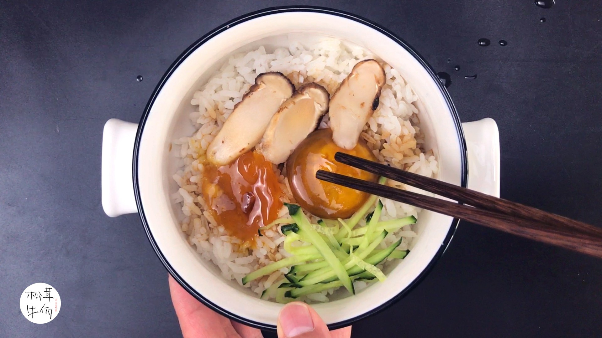

# 松茸炒饭 (Matsutake Fried Rice with Golden Crispy Rice Grains)

## 📋 基本資訊 / Recipe Overview
- **料理名稱 (繁體)**：松茸炒飯
- **料理名称 (简体)**：松茸炒饭
- **English Title**：Matsutake Fried Rice with Golden Crispy Rice Grains
- **素食流派 / Diet**：全素 / 纯素 Vegan（五辛素配香葱花；纯净素以芹菜粒、欧芹碎点缀）
- **料理分類 / Category**：02-菌菇山珍类 / 珍馐主食 / 极品菌香
- **份量 / Servings**：2 人份
- **準備時間 / Prep Time**：15 分鐘
- **烹飪時間 / Cook Time**：8 分鐘
- **總計耗時 / Total Time**：23 分鐘
- **來源 / Source**：现代中华素菜 Top 100 · [02-菌菇山珍类.md](../02-菌菇山珍类.md) 第 56 道

## 📖 菜品特色 / Description
新鲜松茸片油煎后炒饭，米粒裹香名贵珍馐。松茸片焦香脆嫩，松茸丁融于米饭，粒粒裹油，菌香扑鼻，素中上品。

---

## 🌿 食材與調味清單 / Ingredients & Seasonings

### 主料
- 新鲜优质松茸 2-3 支（约 120g）
- 隔夜冷米饭（或干爽新蒸米饭，水分偏少） 350g

### 油脂与配料
- 植物黄油 / 纯压榨花生油 2 汤匙（约 30ml）
- 香葱碎 / 鲜芹菜细粒 2 汤匙（点缀提香）
- 熟白芝麻 1 茶匙（约 3g）

### 调味从简（突出松茸原香）
- 天然细海盐 1 茶匙（约 5g）
- 纯酿特级生抽 / 纯植物酱油 1/2 汤匙（约 7.5ml，沿锅边烹入提镬气）
- 现磨白胡椒粉 1/4 茶匙（约 1g）

---

## 🍳 烹飪步驟 / Step-by-Step Cooking Steps

### 步骤 1：新鲜松茸精细打理（切忌浸泡）
1. 松茸千万不要泡水洗，用陶瓷刀削去根部泥沙硬皮，用湿润的厨房纸巾轻轻擦拭菌盖与菌柄表面的微尘泥垢。
2. 挑选 2 支顶盖完好的松茸纵向切成 2-3mm 均匀薄片（用于油煎与盖顶摆盘）；余下的松茸切成 0.5cm 见方的小丁（用于融入米饭翻炒）。

### 步骤 2：香煎松茸薄片（留香点睛）
1. 平底锅加热，放入 1 汤匙植物黄油或花生油融化。
2. 将松茸薄片整齐铺入锅中，保持中小火慢煎，撒上极微量细海盐。
3. 煎约 1.5-2 分钟至两面金黄微焦、松茸挥发性醇香弥漫全屋，小心夹出盛盘保温备用。

### 步骤 3：煸炒松茸丁释放香脂
1. 原锅中补入 1 汤匙油脂烧热，倒入切好的松茸丁，中大火煸炒 1-2 分钟，逼出松茸油脂香。
2. 下入一半的香葱碎（或芹菜粒）爆香。

### 步骤 4：大火炒饭裹香
1. 倒入冷米饭，转大火，用锅铲背面快速将米饭压散、划散翻炒。
2. 大火持续翻炒 2-3 分钟，让每一粒米饭在锅气中跳跃，充分吸饱松茸油脂，粒粒油润分明。

### 步骤 5：调味烹香与摆盘
1. 沿锅边淋入 1/2 汤匙生抽激出焦香，加入海盐与现磨白胡椒粉，快速大火颠锅翻炒 30 秒至均匀入味。
2. 撒入剩余的葱碎/芹菜粒翻匀出锅装盘。
3. 将煎好的金黄松茸片整齐铺在炒饭顶端，撒上熟白芝麻即可上席。

---

## 💡 大厨秘诀 / Chef's Tips

1. **松茸清理四不原则**：不水洗浸泡（吸水后香气丧失）、不用铁刀（易氧化发黑）、不去外皮（香气集聚在表皮）、不重调味（仅需盐和微量生抽）。
2. **“分而治之”法**：片煎焦香铺面作为视觉与口感焦点，丁炒入饭使每一口米粒都浸透松茸菌香。
3. **干爽米饭炒出镬气**：米饭水分要少，大火翻炒至米粒在锅中微跳，粒粒裹油，方显大师风范。

---
*食谱归档时间：2026-08-21 · 收录于 20260818-vegetarianism 本地菜谱库 (1Top 精选)*
