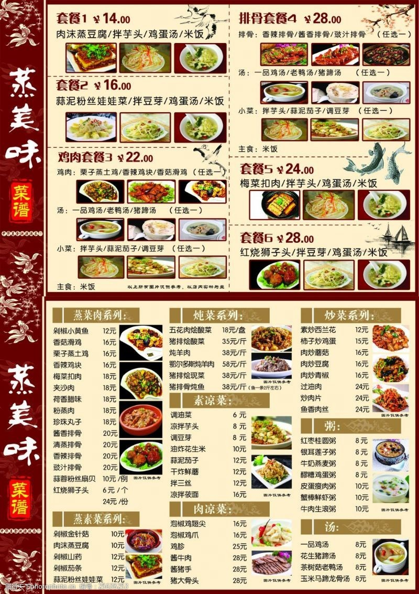

# 梅菜香菇 (Braised Dried Meicai Greens with Shiitake Mushrooms)

## 📋 基本資訊 / Recipe Overview
- **料理名稱 (繁體)**：梅菜香菇
- **料理名称 (简体)**：梅菜香菇
- **English Title**：Braised Dried Meicai Greens with Shiitake Mushrooms
- **素食流派 / Diet**：全素 / 纯素 Vegan (纯净素)
- **料理分類 / Category**：02-菌菇山珍类 / 客家名味 / 咸甜浓醇
- **份量 / Servings**：3-4 人份
- **準備時間 / Prep Time**：40 分鐘 (含梅干菜反复淘洗与浸泡)
- **烹飪時間 / Cook Time**：25 分鐘
- **總計耗時 / Total Time**：65 分鐘
- **來源 / Source**：现代中华素菜 Top 100 · [02-菌菇山珍类.md](../02-菌菇山珍类.md) 第 96 道

## 📖 菜品特色 / Description
梅干菜烧香菇，客家、江南。（客家梅干菜焖香菇，咸甜醇香极下饭。）

---

## 🌿 食材與調味清單 / Ingredients & Seasonings
### 主料
- 优质客家梅干菜（或绍兴梅干菜）80g
- 优质干香菇 12 朵（约 50g，泡发后切大厚块）
- 鲜生姜 10g（切厚片）

### 调味料与焖汁
- 植物油（或花生油）2.5 汤匙（约 37ml，梅菜吸油，油量需略充足）
- 优质生抽 1.5 汤匙（约 22ml）
- 传统老抽 1 茶匙（约 5ml，调浓郁红亮酱色）
- 冰糖碎 1.5 汤匙（约 20g，客家咸甜风味关键）
- 过滤香菇水 + 清水 400ml
- 纯芝麻香油 1/2 茶匙（约 2.5ml）

---

## 🍳 烹飪步驟 / Step-by-Step Cooking Steps
### 步骤 1：梅干菜浸泡与反复淘洗净沙
1. 梅干菜放入温水中浸泡 30-40 分钟至叶片舒展软化。
2. 捞出梅干菜在流动清水下逐叶揉洗，反复换水 4-5 次淘洗干净微细泥沙，挤干水分切成 1.5cm 小段。
3. 干香菇温水泡透，剪去根蒂切成大块，保留沉淀过滤后的香菇原汤。

### 步骤 2：白锅干煸梅干菜
1. 净锅不放油，倒入切碎的梅干菜，中火耐心翻炒煸烤 2-3 分钟，将梅干菜内部多余水汽炒干，逼出梅干菜醇厚的发酵陈香，盛出备用。

### 步骤 3：热油煸透香菇与爆姜
1. 锅中倒入 2.5 汤匙花生油烧热，下入姜片小火煸香。
2. 放入香菇块中火煸炒 2 分钟，直至香菇边缘金黄出香。
3. 倒入干煸过的梅干菜大火翻炒均匀，让油脂完全润透梅菜与香菇。

### 步骤 4：加调料慢火焖透收汁
1. 烹入生抽、老抽和冰糖碎翻炒上色。
2. 倒入 400ml 过滤香菇水和清水，大火烧开转中小火，盖上锅盖慢火煨焖 20 分钟，直至梅干菜软糯、香菇吸足咸甜汁水。
3. 揭开锅盖大火收汁至汤汁浓缩油润，淋上半茶匙香油翻匀出锅。

---

## 💡 大厨秘诀 / Chef's Tips
1. **梅干菜淘洗与白锅干煸**：梅干菜晒制易带细沙，必须多次淘洗；白锅干炒煸干水汽能极大激发梅菜独有的陈香酱气。
2. **香菇肉厚吸足梅菜汁**：选用厚肉干香菇，在慢煨中香菇饱吸梅干菜的咸香与酸甜，口感肥厚胜似红烧肉。
3. **冰糖重油柔化梅菜**：梅菜喜油喜糖，充足的花生油与老冰糖慢炖能软化粗纤维，使整道菜红亮醇美、咸甜交融、极度下饭。

---
*食谱归档时间：2026-08-21 · 收录于 20260818-vegetarianism 本地菜谱库 (1Top 精选)*
