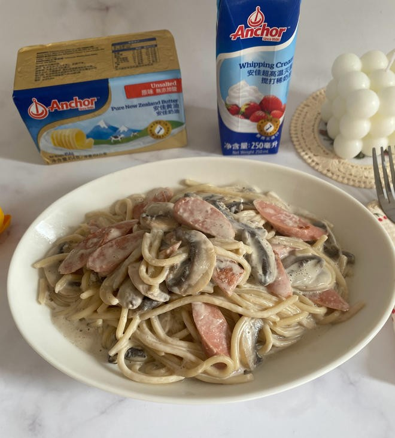

# 植物奶奶油口蘑 (Vegan Creamy Garlic Button Mushrooms with Oat & Cashew Milk)

## 📋 基本資訊 / Recipe Overview
- **料理名稱 (繁體)**：植物奶奶油口蘑
- **料理名称 (简体)**：植物奶奶油口蘑
- **English Title**：Vegan Creamy Garlic Button Mushrooms with Oat & Cashew Milk
- **素食流派 / Diet**：全素 / 纯素 Vegan（五辛素含蒜碎；纯净素以欧芹与百里香为主香）
- **料理分類 / Category**：02-菌菇山珍类 / 西式中做 / 丝滑浓郁
- **份量 / Servings**：2-3 人份
- **準備時間 / Prep Time**：12 分鐘
- **烹飪時間 / Cook Time**：10 分鐘
- **總計耗時 / Total Time**：22 分鐘
- **來源 / Source**：现代中华素菜 Top 100 · [02-菌菇山珍类.md](../02-菌菇山珍类.md) 第 48 道

## 📖 菜品特色 / Description
口蘑植物奶或燕麦奶白汁烩，西式中做浓郁顺滑。天然腰果奶与燕麦奶营造出媲美动物奶油的丝滑质感，与煎香口蘑完美融合。

---

## 🌿 食材與調味清單 / Ingredients & Seasonings

### 主料
- 鲜白口蘑 / 鲜褐菇（棕口蘑） 300g（洗净对半切或切厚片）

### 纯素植物奶白汁基底
- 原味无糖燕麦奶 150ml
- 熟腰果泥（生腰果 30g 浸泡 2 小时后加 60ml 水打成细腻浓浆）
- 营养酵母粉（Nutritional Yeast） 1 汤匙（约 8g，赋予天然奶酪咸香味）
- 玉米淀粉 / 低筋面粉 1/2 茶匙（约 2.5g）

### 香料与调味
- 特级初榨橄榄油 / 植物黄油 1.5 汤匙（约 22ml）
- 大蒜 4 瓣（切细末；纯净素可省）
- 新鲜百里香（Thyme） 2 枝（或干百里香 1/3 茶匙）
- 海盐 1 茶匙（约 5g）
- 现磨粗粒黑胡椒碎 1/2 茶匙（约 2g）
- 新鲜欧芹碎（Parsley） 1 汤匙（出锅点缀）

---

## 🍳 烹飪步驟 / Step-by-Step Cooking Steps

### 步骤 1：口蘑焦香油煎
1. 口蘑用湿布擦净，切成厚片或四等分块。
2. 平底锅倒入 1 汤匙橄榄油烧热，下入口蘑块平铺，中小火慢煎 3-4 分钟，煎至水分挥发、表面焦黄上色（产生浓郁美拉德焦香），盛出几片漂亮口蘑留作最终摆盘。

### 步骤 2：爆香香草与蒜末
在原锅中补入 1/2 汤匙橄榄油，下入蒜末与新鲜百里香叶，微火煸炒 30 秒出香。

### 步骤 3：调制与注入植物奶白汁
1. 将燕麦奶、腰果浓浆、营养酵母粉与玉米淀粉混合充分搅匀。
2. 将调好的植物奶液缓缓倒入锅中，转小火慢煮，并用耐热刮刀不断画圈搅拌。
3. 煮约 1-2 分钟，酱汁在微沸中逐渐变得浓稠丝滑、泛起细腻光泽。

### 步骤 4：裹汁调味与装盘
1. 倒回煎好的口蘑块，小火翻裹 1 分钟，让浓稠白汁紧紧挂在每一块口蘑上。
2. 撒入海盐与大量现磨黑胡椒碎调味翻匀。
3. 盛入温热盘中，表面摆上预留的焦香口蘑片，撒上新鲜欧芹碎，搭配烤法棍或米饭食用极佳。

---

## 💡 大厨秘诀 / Chef's Tips

1. **腰果浓浆是植物奶油神作**：腰果富含优质植物油脂，高速打碎后具有极佳的乳化增稠效果，口感丝滑甚至超越传统乳脂奶油。
2. **口蘑必须煎出焦糖化**：煎至焦黄色才能彻底激发菌菇深沉的坚果香，中和植物奶的单一谷物味。
3. **营养酵母赋予灵魂**：纯素营养酵母自带坚果芝士般的鲜香，是西式纯素白汁不可或缺的 Umami 增强剂。

---
*食谱归档时间：2026-08-21 · 收录于 20260818-vegetarianism 本地菜谱库 (1Top 精选)*
