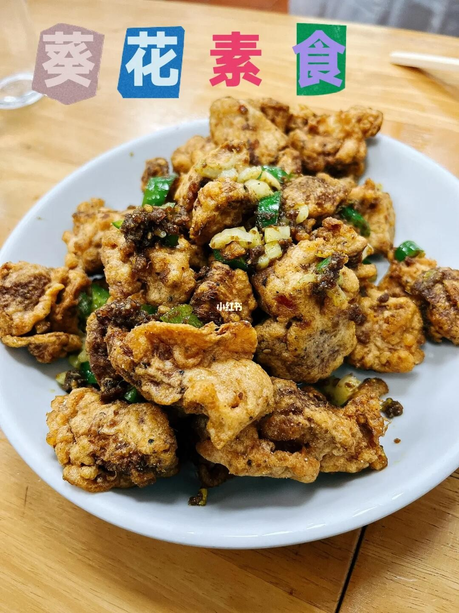

# 椒鹽猴頭菇 (Crispy Salt and Pepper Lion's Mane Mushrooms)

## 📋 基本資訊 / Recipe Overview
- **料理名稱 (繁體)**：椒鹽猴頭菇
- **料理名称 (简体)**：椒盐猴头菇
- **English Title**：Crispy Salt and Pepper Lion's Mane Mushrooms
- **素食流派 / Diet**：全素 / 纯素 Vegan (纯净素 / 无五辛)
- **料理分類 / Category**：02-菌菇山珍类 / 酥炸风味 / 外酥里嫩
- **份量 / Servings**：2-3 人份
- **準備時間 / Prep Time**：30 分鐘
- **烹飪時間 / Cook Time**：10 分鐘
- **總計耗時 / Total Time**：40 分鐘
- **來源 / Source**：现代中华素菜 Top 100 · [02-菌菇山珍类.md](../02-菌菇山珍类.md) 第 34 道

## 📖 菜品特色 / Description
炸至金黄酥脆撒椒盐，外酥内嫩。

---

## 🌿 食材與調味清單 / Ingredients & Seasonings
### 主料
- 优质干猴头菇 4 朵（约 60g，泡发去苦挤干后约 250g）

### 底味腌料
- 纯酿生抽 1 汤匙（15ml）
- 食盐 1/3 茶匙（2g）
- 白胡椒粉 1/2 茶匙（1.5g）
- 五香粉 1/4 茶匙（1g）

### 秘制酥脆裹粉
- 粗颗粒地瓜粉（番薯粉） 50g
- 玉米淀粉 30g
- 无铝泡打粉 1/4 茶匙（1g，令外壳蓬松硬脆）

### 配料与调味
- 自制特香椒盐粉 1.5 茶匙（慢火炒香花椒打粉 + 炒香海盐 + 微量白胡椒粉）
- 红椒末 10g（配色）
- 青椒末 10g（配色）
- 熟白芝麻 1 茶匙（3g）
- 植物油 500ml（油炸实耗约 35ml）

---

## 🍳 烹飪步驟 / Step-by-Step Cooking Steps
### 步骤 1：去苦泡发与手撕小块
1. 猴头菇温水浸泡软透，彻底剪掉根部黑色硬蒂。
2. 在清水中反复揉搓挤干 6-7 次至水清澈透明无一丝黄色，用力挤干多余水分。
3. 用手撕成约小核桃大小的适口块状。

### 步骤 2：底味微腌与裹粉
1. 猴头菇块放入碗中，加入生抽 1 汤匙、盐 1/3 茶匙、白胡椒粉 1/2 茶匙和五香粉 1/4 茶匙，抓匀腌制 5 分钟入底味。
2. 将地瓜粉、玉米淀粉与泡打粉混合拌匀。
3. 将腌好的猴头菇块分批倒入粉中，充分翻拌抓匀裹上干粉，静置 2 分钟让粉微返潮吸附牢固。

### 步骤 3：初炸定型与复炸抢酥
1. 锅中倒入植物油加热至六成热（约 160℃），逐块下入猴头菇块。
2. 中小火炸约 3 分钟至表面硬挺、呈现淡金黄色，捞出控油。
3. 升高油温至 180-190℃，倒入猴头菇块复炸 30 秒至外壳金黄酥硬，迅速捞出沥干油分。

### 步骤 4：干锅翻抛椒盐出锅
1. 净锅烧热不放油，下青红椒末与白芝麻干炒 10 秒出香。
2. 倒入复炸好的猴头菇块，迅速撒入足量自制椒盐粉。
3. 快速颠锅翻抛均匀，使每一颗猴头菇外皮均匀附着椒盐，即刻出锅装盘趁热享用。

---

## 💡 大厨秘诀 / Chef's Tips
1. **手撕结构吸粉炸酥壳**：手撕的不规则断面能吸附更多地瓜粉与泡打粉，炸出蓬松轻脆且硬挺的黄金外壳。
2. **二次高温抢酥逼油**：初炸炸透，高温复炸 30 秒能迅速逼出内部多余油脂，使外壳酥脆不腻、内部鲜嫩爆汁。
3. **现炒椒盐粉香味倍增**：将优质花椒粒与海盐小火慢炒至微黄微香后打碎成粉，椒香浓郁远胜市售袋装椒盐。

---
*食谱归档时间：2026-08-21 · 收录于 20260818-vegetarianism 本地菜谱库 (1Top 精选)*
