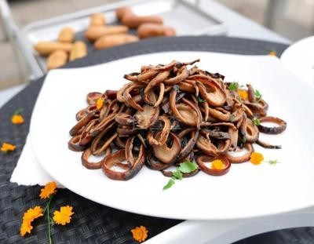

# 椒鹽茶樹菇 (Crispy Salt and Pepper Agrocybe (Tea Tree) Mushrooms)

## 📋 基本資訊 / Recipe Overview
- **料理名稱 (繁體)**：椒鹽茶樹菇
- **料理名称 (简体)**：椒盐茶树菇
- **English Title**：Crispy Salt and Pepper Agrocybe (Tea Tree) Mushrooms
- **素食流派 / Diet**：全素 / 纯素 Vegan (纯净素 / 无五辛)
- **料理分類 / Category**：02-菌菇山珍类 / 酥香小吃 / 佐茶下酒
- **份量 / Servings**：2-3 人份
- **準備時間 / Prep Time**：10 分鐘
- **烹飪時間 / Cook Time**：8 分鐘
- **總計耗時 / Total Time**：18 分鐘
- **來源 / Source**：现代中华素菜 Top 100 · [02-菌菇山珍类.md](../02-菌菇山珍类.md) 第 38 道

## 📖 菜品特色 / Description
炸至干香酥脆撒椒盐，下酒佐餐佐茶。

---

## 🌿 食材與調味清單 / Ingredients & Seasonings
### 主料
- 新鲜茶树菇 300g

### 裹粉材料
- 红薯淀粉（地瓜粉） 60g（酥脆关键）
- 玉米淀粉 20g

### 配料与调味
- 特制椒盐粉 1.5 茶匙（现炒花椒粉 + 细海盐 + 白胡椒粉）
- 熟白芝麻 1 茶匙（3g）
- 干辣椒段 2 根（去籽剪细丝，增香微辣）
- 红椒碎 10g（配色点缀）
- 植物油 500ml（油炸实耗约 35ml）

---

## 🍳 烹飪步驟 / Step-by-Step Cooking Steps
### 步骤 1：洗净与彻底吸干水分（成败关键）
1. 茶树菇剪去根部硬结沙囊，洗净冲洗干净。
2. 太粗的茶树菇撕成细条，太长的从中截断。
3. **彻底吸干**：用厨房纸巾或干毛巾反复轻压，彻底吸干表面水分（水分过多会导致炸制时溅油且外皮软塌）。

### 步骤 2：保鲜袋摇晃均匀裹粉
1. 准备一个干净的大号食品保鲜袋，放入红薯淀粉 60g 与玉米淀粉 20g。
2. 放入微带湿润但表面无明水的茶树菇条。
3. 往袋中充入空气捏紧袋口，用力上下左右摇晃 15-20 秒，使每一根茶树菇表面均匀裹上一层薄薄的干淀粉。
4. 倒出茶树菇，在漏勺中轻轻抖掉多余散粉。

### 步骤 3：中火炸酥出脆香
1. 锅中倒入植物油加热至五六成热（约 160℃，放入一根茶树菇能迅速浮起冒泡）。
2. 抖散下入茶树菇，保持中小火炸 3-4 分钟。
3. 期间用筷子轻轻拨散防止粘连，炸至茶树菇菌丝变硬、表面呈金黄酥脆状，捞出充分控油沥干。

### 步骤 4：干锅翻抛椒盐出锅
1. 净锅烧热不放油，下入干辣椒丝与红椒碎干炒 10 秒出香。
2. 倒入炸好的酥脆茶树菇，迅速撒入足量特制椒盐粉与熟白芝麻。
3. 快速颠锅翻拌均匀，即可趁热装盘食用，干香酥脆如薯条。

---

## 💡 大厨秘诀 / Chef's Tips
1. **水分彻底吸干防溅防塌**：茶树菇水分必须吸干，否则入热油易剧烈溅油，且炸出后易返潮变软。
2. **保鲜袋摇粉法极度均匀**：利用保鲜袋充气摇晃，粉层极其轻薄均匀，杜绝粉浆粘连厚重。
3. **红薯淀粉打造干香脆感**：红薯淀粉炸出的茶树菇金黄硬挺，放凉依然酥脆干香，越嚼越有山珍浓香。

---
*食谱归档时间：2026-08-21 · 收录于 20260818-vegetarianism 本地菜谱库 (1Top 精选)*
