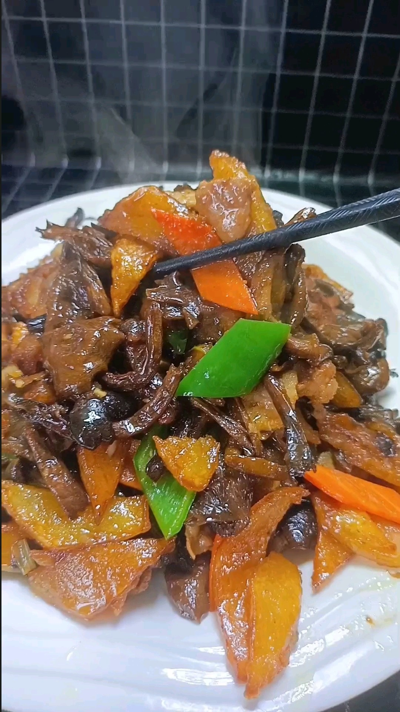

# 榛蘑炖土豆 (Braised Wild Hazel Mushrooms with Potatoes)

## 📋 基本資訊 / Recipe Overview
- **料理名稱 (繁體)**：榛蘑燉土豆
- **料理名称 (简体)**：榛蘑炖土豆
- **English Title**：Braised Wild Northeast Hazel Mushrooms with Soft Potatoes in Mushroom Broth
- **素食流派 / Diet**：全素 / 纯素 Vegan (东北传统名山珍炖菜，不含五辛或含葱蒜可选)
- **料理分類 / Category**：02-菌菇山珍类 / 关东炖菜 / 浓香下饭
- **份量 / Servings**：3-4 人份
- **準備時間 / Prep Time**：40 分鐘 (含榛蘑浸泡去沙)
- **烹飪時間 / Cook Time**：25 分鐘
- **總計耗時 / Total Time**：65 分鐘
- **來源 / Source**：现代中华素菜 Top 100 · [02-菌菇山珍类.md](../02-菌菇山珍类.md) 第 75 道

## 📖 菜品特色 / Description
东北野生榛蘑素炖土豆，山珍香气浓烈下饭。野生榛蘑独特的浓郁山野松木菌香，经小火慢炖完全渗入沙糯土豆之中。原汤沉淀炖煮，汤浓酱香，土豆软糯起沙，为东北素炖之王。

---

## 🌿 食材與調味清單 / Ingredients & Seasonings
### 主料
- 东北优质干野生榛蘑 40g（泡发后约 200g）
- 东北黄心土豆 2 个（约 400g）
### 配料 / 炖煮香料
- 八角（大料） 1 颗
- 生姜 3 片（约 10g）
- 大葱段 15g（净素可免）
- 东北土豆粉条（选配） 50g（温水泡软）
### 调味料与炖汤
- 过滤澄清榛蘑泡发原汤 + 热水 约 500ml
- 纯酿造特级生抽 2 汤匙（约 30ml）
- 红烧老抽 1/2 汤匙（约 7.5ml，调酱色）
- 优质素蚝油 1 汤匙（约 15ml）
- 食盐 1 茶匙（约 5g）
- 老冰糖 4 粒（约 6g，提亮柔和）
- 熟大豆油 2 汤匙（约 30ml）

---

## 🍳 烹飪步驟 / Step-by-Step Cooking Steps
### 步骤 1：野生榛蘑科学泡发与彻底去沙（核心功法）
1. **冷水冲灰**：将干榛蘑置于网筛中，用冷水快速冲洗掉表面附着的浮灰浮尘。
2. **温水泡发**：用 40℃ 温水浸泡 40-50 分钟至榛蘑完全回软舒展。
3. **顺向旋转去沙**：泡软后用手顺着同一个方向轻柔旋转搅动榛蘑，让褶皱中的泥沙在离心力下自然沉降到底部。
4. **剪除老根**：捞出榛蘑，用剪刀剪去根部硬蒂（老根是藏沙死角），再用清水轻轻漂洗一次。
5. **原汤过滤**：将泡榛蘑的原汤静置 15 分钟让细沙完全沉底，小心倒出上层的澄清原汤备用（切勿倒掉！这是全菜鲜味之源）。

### 步骤 2：土豆切块与食材煸炒
1. 黄心土豆去皮，切成适口的大滚刀块，用清水洗去表面淀粉沥干。
2. 锅中倒入 2 汤匙熟大豆油烧至五成热，下入八角、姜片、葱段煸炒出浓郁香气。
3. 下入土豆块和处理好的榛蘑，大火持续翻炒 3-4 分钟，炒至土豆边缘微泛焦黄透明、榛蘑爆发出醇厚山珍香。

### 步骤 3：上色与注入原汤慢炖
1. 在锅中加入生抽 2 汤匙、老抽 1/2 汤匙、素蚝油 1 汤匙和冰糖，翻炒 1 分钟让食材均匀裹上红亮酱色。
2. 倒入澄清的榛蘑原汤，并补入足量热水至水量与食材齐平（约 500ml）。
3. 大火烧开撇去浮沫，盖上锅盖转中小火慢炖 15-20 分钟。

### 步骤 4：下粉条（可选）与大火收汁起沙
1. （若加粉条可在出锅前 8 分钟下入）炖至土豆用筷子能轻松扎透、边缘开始沙化。
2. 加入食盐 1 茶匙调味，揭开锅盖转大火翻炒收汁 2-3 分钟，让炖碎的土豆粉质与浓郁榛蘑原汤自然乳化收浓，红亮酱汁紧紧包裹土豆与榛蘑即可盛入大碗。

---

## 💡 大厨秘诀 / Chef's Tips
1. **泡蘑水是鲜味灵魂绝不可倒**：野生榛蘑干制过程中凝聚了海量谷氨酸，澄清过滤后的泡发原汤是纯天然顶级素高汤，必须作为炖汤注入。
2. **顺时针搅动与剪硬蒂彻底去沙**：野生榛蘑长于密林极易带沙，旋转沉降法搭配剪除根蒂能彻底告别“碜牙”苦恼。
3. **大火收汁土豆起沙自挂浓芡**：无需额外勾淀粉芡，土豆在慢炖收汁中边缘自然溶出的淀粉会让汤汁浓稠醇厚，裹在榛蘑上极度下饭。

---
*食谱归档时间：2026-08-21 · 收录于 20260818-vegetarianism 本地菜谱库 (1Top 精选)*
