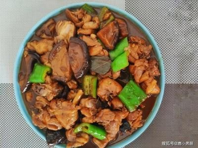

# 油焖松蕈 (Braised Pine Mushrooms in Sweet Soy Sauce (Suiyuan Shidan Heritage))

## 📋 基本資訊 / Recipe Overview
- **料理名稱 (繁體)**：油燜松蕈
- **料理名称 (简体)**：油焖松蕈
- **English Title**：Braised Pine Mushrooms in Sweet Soy Sauce (Suiyuan Shidan Heritage)
- **素食流派 / Diet**：全素 / 纯素 Vegan
- **料理分類 / Category**：02-菌菇山珍类 / 古法传承 / 浓油赤酱
- **份量 / Servings**：2-3 人份
- **準備時間 / Prep Time**：15 分鐘
- **烹飪時間 / Cook Time**：10 分鐘
- **總計耗時 / Total Time**：25 分鐘
- **來源 / Source**：现代中华素菜 Top 100 · [02-菌菇山珍类.md](../02-菌菇山珍类.md) 第 58 道

## 📖 菜品特色 / Description
清代《随园食单》松蕈古法油焖，酱香浓厚。整朵松蕈油煎透亮，加清酱与甜酒酿慢火油焖，红亮油润，鲜韧弹牙，古风雅致。

---

## 🌿 食材與調味清單 / Ingredients & Seasonings

### 主料
- 鲜松蕈（野生松蘑 / 小松茸） 300g（保持整朵完整，洗净沥干）

### 随园食单古法调味料
- 纯压榨浓香菜籽油 / 花生油 3 汤匙（约 45ml）
- 传统古法清酱（传统天然发酵生抽） 2 汤匙（约 30ml）
- 纯酿甜酒酿汁（或天然冰糖粉 10g） 1.5 汤匙（约 22ml，赋天然酒香与甘润）
- 生姜 3 片（切薄片）
- 素高汤 / 沸水 80ml
- 芝麻香油 1/2 茶匙（约 2.5ml）

---

## 🍳 烹飪步驟 / Step-by-Step Cooking Steps

### 步骤 1：松蕈古法精修（整朵不切）
1. 遵清代袁枚《随园食单》古训：“万不可切成碎块……或去其背专取肚皮，则真味全失矣”。
2. 选用新鲜松蕈，用软毛小刷在细流水下迅速刷去泥沙杂质，轻轻用布擦干，保持整朵完整（若个体稍大，仅纵向对半切开）。

### 步骤 2：菜籽油慢煎透（逼水生香）
1. 锅中倒入 3 汤匙浓香菜籽油，烧至 5 成热，下入姜片爆香。
2. 下入整朵松蕈，转中小火慢煎。松蕈受热会逐渐析出内部水分，继续煎炒 3-4 分钟。
3. 待水分完全收干，松蕈表面微缩、吸收菜籽油呈现金黄油亮透亮状态。

### 步骤 3：烹清酱与甜酒酿油焖
1. 沿锅边烹入传统清酱（生抽）2 汤匙，大火翻炒激发出浓烈酱香与焦糖化色泽。
2. 加入纯酿甜酒酿汁 1.5 汤匙（带来天然发酵酒香与温和回甘）。
3. 注入沸水或素高汤 80ml，大火烧开后转小火，加盖慢火“油焖” 5-6 分钟，让酱汁与酒酿甘甜充分渗入松蕈肉质深处。

### 步骤 4：大火收汁与紧汁亮油
1. 揭盖转大火，快速翻动锅铲进行收汁。
2. 待锅内水分全部蒸发、只剩下红亮浓稠的酱油混合油紧紧包裹住每一朵松蕈时，淋入 1/2 茶匙香油翻匀关火。
3. 出锅盛入素瓷深盘中趁热享用。

---

## 💡 大厨秘诀 / Chef's Tips

1. **随园食单典故与原味**：袁枚《随园食单·素菜类》记载：“松蕈，生松树下，如蘑菇而小，以香胜……或竟用油煎，加清酱、酒酿亦佳。” 严禁切碎加鸡汤，强调突出本味。
2. **菜籽油煎透出香**：松蕈木质纤维较紧，用菜籽油充分煎透至“吐水又吸油”，才能去除草涩生味，产生肉质般的韧劲。
3. **清酱配酒酿是绝配**：以甜酒酿代替普通白糖，发酵米酒的清甜能柔化酱油的咸度，与松木香相得益彰。

---
*食谱归档时间：2026-08-21 · 收录于 20260818-vegetarianism 本地菜谱库 (1Top 精选)*
