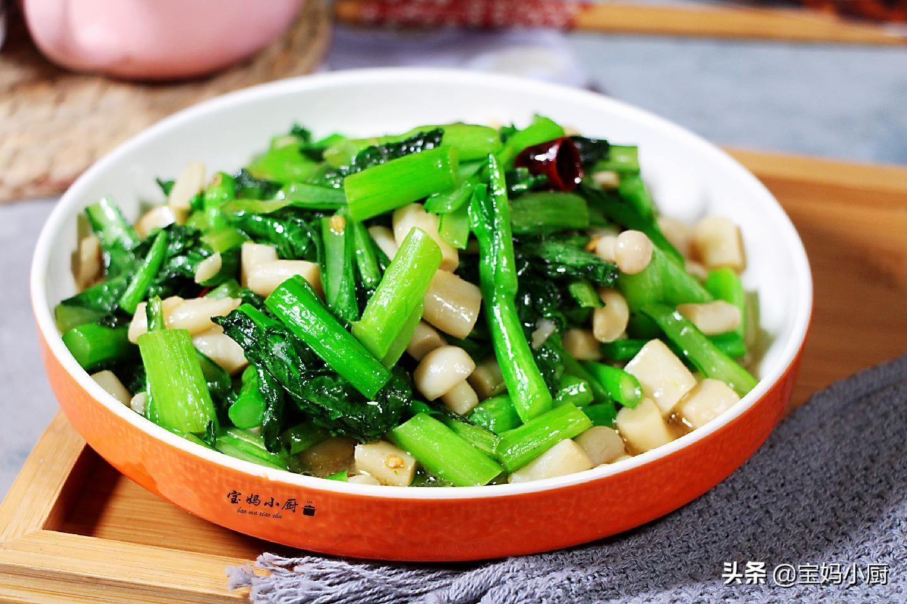

# 海鲜菇扒菜心 (Braised Shimeji Mushrooms over Tender Choy Sum)

## 📋 基本資訊 / Recipe Overview
- **料理名稱 (繁體)**：海鮮菇扒菜心
- **料理名称 (简体)**：海鲜菇扒菜心
- **English Title**：Braised White Beech Mushrooms with Tender Choy Sum in Glass Oyster Glaze
- **素食流派 / Diet**：全素 / 纯素 Vegan (纯素粤式宴席素菜，不含五辛)
- **料理分類 / Category**：02-菌菇山珍类 / 粤菜经典 / 宴席素品
- **份量 / Servings**：2-3 人份
- **準備時間 / Prep Time**：10 分鐘
- **烹飪時間 / Cook Time**：8 分鐘
- **總計耗時 / Total Time**：18 分鐘
- **來源 / Source**：现代中华素菜 Top 100 · [02-菌菇山珍类.md](../02-菌菇山珍类.md) 第 66 道

## 📖 菜品特色 / Description
海鲜菇（真姬菇）扒青菜心，素蚝油琉璃明芡。海鲜菇形似玉指、口感滑脆甘甜，菜心碧绿清爽挺拔，淋以晶莹剔透的素蚝油高汤琉璃明芡，浓醇包裹爽脆，为酒楼级经典素品。

---

## 🌿 食材與調味清單 / Ingredients & Seasonings
### 主料
- 新鲜海鲜菇（真姬菇/白玉菇） 200g
- 宁夏嫩菜心 250g
### 辅料
- 生姜 2 片（切极细丝，约 5g）
- 红椒丝 5g（点缀配色）
- 素高汤（或干香菇浸泡澄清液） 100ml
### 调味与琉璃芡汁
- 高级素蚝油（香菇素蚝油） 1.5 汤匙（约 22ml）
- 纯酿造生抽 1 茶匙（约 5ml）
- 白糖 1/3 茶匙（约 1.5g）
- 食盐 1/2 茶匙（约 2.5g）
- 白胡椒粉 少许
- 水淀粉（玉米淀粉 1 茶匙 + 清水 2 汤匙）
- 花生油 1.5 汤匙
- 芝麻香油 1/2 茶匙（出锅明油）

---

## 🍳 烹飪步驟 / Step-by-Step Cooking Steps
### 步骤 1：食材改刀与清洗
1. 海鲜菇切除根部培养基杂质，掰散后在流水下冲洗干净，切成约 5cm 的整齐长段。
2. 菜心洗净修齐根部，剔除粗老表皮；生姜切细丝；红椒切细丝备用。

### 步骤 2：菜心焯水与码盘
1. 锅中加入宽水大火烧沸，加入 1 茶匙盐和 1/2 汤匙食用油。
2. 先入菜心根茎焯烫 30 秒，再将整株菜心推入烫 20 秒，捞出迅速投入冰水中过凉（锁住翠绿色泽），沥干水分后整齐头尾一致码入长盘中垫底。

### 步骤 3：海鲜菇焯水与煨烧
1. 原沸水中下入海鲜菇段焯水 40 秒去生涩味，捞出沥干。
2. 净锅倒入 1 汤匙花生油烧热，下入姜丝小火煸炒出香；倒入焯好的海鲜菇翻炒 30 秒，注入 100ml 素高汤大火煮沸，转小火焖煨 2 分钟让海鲜菇充分释放清甜。

### 步骤 4：调制琉璃芡与扒浇
1. 在锅中加入素蚝油 1.5 汤匙、生抽 1 茶匙、白糖 1/3 茶匙、盐 1/3 茶匙和少许白胡椒粉，下入红椒丝翻匀煨透。
2. 转大火，将水淀粉分次淋入锅中，用锅铲轻柔推匀，待芡汁由浑浊变清亮透亮、起大泡呈“琉璃玻璃芡”时，淋入 1/2 茶匙香油。
3. 将海鲜菇与浓郁光亮的芡汁顺着盘中央均匀浇淋在菜心之上即可上桌。

---

## 💡 大厨秘诀 / Chef's Tips
1. **琉璃明芡的推芡手法**：水淀粉下锅必须在大火沸腾时分次淋入，不要乱搅，用锅铲由锅底轻推，起泡透明并加明油（尾油），才能做出晶莹剔透不泻水的玻璃芡。
2. **菜心过冰水“过冷河”**：焯好后的菜心必须过冷水骤冷，阻断余温使其保持碧绿脆爽，热芡浇淋上去后上热下脆，层次分明。
3. **海鲜菇焯水去草腥**：海鲜菇自带微弱草酸与泥土腥味，先焯水 40 秒再煨烧，菌鲜更加清纯甜美。

---
*食谱归档时间：2026-08-21 · 收录于 20260818-vegetarianism 本地菜谱库 (1Top 精选)*
