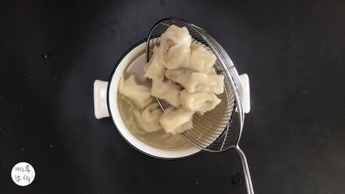

# 清汤松茸 (Consommé of Fresh Matsutake in Supreme Clear Vegetarian Broth)

## 📋 基本資訊 / Recipe Overview
- **料理名稱 (繁體)**：清湯松茸
- **料理名称 (简体)**：清汤松茸
- **English Title**：Consommé of Fresh Matsutake in Supreme Clear Vegetarian Broth
- **素食流派 / Diet**：全素 / 纯素 Vegan
- **料理分類 / Category**：02-菌菇山珍类 / 国宴极品 / 至清至鲜
- **份量 / Servings**：2 人份（位上汤盅）
- **準備時間 / Prep Time**：15 分鐘
- **烹飪時間 / Cook Time**：10 分鐘
- **總計耗時 / Total Time**：25 分鐘
- **來源 / Source**：现代中华素菜 Top 100 · [02-菌菇山珍类.md](../02-菌菇山珍类.md) 第 57 道

## 📖 菜品特色 / Description
素高汤氽新鲜松茸片，至清至鲜。国宴素席典范，清澈如水的高汤衬托出鲜松茸的旷达幽香，一口入喉，温润甘冽。

---

## 🌿 食材與調味清單 / Ingredients & Seasonings

### 主料
- 顶级新鲜松茸 2 支（约 100g，紧实未开伞为上品）

### 澄澈素高汤（吊汤底料）
- 鲜黄豆芽 150g（锅中少油干炒出香）
- 甜玉米 1/2 根（切小块）
- 优质干香菇蒂 6 个（增深层鲜香）
- 胡萝卜 1/3 根（切片提甘甜）
- 优质矿泉水 800ml
- （熬煮过滤后取澄清高汤 500ml）

### 极简点缀与调味
- 宁夏优质枸杞 4 粒（温水泡开）
- 嫩菜心嫩尖 / 豌豆苗 2 根（开水微烫）
- 顶级天然海盐 1/2 茶匙（约 2.5g）
- 白胡椒粒 2 粒（微拍裂，汤中提气）

---

## 🍳 烹飪步驟 / Step-by-Step Cooking Steps

### 步骤 1：吊制至清素高汤
1. 汤锅中加几滴油，下入洗净的黄豆芽煸炒至微发软、出豆香味。
2. 注入矿泉水 800ml，放入玉米块、胡萝卜片、干香菇蒂与 2 粒拍裂的白胡椒粒。
3. 大火煮沸，细心撇尽全部浮沫与油星，转微火加盖慢熬 40 分钟。
4. 关火，用双层密织纱布彻底过滤所有渣滓，留下一碗清澈见底、透着淡金色的极清素高汤（约 500ml）。

### 步骤 2：新鲜松茸精工切片
1. 新鲜松茸用湿厨房纸轻柔擦拭干净，削去根部硬皮泥沙。
2. 选用锋利陶瓷刀，将松茸纵向切成 2-3mm 均匀的厚片（厚片能保持脆嫩与多汁感）。

### 步骤 3：滚汤浸烫与入盅（位上法）
1. 将澄清的素高汤倒入小锅中加热至微沸（90℃-95℃），加入海盐 1/2 茶匙调匀（汤味宜极淡，以突出松茸原鲜）。
2. 取两只温热的紫砂汤盅或白瓷盖碗，分别放入切好的鲜松茸厚片、2 粒枸杞和 1 根嫩菜尖。
3. 将滚烫的清透高汤缓缓冲入盅内，立即盖紧盅盖。

### 步骤 4：静置焖浸与品尝
1. 加盖静置焖浸 3-5 分钟（或放入蒸箱微火保温蒸 3 分钟），利用高温汤汁将松茸瞬间烫至断生，挥发性松茸醇与清鲜原汁完美释放于汤中。
2. 揭盖趁热奉客，先闻其幽香扑鼻，再品清汤甘冽，最后咀嚼松茸片脆嫩弹牙。

---

## 💡 大厨秘诀 / Chef's Tips

1. **至清至简方显山珍真味**：汤色必须如纯净水般清透无油花，不夺松茸之主位，素托鲜才是最高境界。
2. **滚汤冲浸而非久煮**：松茸质地娇贵，若在沸水中长时间滚煮，其特有的挥发性香气会随蒸汽散失、肉质变老；以 95℃ 滚汤冲入加盖焖浸 3 分钟，口感最脆嫩香气最浓郁。
3. **必须选用优质矿泉水吊汤**：好水才能引出好汤，避免使用含氯自来水影响松茸天然矿质清香。

---
*食谱归档时间：2026-08-21 · 收录于 20260818-vegetarianism 本地菜谱库 (1Top 精选)*
