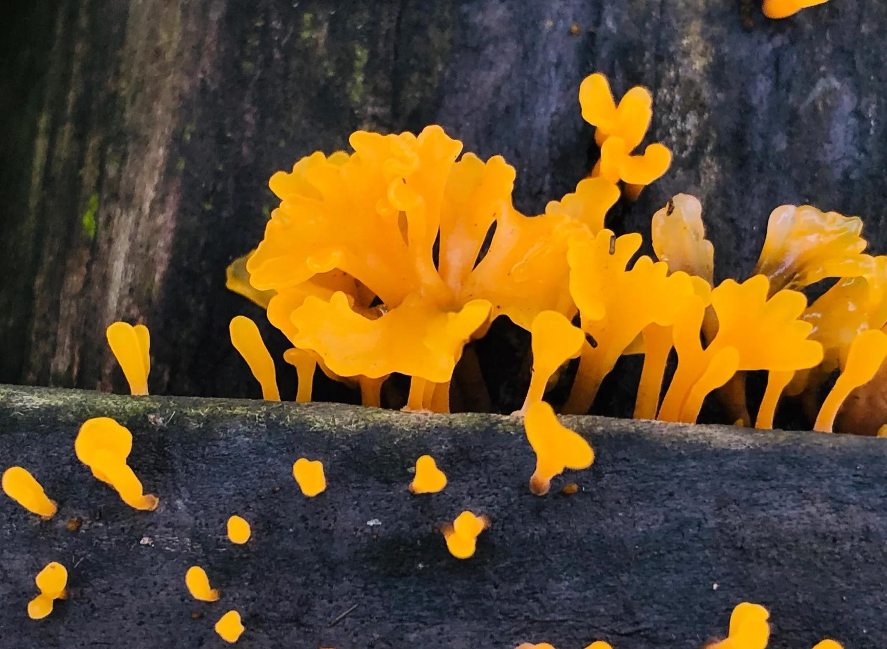

# 清润桂花耳 (Stewed Golden Osmanthus Ear Fungus with Sweet Osmanthus Broth)

## 📋 基本資訊 / Recipe Overview
- **料理名稱 (繁體)**：清潤桂花耳
- **料理名称 (简体)**：清润桂花耳
- **English Title**：Stewed Golden Osmanthus Ear Fungus with Sweet Osmanthus Broth
- **素食流派 / Diet**：全素 / 纯素 Vegan (纯净素)
- **料理分類 / Category**：02-菌菇山珍类 / 传统名斋六耳 / 晶莹润养
- **份量 / Servings**：2-3 人份
- **準備時間 / Prep Time**：4 小時 (常温水泡发与修整)
- **烹飪時間 / Cook Time**：1 小時
- **總計耗時 / Total Time**：5 小時
- **來源 / Source**：现代中华素菜 Top 100 · [02-菌菇山珍类.md](../02-菌菇山珍类.md) 第 89 道

## 📖 菜品特色 / Description
桂花耳入上素，名贵干货。（名贵黄金桂花耳甜炖或入上素，晶莹剔透。）

---

## 🌿 食材與調味清單 / Ingredients & Seasonings
### 主料
- 优质干桂花耳（金黄花耳）20g（泡发后呈晶莹橙黄色花瓣状）
- 优质干桂花 / 糖桂花 1 茶匙（约 5g）
- 宁夏枸杞 15 粒
- 鲜莲子 / 泡发干莲子 15g（去苦芯）

### 调味与炖水
- 多晶黄冰糖 35g
- 纯净水 600ml

---

## 🍳 烹飪步驟 / Step-by-Step Cooking Steps
### 步骤 1：常温泡发与细致修整
1. 干桂花耳放入碗中，注入常温凉水浸泡 3-4 小时，直至充分吸水舒展，还原成金黄透明、微带脆性的花瓣状。
2. 用剪刀仔细剪去底部的黑色硬结蒂部，流水冲洗干净。
3. 放入沸水中轻烫 30 秒，捞出沥干。

### 步骤 2：入盅文火炖煮
1. 将修整好的桂花耳与去芯莲子放入炖盅中。
2. 注入 600ml 纯净水，放入老冰糖 35g。
3. 盖严炖盅，上蒸锅大火烧开转小火，隔水文火慢炖 50 分钟至汤水微稠、桂花耳胶润弹滑。

### 步骤 3：撒入枸杞与桂花出香
1. 揭开炖盅盖，放入洗净的枸杞和干桂花（或糖桂花）。
2. 继续隔水微炖 5-8 分钟，让天然桂花的花香彻底渗透进甜汤中。
3. 关火出盅，温热或冷藏食用皆清香扑鼻。

---

## 💡 大厨秘诀 / Chef's Tips
1. **常温凉水泡发**：桂花耳属于名贵胶质菌，切忌用开水泡发以免胶质溢散软烂失却弹性，凉水泡开后肉质金黄晶亮且爽滑。
2. **剪尽硬蒂**：底部的老根硬蒂要剪得干净，入口才无杂质阻碍，尽享丝滑。
3. **后下桂花封香**：干桂花不耐久煮，过早下锅香味易挥发殆尽，起锅前 5 分钟加入能锁住馥郁清幽的花香。

---
*食谱归档时间：2026-08-21 · 收录于 20260818-vegetarianism 本地菜谱库 (1Top 精选)*
