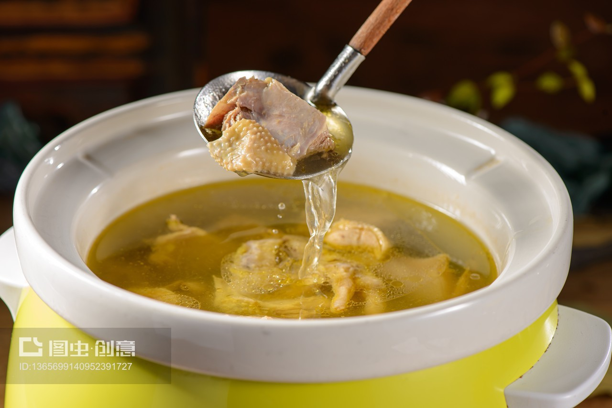

# 清炖石耳 (Double-Boiled Mountain Cliff Stone Ear Fungus Soup)

## 📋 基本資訊 / Recipe Overview
- **料理名稱 (繁體)**：清燉石耳
- **料理名称 (简体)**：清炖石耳
- **English Title**：Double-Boiled Mountain Cliff Stone Ear Fungus Soup
- **素食流派 / Diet**：全素 / 纯素 Vegan (纯净素)
- **料理分類 / Category**：02-菌菇山珍类 / 名山绝壁山珍 / 养生清补
- **份量 / Servings**：2-3 人份
- **準備時間 / Prep Time**：3 小時 (温水泡发与淘米水细刷去沙)
- **烹飪時間 / Cook Time**：1.5 小時 (隔水文火慢炖)
- **總計耗時 / Total Time**：4.5 小時
- **來源 / Source**：现代中华素菜 Top 100 · [02-菌菇山珍类.md](../02-菌菇山珍类.md) 第 87 道

## 📖 菜品特色 / Description
石耳山珍，徽、赣、寺院。（黄山/庐山悬崖野生石耳清炖，清火养生山珍。）

---

## 🌿 食材與調味清單 / Ingredients & Seasonings
### 主料
- 优质干石耳（黄山或庐山绝壁野生石耳）20g
- 鲜白果（银杏果，熟去芯）10 粒
- 鲜山药片 / 铁棍山药 60g
- 枸杞 10 粒

### 淘洗料
- 淘米水 / 细盐水 适量（洗刷石耳细沙）

### 汤底与调味料
- 澄清洗净的素高汤（甘蔗玉米素高汤）700ml
- 食盐 1/2 茶匙（约 3g）
- 白胡椒粒 5 粒（压碎）
- 生姜片 2 片（约 6g）

---

## 🍳 烹飪步驟 / Step-by-Step Cooking Steps
### 步骤 1：温水浸泡与淘米水洗沙
1. 干石耳放入 40-50℃ 温水中浸泡 2-3 小时至完全舒展柔软。
2. 倒掉泡发水，倒入浓稠淘米水，用双手轻轻揉搓石耳正反两面，去除表面附着的悬崖地衣、苔藓与微细沙粒。
3. 剪去石耳底部的坚硬硬结与根蒂，用清水反复漂洗 3-4 遍直至毫无泥沙，挤干水分，撕成适口大片。

### 步骤 2：沸水焯烫除涩
1. 锅内烧开水，放入生姜片，下入石耳片焯烫 1 分钟，捞出过凉水沥干。

### 步骤 3：入盅隔水慢炖
1. 将处理洁净的石耳片、鲜山药片、熟白果、压碎白胡椒粒一同放入陶瓷炖盅中。
2. 注入 700ml 澄清素高汤，盖严炖盅盖。
3. 蒸锅大火烧沸后放入炖盅，转小火隔水文火慢炖 1 小时 20 分钟。

### 步骤 4：调味起盅
1. 揭盖加入枸杞和 1/2 茶匙食盐，继续慢炖 10 分钟使盐味融汇。
2. 出盅趁热品尝，汤色清澈透亮，石耳脆滑爽口。

---

## 💡 大厨秘诀 / Chef's Tips
1. **淘米水揉搓净细沙**：石耳生长于名山绝壁悬崖阴湿石缝中，表面常有微细砂砾与苔藓。用温水泡透后以淘米水揉刷漂洗，是彻底洗净石耳的传统大厨秘诀。
2. **配白果山药清补**：石耳性凉味甘，素食清炖搭配性温的白果与健脾山药，相得益彰，汤味更加甘甜清润。
3. **隔水文火清炖**：隔水炖法能保持石耳特有的爽脆柔滑质感，汤水清澈见底而不浑浊。

---
*食谱归档时间：2026-08-21 · 收录于 20260818-vegetarianism 本地菜谱库 (1Top 精选)*
