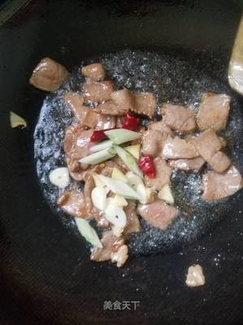

# 滑炒平菇 (Slippery Stir-Fried Oyster Mushrooms)

## 📋 基本資訊 / Recipe Overview
- **料理名稱 (繁體)**：滑炒平菇
- **料理名称 (简体)**：滑炒平菇
- **English Title**：Tender Slippery Stir-Fried Grey Oyster Mushrooms with Scallion and Carrots
- **素食流派 / Diet**：全素 / 纯素 Vegan (家常经典，不含五辛或含葱蒜可选)
- **料理分類 / Category**：02-菌菇山珍类 / 家常热炒 / 滑嫩鲜香
- **份量 / Servings**：2-3 人份
- **準備時間 / Prep Time**：10 分鐘
- **烹飪時間 / Cook Time**：6 分鐘
- **總計耗時 / Total Time**：16 分鐘
- **來源 / Source**：现代中华素菜 Top 100 · [02-菌菇山珍类.md](../02-菌菇山珍类.md) 第 69 道

## 📖 菜品特色 / Description
平菇撕小朵滑炒，家常最亲民菌菇。平菇经焯水挤干后大火滑炒，肉质柔滑多汁、软嫩爽口，配以胡萝卜与青椒提色，豉香酱汁裹满菌褶，鲜美下饭，温润可口。

---

## 🌿 食材與調味清單 / Ingredients & Seasonings
### 主料
- 新鲜优质鲜平菇 350g
### 配料
- 胡萝卜 30g（切菱形薄片）
- 青尖椒 1 个（约 40g，切菱形块）
- 大葱白 1 段（约 15g，切葱花）
- 生姜 1 片（约 5g，切末）
- 大蒜 2 瓣（切片，可选）
### 调味料与滑芡汁
- 纯酿造特级生抽 1.5 汤匙（约 22ml）
- 优质素蚝油 1 汤匙（约 15ml）
- 白糖 1/4 茶匙（约 1g，和味提鲜）
- 食盐 1/3 茶匙（约 2g）
- 白胡椒粉 1/4 茶匙
- 水淀粉（玉米淀粉 1 茶匙 + 清水 2 汤匙）
- 食用大豆油/花生油 2 汤匙

---

## 🍳 烹飪步驟 / Step-by-Step Cooking Steps
### 步骤 1：撕朵、焯水与极致挤水
1. 平菇切除根部硬结，顺着天然纹理撕成适口小朵，流水快速冲洗干净。
2. 锅中宽水烧开，加 1/2 茶匙盐，下平菇焯烫 40 秒变软捞出，投入冷水中降温。
3. **核心要诀**：捞出后用手用力攥挤平菇，彻底挤干菌褶内的水分（挤得越干，炒时越香越滑不出水）。

### 步骤 2：煸炒配料激发出香
1. 热锅倒入 2 汤匙食用油烧至五成热，下入葱花、姜末、蒜片爆香。
2. 下入胡萝卜菱形片，大火翻炒 30 秒至胡萝卜变软并渗出金黄色胡萝卜素。

### 步骤 3：大火滑炒与调味
1. 倒入彻底攥干水分的平菇，转大火猛火翻炒 1 分钟，炒至平菇微泛油光、散发浓郁菌香。
2. 下入青椒块，沿锅边烹入生抽 1.5 汤匙、素蚝油 1 汤匙，加入白糖 1/4 茶匙、食盐 1/3 茶匙和白胡椒粉，快速翻炒均匀。

### 步骤 4：勾芡滑润出锅
1. 烹入调匀的水淀粉，大火快速颠锅翻炒 15 秒，使薄芡均匀挂在平菇表面，呈现亮泽滑润质感，关火盛盘。

---

## 💡 大厨秘诀 / Chef's Tips
1. **“用力挤干水分”是不出汤的铁律**：平菇吸水力极强，焯水后若不彻底挤干，入锅遇盐即大量吐水变成“水煮平菇”，失去滑嫩焦香。
2. **沿锅边烹酱激发香气**：生抽与蚝油从锅壁滚烫处淋入，焦香瞬间释放并被平菇迅速吸附。
3. **勾薄芡赋予滑嫩口感**：薄水淀粉受热糊化后在平菇表面形成保护薄膜，既锁住内部汁水，又让平菇口感丝滑柔润。

---
*食谱归档时间：2026-08-21 · 收录于 20260818-vegetarianism 本地菜谱库 (1Top 精选)*
