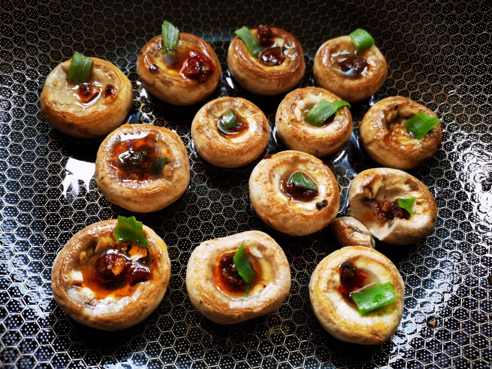

# 烤蘑菇 (Oven & Air-Fryer Roasted Whole Button Mushrooms with Natural Mushroom Broth)

## 📋 基本資訊 / Recipe Overview
- **料理名稱 (繁體)**：烤蘑菇
- **料理名称 (简体)**：烤蘑菇
- **English Title**：Oven & Air-Fryer Roasted Whole Button Mushrooms with Natural Mushroom Broth
- **素食流派 / Diet**：全素 / 纯素 Vegan (纯净素)
- **料理分類 / Category**：02-菌菇山珍类 / 现代极简低卡 / 原鲜爆汁
- **份量 / Servings**：2-3 人份
- **準備時間 / Prep Time**：5 分鐘
- **烹飪時間 / Cook Time**：8-10 分鐘 (空气炸锅) / 15 分鐘 (烤箱)
- **總計耗時 / Total Time**：15 分鐘
- **來源 / Source**：现代中华素菜 Top 100 · [02-菌菇山珍类.md](../02-菌菇山珍类.md) 第 100 道

## 📖 菜品特色 / Description
鲜蘑菇烤箱或空气炸，低卡现代家常。（整颗口蘑或平菇烤箱/空气炸锅盐黑椒烤出天然原鲜汤汁。）

---

## 🌿 食材與調味清單 / Ingredients & Seasonings
### 主料
- 新鲜圆整白口蘑 12-15 朵（选菌盖饱满圆整、未开伞的优质鲜菇）

### 极简调味（保留原汁原鲜）
- 优质初榨橄榄油（或植物油）1 汤匙（约 15ml，刷表面防干）
- 研磨海盐 / 细食盐 1/3 茶匙（约 2g，每朵蘑菇碗内撒几粒）
- 现磨黑胡椒碎 1/4 茶匙（约 1g）
- 欧芹碎 / 迷迭香碎 极少许（可选，增添清新风味）

---

## 🍳 烹飪步驟 / Step-by-Step Cooking Steps
### 步骤 1：口蘑流水轻洗与旋转去蒂
1. 挑选外形圆整肥厚的白口蘑，在流动清水下迅速冲净表面浮土，用厨房纸巾彻底擦干水分（切忌长时间浸水）。
2. 用手指捏住口蘑菌柄，轻轻左右旋转拧断并摘除菌蒂，保留一个完整的圆形凹槽小碗（菌盖碗）。

### 步骤 2：刷油与码盘（凹槽必须朝上）
1. 用油刷在口蘑的外表皮薄薄刷上一层橄榄油（锁水防干裂）。
2. 将口蘑**凹槽朝上、平稳平整**地摆入空气炸锅炸篮或垫有硅油纸的烤盘中（切勿重叠）。

### 步骤 3：点缀海盐与黑胡椒
1. 在每个口蘑朝上的凹槽小碗里，撒入 2-3 粒海盐和少许现磨黑胡椒碎（注意盐不可多，微量海盐足以促使口蘑细胞壁出水）。

### 步骤 4：高温烘烤出爆汁原汤
1. **空气炸锅法**：无需预热，设定 **180℃ 烘烤 8-10 分钟**。
2. **烤箱法**：预热至 **200℃，上下火烘烤 12-15 分钟**。
3. 烘烤至菌肉变软微黄，观察每个口蘑凹槽内积满一整碗金黄明澈、滚烫清甜的天然口蘑鲜汤时，小心取出装盘。
4. 撒上少许欧芹碎，小心端起先吮吸清甜菌汁，再品嚼柔滑菌肉。

---

## 💡 大厨秘诀 / Chef's Tips
1. **凹槽朝上绝对不可翻面**：烤口蘑的最高精髓在于蘑菇受热后自身溢出的天然“菌菇鲜汁”。摘除菌蒂后凹槽朝上放置，菌盖犹如天然小汤碗，能完整盛装所有鲜汁。
2. **微量海盐促出汁**：烤前在每个菌碗内点缀几粒海盐，渗透压能迅速促使口蘑内部多糖与水分渗出，汇聚成鲜甜无匹的天然原汤。
3. **洗后彻底擦干水分**：口蘑吸水性极强，清洗后必须用纸巾吸干表面水分，否则烤制时会产生水气稀释蘑菇原本浓醇的原汁。

---
*食谱归档时间：2026-08-21 · 收录于 20260818-vegetarianism 本地菜谱库 (1Top 精选)*
