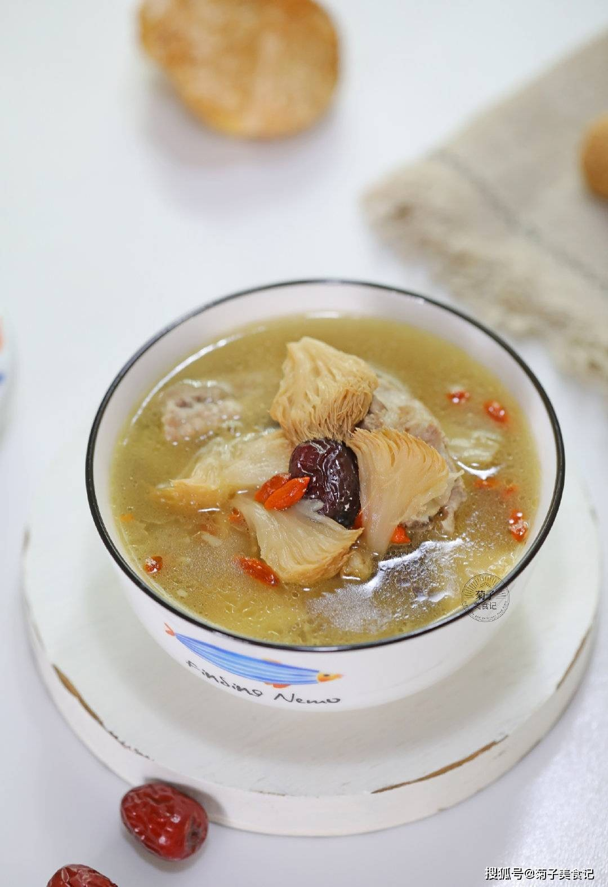

# 猴頭菇湯 (Clear Lion's Mane Mushroom and Bamboo Fungus Supreme Soup)

## 📋 基本資訊 / Recipe Overview
- **料理名稱 (繁體)**：猴頭菇湯
- **料理名称 (简体)**：猴头菇汤
- **English Title**：Clear Lion's Mane Mushroom and Bamboo Fungus Supreme Soup
- **素食流派 / Diet**：全素 / 纯素 Vegan (纯净素 / 清雅素汤)
- **料理分類 / Category**：02-菌菇山珍类 / 清雅素汤 / 筵席汤品
- **份量 / Servings**：2-3 人份
- **準備時間 / Prep Time**：25 分鐘 (含去苦泡发)
- **烹飪時間 / Cook Time**：35 分鐘
- **總計耗時 / Total Time**：60 分鐘
- **來源 / Source**：现代中华素菜 Top 100 · [02-菌菇山珍类.md](../02-菌菇山珍类.md) 第 35 道

## 📖 菜品特色 / Description
猴头配菜心或竹荪，清鲜醇厚。

---

## 🌿 食材與調味清單 / Ingredients & Seasonings
### 主料
- 优质干猴头菇 2 朵（约 30g，泡发去苦后约 130g）
- 优质干竹荪 6-8 根（约 15g）

### 配料与清甜底料
- 鲜甜玉米半根（切厚圆轮段）
- 胡萝卜半根（切厚片）
- 鲜香菇 2 朵（切厚片增香）
- 鲜嫩油菜心 4 棵（出锅前汆烫）
- 宁夏枸杞 15 粒
- 生姜 3 片

### 调味料
- 食盐 1/2 茶匙（3g）
- 白胡椒粉 1/4 茶匙（1g）
- 芝麻香油 1/4 茶匙（1.5ml，提亮增香）
- 纯净水 1200ml

---

## 🍳 烹飪步驟 / Step-by-Step Cooking Steps
### 步骤 1：猴头菇与竹荪前处理
1. 猴头菇温水浸泡软透，彻底剪除发黑硬蒂，在清水中反复揉洗挤水 6 次至水完全清澈，用力挤干撕成小朵。
2. **竹荪处理**：竹荪用淡盐水浸泡 20 分钟，洗净后剪除根部白圈与头部封闭的网盖（去怪味关键），切成 3cm 长段备用。

### 步骤 2：慢熬蔬果清甜素高汤底
1. 砂锅中加入纯净水 1200ml，放入玉米段、胡萝卜片、香菇片与生姜片。
2. 大火烧开后转中小火，加盖慢熬 15 分钟，让玉米与胡萝卜的自然果糖充分释放，熬出清甜澄澈的素汤底。

### 步骤 3：加入猴头菇与竹荪慢煲
1. 放入处理好的猴头菇小朵，中小火慢煮 12 分钟，让猴头菇充分吸纳蔬果鲜甜。
2. 放入处理好的竹荪段与枸杞，继续慢火煲煮 8 分钟至竹荪爽脆吸汁。

### 步骤 4：烫入菜心与清雅调味
1. 下入洗净的鲜嫩菜心，烫煮 1 分钟至断生碧绿。
2. 加入食盐 1/2 茶匙与白胡椒粉 1/4 茶匙调味，滴入几滴芝麻香油提亮，盛入汤碗中清雅上桌。

---

## 💡 大厨秘诀 / Chef's Tips
1. **竹荪去头去尾无异味**：干竹荪必须剪去头部封闭菌盖与尾部白圈，淡盐水浸泡洗净，方能呈现纯净清甜。
2. **玉米胡萝卜天然提鲜**：以玉米和胡萝卜慢火煮出天然植物清甜，使素汤清而不淡、鲜醇回甘。
3. **菜心出锅前一分钟烫熟**：菜心切勿久煮，最后 1 分钟下锅保持翠绿爽脆，与软滑猴头菇和爽脆竹荪形成完美层次。

---
*食谱归档时间：2026-08-21 · 收录于 20260818-vegetarianism 本地菜谱库 (1Top 精选)*
