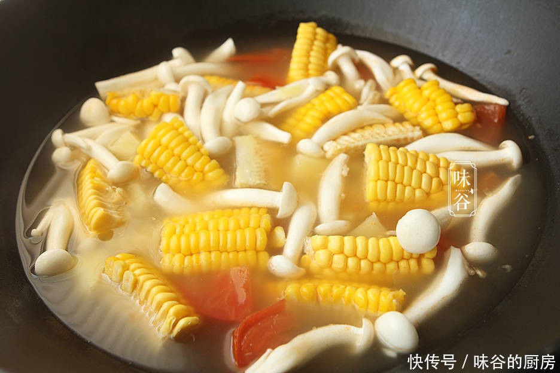

# 白玉菇汤 (Clear White Jade Mushroom and Vegetable Soup)

## 📋 基本資訊 / Recipe Overview
- **料理名稱 (繁體)**：白玉菇湯
- **料理名称 (简体)**：白玉菇汤
- **English Title**：Clear White Jade Mushroom Soup with Ripe Tomato and Silken Tofu
- **素食流派 / Diet**：全素 / 纯素 Vegan (纯素清润养生汤品，不含五辛)
- **料理分類 / Category**：02-菌菇山珍类 / 养生清汤 / 减脂素汤
- **份量 / Servings**：2-3 人份
- **準備時間 / Prep Time**：10 分鐘
- **烹飪時間 / Cook Time**：15 分鐘
- **總計耗時 / Total Time**：25 分鐘
- **來源 / Source**：现代中华素菜 Top 100 · [02-菌菇山珍类.md](../02-菌菇山珍类.md) 第 67 道

## 📖 菜品特色 / Description
白玉菇清汤或与番茄、嫩豆腐同煮，洁白清润。白玉菇如凝脂美玉，口感脆嫩无渣，番茄煸炒出自然红亮果酸沙汁，与豆腐柔嫩交融，汤色如晚霞澄亮，酸甜开胃，清润滋养。

---

## 🌿 食材與調味清單 / Ingredients & Seasonings
### 主料
- 新鲜白玉菇 150g
- 成熟多汁番茄 1 个（约 150g）
- 嫩豆腐（或南豆腐） 150g
### 辅料
- 生姜 2 片（切细丝，约 5g）
- 纯净水 / 素高汤 800ml
- 新鲜香菜碎 / 葱花（选配） 适量
### 调味料
- 食用植物油 1 茶匙（约 5ml）
- 优质食盐 1 茶匙（约 5g）
- 白胡椒粉 1/4 茶匙（约 1g）
- 芝麻香油 1/4 茶匙（出锅点香）

---

## 🍳 烹飪步驟 / Step-by-Step Cooking Steps
### 步骤 1：食材精细初加工
1. 白玉菇切去根部杂质掰散，流水洗净沥干水分；嫩豆腐切成 1.5cm 见方的小块，泡入淡盐水中静置备用（防碎去豆腥）。
2. 番茄顶部划十字花刀，开水烫 10 秒后剥去外皮，切成细腻的小番茄丁。

### 步骤 2：番茄煸炒出沙汁
1. 汤锅加热倒入 1 茶匙植物油，下入姜丝煸出香味。
2. 倒入切好的番茄丁，转中小火耐心煸炒 2-3 分钟，一边翻炒一边用锅铲轻压，直到番茄完全软化化沙、析出浓郁红亮的天然番茄汁酸香。

### 步骤 3：注入温水与炖煮菌菇
1. 向番茄锅中注入 800ml 纯净水或沸水，大火烧开，此时汤色呈现自然的鲜红透亮。
2. 下入洗净的白玉菇与沥干的嫩豆腐块，转中小火慢煮 8-10 分钟，让白玉菇的天然鲜味与氨基酸充分释放融于汤中。

### 步骤 4：出锅调味与盛盘
1. 临出锅前调入食盐 1 茶匙、白胡椒粉 1/4 茶匙，搅拌均匀。
2. 关火出锅，滴入数滴芝麻香油，撒上鲜香菜碎或葱花，盛入深汤碗即可温热享用。

---

## 💡 大厨秘诀 / Chef's Tips
1. **番茄去皮煸沙是汤鲜关键**：番茄去皮后小火慢煸出红油沙汁，天然谷氨酸与苹果酸能成倍激发白玉菇的天然鲜甜，无需添加任何味精。
2. **豆腐淡盐水浸泡防碎**：嫩豆腐切块后泡淡盐水 5 分钟，蛋白质微凝固，下锅煮制时不易破碎散烂，口感更加滑嫩。
3. **油量极简更清爽**：全汤仅用 1 茶匙油煸炒番茄，煮出的汤清澈不腻，是减脂期与日常养生的顶级素汤。

---
*食谱归档时间：2026-08-21 · 收录于 20260818-vegetarianism 本地菜谱库 (1Top 精选)*
