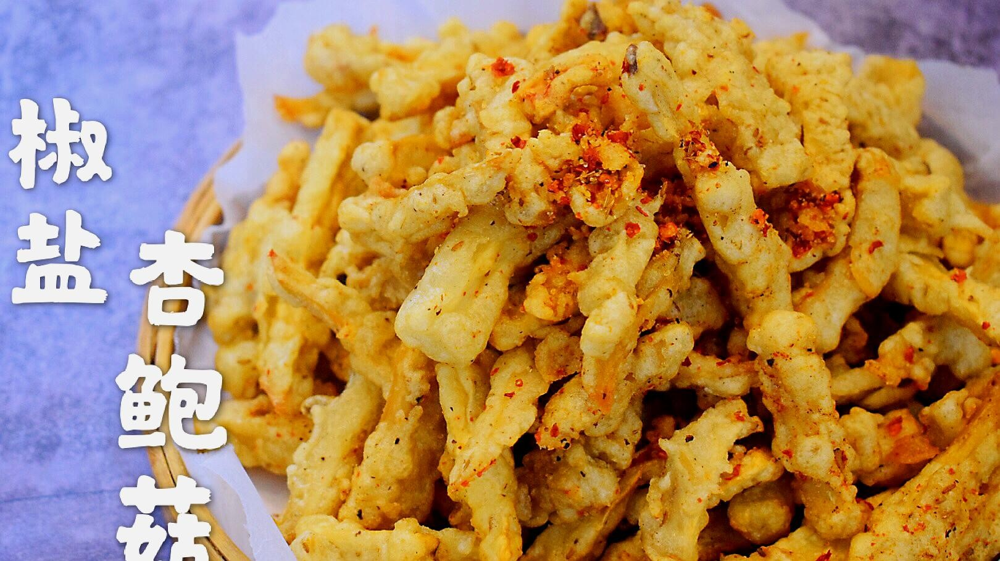

# 鹽酥杏鮑菇 (Taiwanese Crispy Salt and Pepper King Oyster Mushrooms)

## 📋 基本資訊 / Recipe Overview
- **料理名稱 (繁體)**：鹽酥杏鮑菇
- **料理名称 (简体)**：盐酥杏鲍菇
- **English Title**：Taiwanese Crispy Salt and Pepper King Oyster Mushrooms
- **素食流派 / Diet**：全素 / 纯素 Vegan (纯净素 / 无五辛；若食五辛可加炸蒜酥)
- **料理分類 / Category**：02-菌菇山珍类 / 台式夜市小吃 / 酥炸风味
- **份量 / Servings**：2-3 人份
- **準備時間 / Prep Time**：12 分鐘
- **烹飪時間 / Cook Time**：8 分鐘
- **總計耗時 / Total Time**：20 分鐘
- **來源 / Source**：现代中华素菜 Top 100 · [02-菌菇山珍类.md](../02-菌菇山珍类.md) 第 27 道

## 📖 菜品特色 / Description
气炸或油炸外酥里多汁，九层塔椒盐小吃。

---

## 🌿 食材與調味清單 / Ingredients & Seasonings
### 主料
- 鲜嫩杏鲍菇 3 根（约 350g）

### 腌制底味
- 纯酿生抽 1 汤匙（15ml）
- 五香粉 1/3 茶匙（1g）
- 白胡椒粉 1/2 茶匙（1.5g）
- 食盐 1/3 茶匙（2g）

### 裹粉材料
- 粗颗粒地瓜粉（台湾番薯粉） 80g（起酥颗粒感核心）
- 玉米淀粉 20g

### 香料与调味
- 新鲜九层塔 1 大把（约 20g，洗净用厨房纸彻底吸干水分）
- 特制台式椒盐粉 1.5 茶匙（炒香花椒粉、白胡椒粉、海盐、微量肉桂粉混合）
- 植物油 500ml（油炸实耗约 35ml）

---

## 🍳 烹飪步驟 / Step-by-Step Cooking Steps
### 步骤 1：手撕粗块与入味腌制
1. 杏鲍菇洗净擦干，用手撕成约大拇指粗细的滚刀长条块（手撕断面粗糙不规则，比刀切更容易附着粉浆与酱料）。
2. 将杏鲍菇块放入大碗中，加入生抽 1 汤匙、五香粉 1/3 茶匙、白胡椒粉 1/2 茶匙和盐 1/3 茶匙，用手充分抓匀。
3. 静置腌制 8-10 分钟，让杏鲍菇充分吸收底味并析出少许天然水分。

### 步骤 2：裹地瓜粉与静置返潮
1. 将地瓜粉与玉米淀粉混合均匀。
2. 将腌制好的杏鲍菇分次倒入粉中，抓匀裹粉，使菇块表面均匀包裹上一层白色干粉。
3. 裹粉后静置 2-3 分钟（返潮步骤），利用菇体自身渗出的微量水分使干粉牢牢吸附，防止入油锅脱粉散落。

### 步骤 3：初炸定型与复炸抢酥
1. 锅中倒入足量植物油，加热至 160-170℃（丢入少许粉屑能立刻浮起冒泡）。
2. 将杏鲍菇抖去表面多余浮粉，逐块放入油锅中。
3. 中火慢炸 3 分钟至表面定型、硬壳微黄，捞出沥油。
4. 将油温升高至 180-190℃，倒入炸好的杏鲍菇复炸 30 秒抢酥。

### 步骤 4：同炸九层塔与拌匀椒盐
1. 在复炸的最后 10 秒钟，将彻底吸干水分的九层塔叶片投入油锅中，与杏鲍菇同炸 5-8 秒至九层塔变脆透明。
2. 迅速将杏鲍菇与九层塔一同捞出，充分沥干油分。
3. 倒入大盆中，趁热撒入足量特制台式椒盐粉，快速抛颠拌匀即可趁热盛盘享用。

---

## 💡 大厨秘诀 / Chef's Tips
1. **手撕块状 + 粗粒地瓜粉**：手撕不规则截面能附着更多粗地瓜粉，炸出如台式盐酥鸡般凹凸酥脆的黄金鳞片外壳。
2. **静置返潮防脱浆**：裹粉后静置 2 分钟让粉回潮，下油锅不爆油、不掉粉，油清粉牢。
3. **九层塔必须完全擦干**：九层塔叶片有一丝水份入热油都会引起剧烈油爆，必须用多张厨房纸反复吸干后入锅瞬间炸酥。

---
*食谱归档时间：2026-08-21 · 收录于 20260818-vegetarianism 本地菜谱库 (1Top 精选)*
