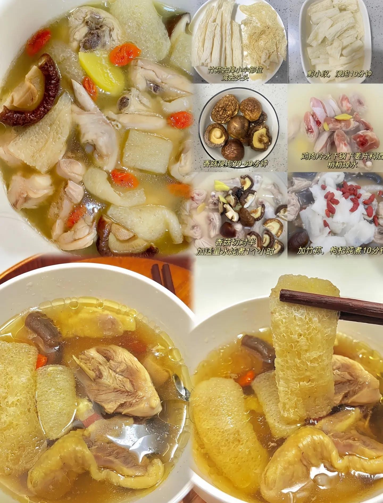

# 竹荪炖菇 (Double-Boiled Bamboo Fungus and Assorted Mushroom Soup)

## 📋 基本資訊 / Recipe Overview
- **料理名稱 (繁體)**：竹蓀燉菇
- **料理名称 (简体)**：竹荪炖菇
- **English Title**：Double-Boiled Bamboo Fungus and Trio Mushroom Nourishing Clear Soup
- **素食流派 / Diet**：全素 / 纯素 Vegan (纯素养生汤品，不含五辛)
- **料理分類 / Category**：02-菌菇山珍类 / 养生汤羹 / 清炖素汤
- **份量 / Servings**：2-3 人份
- **準備時間 / Prep Time**：25 分鐘
- **烹飪時間 / Cook Time**：30 分鐘
- **總計耗時 / Total Time**：55 分鐘
- **來源 / Source**：现代中华素菜 Top 100 · [02-菌菇山珍类.md](../02-菌菇山珍类.md) 第 62 道

## 📖 菜品特色 / Description
竹荪配香菇、白玉菇、红枣清炖，清透鲜美。竹荪吸饱多重菌菇复合原汁，网状纤维爽滑脆嫩，汤色清澈明亮如山泉，回味清甜甘润，为素膳滋补清炖汤之典范。

---

## 🌿 食材與調味清單 / Ingredients & Seasonings
### 主料
- 优质干竹荪 15g（约 6-8 朵）
- 新鲜鲜香菇 4 朵（约 80g）
- 新鲜白玉菇 100g
### 辅料 / 养生甘味
- 红枣 3 枚（去核切半）
- 优质宁夏枸杞 15 粒
- 生姜 2 片（约 6g）
- 纯净水 1000ml
### 调味品
- 优质食盐 1 茶匙（约 5g）
- 白胡椒粉 少许（约 0.5g，去寒增香）
- 冷榨芝麻香油 1/4 茶匙（选配，滴香）

---

## 🍳 烹飪步驟 / Step-by-Step Cooking Steps
### 步骤 1：食材精细初加工
1. **竹荪处理**：剪去竹荪菌盖封闭部与根托，用 40℃ 温淡盐水浸泡 20 分钟回软，洗净杂质挤干水分，切成 4-5cm 长段备用。
2. **鲜菇处理**：鲜香菇去蒂洗净切成 0.5cm 厚片；白玉菇切除根部基质掰散洗净沥干；红枣洗净去核（去核可防燥热）；枸杞温水浸泡洗净。

### 步骤 2：先炖鲜菇出底汤
1. 选用砂锅或陶瓷炖盅，注入纯净水 1000ml，放入生姜片、香菇片、白玉菇与红枣。
2. 大火烧开后，用汤勺撇去表面浮沫，盖上锅盖转小火慢炖 20 分钟，让香菇的厚重香气与白玉菇的清甜多糖充分析入汤中。

### 步骤 3：放入竹荪慢煨入味
1. 开盖下入处理好的竹荪段，用筷子轻轻压入汤汁中。
2. 继续盖上砂锅盖，保持微沸小火慢炖 10 分钟，让竹荪吸饱复合菌汤的鲜香，同时保持爽脆不散烂。

### 步骤 4：出锅调味与点缀
1. 出锅前 3 分钟撒入枸杞，调入食盐 1 茶匙和少许白胡椒粉轻轻搅拌均匀。
2. 关火出锅前可点入 2-3 滴纯芝麻香油，盛入汤碗即可趁热温润品饮。

---

## 💡 大厨秘诀 / Chef's Tips
1. **菌菇搭配做减法**：清炖汤切忌杂菌堆砌过多导致串味，以清香型竹荪为主，搭配 1-2 种鲜菇（如香菇提醇厚、白玉菇提鲜甜）最佳。
2. **竹荪后下保脆爽**：竹荪纤维娇嫩不宜久煮，先慢炖鲜菇 20 分钟出色出味，最后 10 分钟下竹荪，方能成就不软烂、脆爽如生的上乘口感。
3. **去核红枣自然回甘**：素汤不加糖精与化学鲜味剂，利用去核红枣与菌菇多糖天然协同作用，炖出甘冽清润的泉水般滋味。

---
*食谱归档时间：2026-08-21 · 收录于 20260818-vegetarianism 本地菜谱库 (1Top 精选)*
