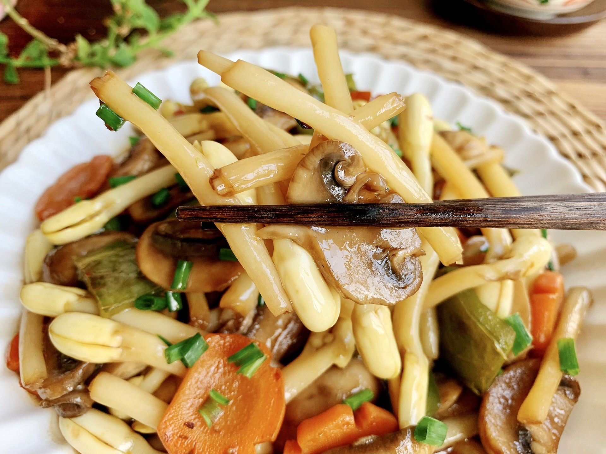

# 素炒三菇 (Sautéed Triple Mushrooms (Shiitake, Straw & Shimeji))

## 📋 基本資訊 / Recipe Overview
- **料理名稱 (繁體)**：素炒三菇
- **料理名称 (简体)**：素炒三菇
- **English Title**：Sautéed Triple Mushrooms (Shiitake, Straw & Shimeji)
- **素食流派 / Diet**：全素 / 纯素 Vegan
- **料理分類 / Category**：02-菌菇山珍类 / 菌香三重奏 / 层次丰富
- **份量 / Servings**：2-3 人份
- **準備時間 / Prep Time**：12 分鐘
- **烹飪時間 / Cook Time**：6 分鐘
- **總計耗時 / Total Time**：18 分鐘
- **來源 / Source**：现代中华素菜 Top 100 · [02-菌菇山珍类.md](../02-菌菇山珍类.md) 第 51 道

## 📖 菜品特色 / Description
香菇、草菇、白玉菇或杏鲍菇合炒，层次丰富。三种不同质地与香气的菌菇汇聚一盘，鲜滑、软糯、脆嫩兼备。

---

## 🌿 食材與調味清單 / Ingredients & Seasonings

### 主料（三菇组合）
- 鲜香菇 100g（切厚片）
- 鲜草菇 100g（对半切开，打浅十字花刀）
- 鲜白玉菇 / 蟹味菇 100g（切除根部，洗净切段）

### 配料与调味料
- 荷兰豆 / 青彩椒片 50g（配色提脆）
- 生姜 3 片（切细丝）
- 纯植物花生油 2 汤匙（约 30ml）
- 香菇素蚝油 1.5 汤匙（约 22ml）
- 优质生抽 1 汤匙（约 15ml）
- 纯酿料酒 / 素高汤 2 汤匙（约 30ml）
- 白砂糖 1/3 茶匙（约 1.5g）
- 白胡椒粉 1/4 茶匙（约 1g）
- 玉米淀粉 1 茶匙（兑水 2 汤匙成薄芡）
- 芝麻香油 1/2 茶匙（约 2.5ml）

---

## 🍳 烹飪步驟 / Step-by-Step Cooking Steps

### 步骤 1：三菇精修与焯水
1. 香菇切厚片，草菇对半切并在切面划十字刀，白玉菇洗净切成 4cm 长段；荷兰豆撕去老筋。
2. 沸水锅中加少许盐和油，下入三菇与荷兰豆焯烫 1 分钟，捞出过冷水沥干备用。

### 步骤 2：热油爆香底料
炒锅烧热倒入花生油，下入姜丝中小火煸炒 20 秒，煸出浓郁姜香。

### 步骤 3：大火猛炒三菇
1. 倒入沥干的三菇，转大火猛火快速翻炒 1 分钟，让菌体均匀受热挥发多余水汽。
2. 下入荷兰豆翻炒均匀。

### 步骤 4：烹入高汤与挂汁
1. 沿锅边烹入料酒/素高汤，调入素蚝油、生抽、白糖与白胡椒粉，大火翻炒 1 分钟入味。
2. 淋入水淀粉快速翻炒勾出透亮芡汁，淋入香油翻匀出锅装盘。

---

## 💡 大厨秘诀 / Chef's Tips

1. **三菇质地精巧搭配**：香菇提供浓郁醇香，草菇提供爆汁弹滑，白玉菇提供清甜爽脆，三种口感交织层次分明。
2. **草菇去涩不可省**：草菇必须与其他两菇一同焯水，去除泥涩味方显鲜甜。
3. **猛火急炒挂薄芡**：三菇焯水后已达八成熟，入锅只需大火猛炒 2 分钟，挂上薄芡即成，切忌久煮软烂。

---
*食谱归档时间：2026-08-21 · 收录于 20260818-vegetarianism 本地菜谱库 (1Top 精选)*
