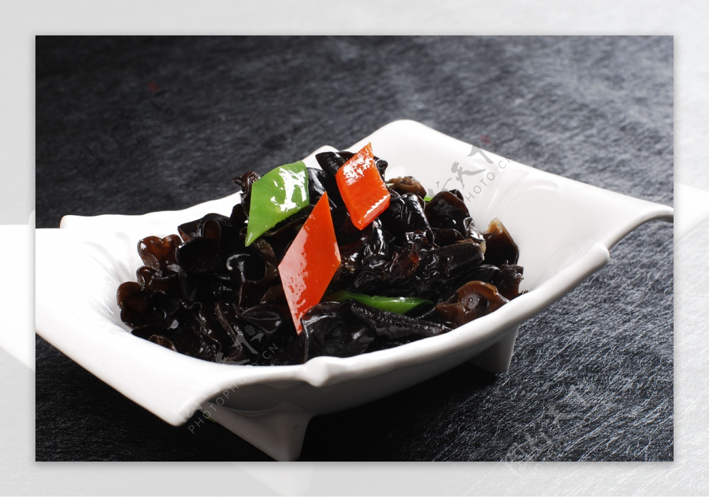

# 素炒云耳 (Stir-Fried Cloud Ear Fungus with Water Chestnuts and Peppers)

## 📋 基本資訊 / Recipe Overview
- **料理名稱 (繁體)**：素炒雲耳
- **料理名称 (简体)**：素炒云耳
- **English Title**：Stir-Fried Cloud Ear Fungus with Water Chestnuts and Peppers
- **素食流派 / Diet**：全素 / 纯素 Vegan (纯净素 / 依喜好可加蒜)
- **料理分類 / Category**：02-菌菇山珍类 / 粤式清炒 / 爽脆可口
- **份量 / Servings**：2-3 人份
- **準備時間 / Prep Time**：20 分鐘 (含冷水泡发云耳与去蒂)
- **烹飪時間 / Cook Time**：4 分鐘
- **總計耗時 / Total Time**：24 分鐘
- **來源 / Source**：现代中华素菜 Top 100 · [02-菌菇山珍类.md](../02-菌菇山珍类.md) 第 88 道

## 📖 菜品特色 / Description
云耳即木耳华南叫法，炒或凉拌。（优质小碗黑木耳/云耳快炒马蹄青椒，脆爽爽口。）

---

## 🌿 食材與調味清單 / Ingredients & Seasonings
### 主料
- 优质小碗黑木耳（干云耳）20g（冷水泡发后约 180g）
- 新鲜马蹄（荸荠）6 颗（约 90g，去皮切厚片）
- 甜青椒 1/2 个（约 40g，切菱形片）
- 红彩椒 1/2 个（约 40g，切菱形片）
- 生姜 5g（切细丝）

### 调味汁与薄芡
- 植物油 1.5 汤匙（约 22ml）
- 食盐 1/2 茶匙（约 3g）
- 香菇素蚝油 1 茶匙（约 5ml）
- 白砂糖 1/4 茶匙（约 1g）
- 素高汤 / 清水 2 汤匙（约 30ml）
- 水淀粉 1 汤匙（玉米淀粉 1/2 茶匙 + 清水 1 汤匙调匀）
- 纯芝麻香油 几滴

---

## 🍳 烹飪步驟 / Step-by-Step Cooking Steps
### 步骤 1：冷水泡发与修整焯水
1. 干云耳用常温凉水浸泡 30 分钟至完全舒展胀发，摘去根蒂撕成小朵。
2. 锅中加水烧沸，下入云耳焯烫 30 秒，迅速捞出过凉水沥干（焯水去土腥，过凉锁住脆韧）。
3. 鲜马蹄去皮洗净切成 0.3cm 薄片，彩椒切菱形片备用。

### 步骤 2：调配碗汁
1. 小碗中加入食盐 1/2 茶匙、素蚝油 1 茶匙、白糖 1/4 茶匙、素高汤 2 汤匙和水淀粉 1 汤匙，搅拌均匀成调味薄芡汁。

### 步骤 3：热油爆香姜丝
1. 炒锅烧热，倒入 1.5 汤匙植物油，下入生姜丝大火爆出香气。
2. 先下入马蹄片和彩椒片，大火快速翻炒 20 秒至断生爽脆。

### 步骤 4：急火合炒裹汁
1. 倒入沥干的云耳小朵，保持大火猛火翻炒 30 秒。
2. 快速淋入调好的碗汁，大火翻炒颠锅 10 秒，使芡汁迅速糊化并均匀包裹在云耳与马蹄表面。
3. 滴入几滴香油，翻匀亮油出锅装盘。

---

## 💡 大厨秘诀 / Chef's Tips
1. **冷水慢泡保脆嫩**：云耳（小碗耳）必须用凉水泡发，严禁开水烫发；沸水快烫 30 秒迅速过凉，能最大程度激发云耳的爽脆口感。
2. **马蹄与云耳双脆搭配**：马蹄清甜脆爽，与弹韧的黑云耳质感互补，色泽黑白红绿分明，清雅可人。
3. **预调碗汁大火急炒**：粤式清炒讲究“锅气”，提前调好芡汁，下锅瞬间大火包汁成型，防止翻炒时间过长导致马蹄出水发软。

---
*食谱归档时间：2026-08-21 · 收录于 20260818-vegetarianism 本地菜谱库 (1Top 精选)*
