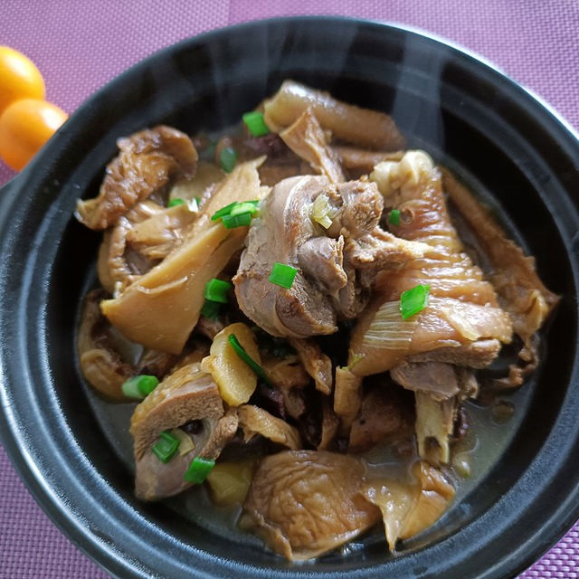

# 素炒元蘑 (Stir-Fried Changbai Mountain Mukitake Mushrooms)

## 📋 基本資訊 / Recipe Overview
- **料理名稱 (繁體)**：素炒元蘑
- **料理名称 (简体)**：素炒元蘑
- **English Title**：Stir-Fried Northern Mukitake (Late Fall Oyster) Mushrooms with Garlic and Peppers
- **素食流派 / Diet**：全素 / 纯素 Vegan (长白山名贵山珍，不含五辛或含葱蒜可选)
- **料理分類 / Category**：02-菌菇山珍类 / 东北山珍 / 肥厚鲜滑
- **份量 / Servings**：2-3 人份
- **準備時間 / Prep Time**：15 分鐘
- **烹飪時間 / Cook Time**：6 分鐘
- **總計耗時 / Total Time**：21 分鐘
- **來源 / Source**：现代中华素菜 Top 100 · [02-菌菇山珍类.md](../02-菌菇山珍类.md) 第 76 道

## 📖 菜品特色 / Description
长白山元蘑（冻蘑）肉质肥厚滑炒，北方山珍。元蘑生长于长白山林区深秋寒冬，肉质紧实肥厚，滑嫩多汁似鲍片。大火爆炒葱蒜青红椒，山野原香浓烈，鲜滑弹牙。

---

## 🌿 食材與調味清單 / Ingredients & Seasonings
### 主料
- 新鲜元蘑（或冷冻元蘑/水发干元蘑） 300g
- 青尖椒 1 个（约 40g，切菱形块）
- 红甜椒 1/2 个（约 30g，切菱形块）
### 辅料
- 大葱花 10g
- 大蒜末 15g（约 4 瓣）
- 生姜片 5g
### 调味料与薄芡
- 纯酿造特级生抽 1.5 汤匙（约 22ml）
- 优质素蚝油 1 汤匙（约 15ml）
- 白糖 1/3 茶匙（约 1.5g）
- 食盐 1/3 茶匙（约 2g，临出锅放）
- 白胡椒粉 1/4 茶匙
- 水淀粉（玉米淀粉 1 茶匙 + 清水 1.5 汤匙）
- 熟大豆油/植物油 2 汤匙

---

## 🍳 烹飪步驟 / Step-by-Step Cooking Steps
### 步骤 1：元蘑解冻与焯水挤干
1. 若使用冻元蘑，需提前自然解冻；顺着纹理撕成适口大片。
2. 锅中烧沸水，下入元蘑片焯烫 1 分钟去除冻制杂味，捞出冲凉后**用双手用力攥干水分**（元蘑肉厚多孔，挤干水分炒制才香滑不出水）。

### 步骤 2：爆香葱姜蒜底油
1. 热锅倒入 2 汤匙大豆油烧至六成热，下入葱花、姜片和一半蒜末，大火爆出浓郁香气。

### 步骤 3：大火煸炒元蘑透亮
1. 倒入攥干的元蘑片，保持全程大火快速猛炒 2 分钟，将元蘑表面的残余水汽彻底炒干，直至元蘑由生涩转为油润光亮、香气溢出。

### 步骤 4：下彩椒调味出锅
1. 下入青红椒块，沿锅边烹入生抽 1.5 汤匙、素蚝油 1 汤匙与白糖 1/3 茶匙翻炒 30 秒至青椒断生。
2. 加入食盐 1/3 茶匙、白胡椒粉与剩余的一半蒜末翻炒均匀，淋入水淀粉薄芡大火翻炒 15 秒收汁亮油装盘。

---

## 💡 大厨秘诀 / Chef's Tips
1. **彻底挤干水分保紧实**：冻元蘑解冻后含水极重，焯水后用力攥干水分是防止炒成“烂炖蘑菇”的绝招，炒出来肉质弹牙。
2. **元蘑吸油宜油润大火**：元蘑肉厚，烹炒油量宜比普通叶菜略多，全程大火猛炒使油脂充分包裹菌体，滑而不腻。
3. **盐临出锅再放**：过早放盐会导致元蘑细胞壁破裂大量出水，出锅前调盐能保持元蘑饱满多汁的肥美口感。

---
*食谱归档时间：2026-08-21 · 收录于 20260818-vegetarianism 本地菜谱库 (1Top 精选)*
