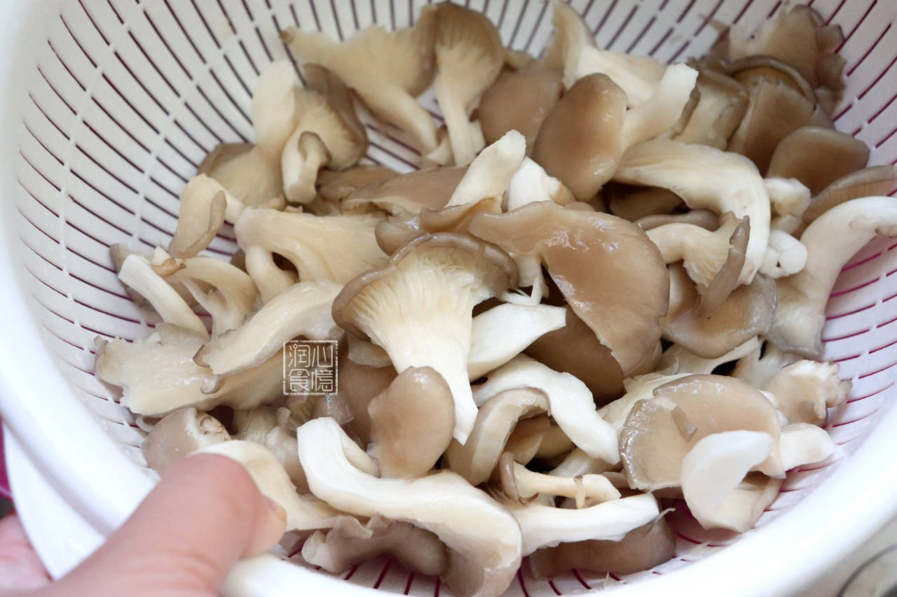

# 素炒凤尾菇 (Stir-Fried Phoenix Oyster Mushrooms with Veggies)

## 📋 基本資訊 / Recipe Overview
- **料理名稱 (繁體)**：素炒鳳尾菇
- **料理名称 (简体)**：素炒凤尾菇
- **English Title**：Stir-Fried Phoenix Mushroom with Sweet Peppers and Crispy Greens
- **素食流派 / Diet**：全素 / 纯素 Vegan (家常经典小炒，不含五辛)
- **料理分類 / Category**：02-菌菇山珍类 / 家常快炒 / 清鲜细腻
- **份量 / Servings**：2-3 人份
- **準備時間 / Prep Time**：8 分鐘
- **烹飪時間 / Cook Time**：5 分鐘
- **總計耗時 / Total Time**：13 分鐘
- **來源 / Source**：现代中华素菜 Top 100 · [02-菌菇山珍类.md](../02-菌菇山珍类.md) 第 72 道

## 📖 菜品特色 / Description
凤尾菇快炒时蔬，口感细腻。凤尾菇菌柄短小、菌肉柔嫩细致，搭配脆甜彩椒与生姜快炒，鲜甜滑润，清香怡人，口感比平菇更显温润清雅。

---

## 🌿 食材與調味清單 / Ingredients & Seasonings
### 主料
- 新鲜凤尾菇 300g
- 青甜椒 1 个（约 50g）
- 红甜椒 1/2 个（约 30g）
### 辅料
- 生姜 1 小块（约 6g，切姜丝或姜末）
- 小葱段 1 根（约 10g，可选）
### 调味料与薄芡
- 特级生抽 1 汤匙（约 15ml）
- 优质素蚝油 1 汤匙（约 15ml）
- 白糖 1/4 茶匙（约 1g）
- 食盐 1/3 茶匙（约 2g）
- 白胡椒粉 少许
- 水淀粉（玉米淀粉 1 茶匙 + 清水 1.5 汤匙）
- 食用植物油 1.5 汤匙

---

## 🍳 烹飪步驟 / Step-by-Step Cooking Steps
### 步骤 1：食材处理与轻焯水
1. 凤尾菇去根切除杂质，顺纹理撕成中等小朵，流水轻柔冲洗净灰尘。
2. 锅中烧开水，下入凤尾菇焯水 30 秒至软，捞出过凉水，用手轻轻攥去大半水分（凤尾菇娇嫩，动作宜轻柔防碎）。
3. 青红椒洗净切菱形片备用。

### 步骤 2：热油炝锅炒配菜
1. 锅烧热倒入 1.5 汤匙植物油，下入生姜丝爆出清香。
2. 下入青红甜椒片，大火翻炒 30 秒至断生飘香。

### 步骤 3：合炒凤尾菇与调味
1. 倒入沥干的凤尾菇，保持大火猛火翻炒 1 分钟。
2. 沿锅边淋入生抽 1 汤匙、素蚝油 1 汤匙，加入白糖 1/4 茶匙、食盐 1/3 茶匙和白胡椒粉翻炒均匀入味。

### 步骤 4：勾薄芡出锅
1. 烹入调好的薄水淀粉，大火翻炒 10 秒收汁挂味，关火装盘即可。

---

## 💡 大厨秘诀 / Chef's Tips
1. **手撕适度轻攥水**：凤尾菇肉质比普通平菇更纤细脆弱，不可用力揉搓，轻轻攥去水分保持菇肉的完整滑顺。
2. **大火短时快炒**：全过程控制在 5 分钟内，避免长时间翻炒导致菌肉出水绵软。
3. **薄芡锁住清甜汁水**：淋入微量水淀粉能让生抽素蚝油的鲜味轻薄包裹在凤尾菇表面，滋润顺喉。

---
*食谱归档时间：2026-08-21 · 收录于 20260818-vegetarianism 本地菜谱库 (1Top 精选)*
