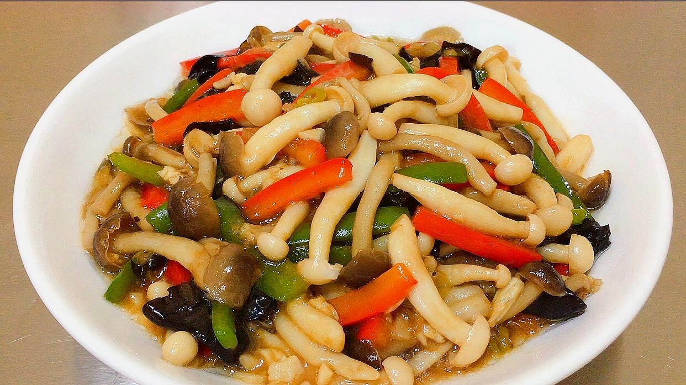

# 素炒双菇 (Sautéed Dual Mushrooms (Fresh Shiitake & Button Mushrooms))

## 📋 基本資訊 / Recipe Overview
- **料理名稱 (繁體)**：素炒雙菇
- **料理名称 (简体)**：素炒双菇
- **English Title**：Sautéed Dual Mushrooms (Fresh Shiitake & Button Mushrooms)
- **素食流派 / Diet**：全素 / 纯素 Vegan
- **料理分類 / Category**：02-菌菇山珍类 / 双重鲜香 / 经典快炒
- **份量 / Servings**：2-3 人份
- **準備時間 / Prep Time**：10 分鐘
- **烹飪時間 / Cook Time**：6 分鐘
- **總計耗時 / Total Time**：16 分鐘
- **來源 / Source**：现代中华素菜 Top 100 · [02-菌菇山珍类.md](../02-菌菇山珍类.md) 第 50 道

## 📖 菜品特色 / Description
香菇配鲜蘑菇或秀珍菇合炒，双重鲜味。香菇浓郁深沉，鲜蘑滑脆多汁，两菌互补，复合鲜香浓郁诱人。

---

## 🌿 食材與調味清單 / Ingredients & Seasonings

### 主料
- 鲜香菇 150g（去蒂切厚片）
- 鲜口蘑（白蘑菇 / 秀珍菇） 150g（切厚片）
- 青红甜椒 各 1/4 个（切菱形片配色）

### 配料与调味
- 生姜 3 片（切细丝）
- 花生油 2 汤匙（约 30ml）
- 香菇素蚝油 1.5 汤匙（约 22ml）
- 优质生抽 1 汤匙（约 15ml）
- 白砂糖 1/3 茶匙（约 1.5g）
- 白胡椒粉 1/4 茶匙（约 1g）
- 素高汤 / 清水 3 汤匙（约 45ml）
- 玉米淀粉 1 茶匙（兑水 2 汤匙薄芡）
- 芝麻香油 1/2 茶匙（约 2.5ml）

---

## 🍳 烹飪步驟 / Step-by-Step Cooking Steps

### 步骤 1：双菇预处理与飞水
1. 香菇切去老蒂，洗净切 3-4mm 厚片；口蘑洗净切厚片；青红椒切菱形片。
2. 锅中烧开宽水，加入少许盐，下入双菇焯水 1 分钟捞出，充分沥干水分（双菇过水可去除生涩味，下锅翻炒时不缩水不脱浆）。

### 步骤 2：爆香姜丝与高温煸炒
1. 炒锅烧热倒入花生油，下入姜丝小火爆香至微黄。
2. 倒入沥干水分的双菇，转大火猛火翻炒 1.5-2 分钟，逼出双菇的复合焦香。

### 步骤 3：调味煨烧入味
1. 下入青红椒片翻炒 30 秒断生。
2. 调入素蚝油 1.5 汤匙、生抽 1 汤匙、白糖 1/3 茶匙、白胡椒粉与素高汤 3 汤匙。
3. 大火翻炒煨烧 1 分钟，让香菇与口蘑充分吸收调味汁。

### 步骤 4：勾芡与淋油出锅
1. 淋入调匀的水淀粉，大火快速颠翻收汁，使浓汁紧密包裹在每一片菌菇上。
2. 淋入香油提亮增香，翻匀出锅装盘。

---

## 💡 大厨秘诀 / Chef's Tips

1. **双菇互补法则**：鲜香菇提供厚重的木质香气与软糯质感，口蘑/秀珍菇提供清脆水润与多汁感，两种菌菇结合鲜味呈几何级倍增。
2. **焯水后彻底沥干**：菌菇焯水后多余水分要沥净，入锅才能在高温热油下迅速产生美拉德香气。
3. **素蚝油紧汁包裹**：素蚝油带有香菇精华提取物，能强化双菇风味，薄芡包裹让口感格外滑嫩。

---
*食谱归档时间：2026-08-21 · 收录于 20260818-vegetarianism 本地菜谱库 (1Top 精选)*
