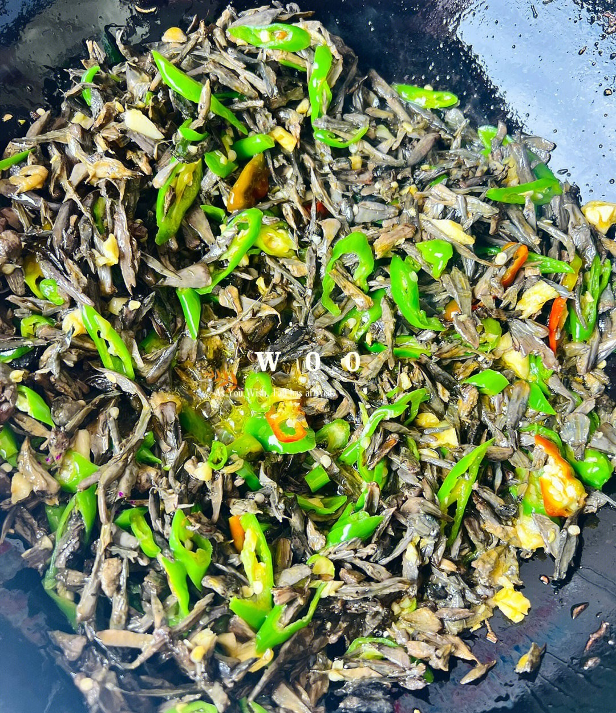

# 素炒干巴菌 (Stir-Fried Thelephora Ganbajun Mushroom with Green Chili)

## 📋 基本資訊 / Recipe Overview
- **料理名稱 (繁體)**：素炒乾巴菌
- **料理名称 (简体)**：素炒干巴菌
- **English Title**：Stir-Fried Thelephora Ganbajun Mushroom with Green Chili
- **素食流派 / Diet**：全素 / 纯素 Vegan (含蒜五辛素；依戒律可去蒜做纯净素)
- **料理分類 / Category**：02-菌菇山珍类 / 云南野生菌珍馐 / 滇味热炒
- **份量 / Servings**：2-3 人份
- **準備時間 / Prep Time**：20 分鐘 (含细致撕菌与面粉吸沙淘洗)
- **烹飪時間 / Cook Time**：6 分鐘
- **總計耗時 / Total Time**：26 分鐘
- **來源 / Source**：现代中华素菜 Top 100 · [02-菌菇山珍类.md](../02-菌菇山珍类.md) 第 81 道

## 📖 菜品特色 / Description
云南名菌，椒盐或青椒炒。（云南野生菌之王，撕丝配青椒蒜末大火快炒，幽香绝伦。）

---

## 🌿 食材與調味清單 / Ingredients & Seasonings
### 主料
- 新鲜干巴菌 250g（亦可用优质干巴菌干品 50g 充分泡发）
- 云南皱皮青椒 / 螺丝椒 3 根（约 80g，斜切丝）
- 红美人椒 1 根（约 15g，切丝配色）
- 大蒜 6 瓣（约 25g，切粗末）

### 清洗辅助料（面粉吸附法）
- 面粉（中筋或低筋）3 汤匙（约 30g）
- 清水 适量

### 调味料
- 优质植物油（或熟菜籽油）2 汤匙（约 30ml）
- 食盐 1 茶匙（约 5g，干巴菌喜咸，微重盐能充分激发菌香）
- 白胡椒粉 1/4 茶匙（约 1g）
- 素高汤 / 清水 1 汤匙（约 15ml，润锅用）

---

## 🍳 烹飪步驟 / Step-by-Step Cooking Steps
### 步骤 1：小刀刮泥与手工细撕
1. 用小刀仔细刮去干巴菌根部附着的泥土、松针和枯草叶。
2. 顺着菌体纹理将其耐心地撕成细条（撕得越细越易洗净泥沙且易炒透入味）。

### 步骤 2：面粉揉吸法彻底除沙
1. 将撕好的干巴菌放入大盆中，撒入 3 汤匙干面粉，用双手轻轻抓揉 1-2 分钟，利用面粉黏性吸附菌褶缝隙中的细微泥沙。
2. 注入清水轻轻淘洗，捞出换水，连续换水淘洗 4-5 遍直至水质完全清澈、盆底无任何沙粒沉淀。
3. 将洗净的干巴菌捞出，用双手用力彻底挤干多余水分（务必挤干，否则入锅易出水发黏）。

### 步骤 3：无油干煸出水汽与幽香
1. 净锅烧热，不放一滴油，将挤干水分的干巴菌倒入热锅中。
2. 保持中火耐心翻炒煸烤 2-3 分钟，逼出干巴菌内部残存的微量水汽，直至锅中升腾起干巴菌特有的浓郁干燥松木香气，盛出备用。

### 步骤 4：热油爆香与大火合炒
1. 锅内倒入 2 汤匙菜籽油烧至六成热，下入蒜末小火煸出蒜香（切勿炒焦）。
2. 下入青红椒丝，转大火快速翻炒 15 秒至断生透香。
3. 倒入煸干透香的干巴菌丝，保持大火急速翻炒 1 分钟，让辛辣椒香与油脂完全渗入菌丝内部。
4. 撒入 1 茶匙食盐、1/4 茶匙白胡椒粉，沿锅边淋入 1 汤匙素高汤激发出锅气，迅速颠锅翻炒 10 秒，亮油出锅装盘。

---

## 💡 大厨秘诀 / Chef's Tips
1. **面粉干搓吸沙法**：干巴菌生于松林腐殖质中，缝隙极易夹带泥沙松针。切忌直接水泡，必须先撒干面粉轻轻揉搓带走杂质，再多次换水洗至无沙。
2. **先干煸后加油炒**：干巴菌含水量如果过大，直接下油锅会导致菌体变软发水。先白锅无油慢煸去水汽，能让菌丝紧致弹韧、菌香暴增。
3. **重油大火与微重盐**：干巴菌素有“野生菌之王”之称，其香气靠高温油脂与足够的盐分激发。火候要猛，盐味要透，才能炒出绝妙的松木幽香。

---
*食谱归档时间：2026-08-21 · 收录于 20260818-vegetarianism 本地菜谱库 (1Top 精选)*
