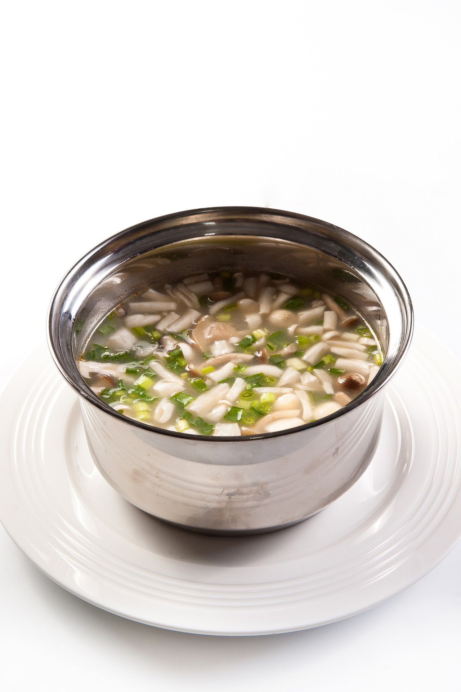

# 素炒杂菌 (Sautéed Assorted Wild & Cultivated Mushrooms with Crispy Aromatics)

## 📋 基本資訊 / Recipe Overview
- **料理名稱 (繁體)**：素炒雜菌
- **料理名称 (简体)**：素炒杂菌
- **English Title**：Sautéed Assorted Wild & Cultivated Mushrooms with Crispy Aromatics
- **素食流派 / Diet**：全素 / 纯素 Vegan（五辛素含蒜；纯素以生姜丝、青红椒丝快炒）
- **料理分類 / Category**：02-菌菇山珍类 / 现代家庭 / 镬气百鲜
- **份量 / Servings**：3-4 人份
- **準備時間 / Prep Time**：12 分鐘
- **烹飪時間 / Cook Time**：6 分鐘
- **總計耗時 / Total Time**：18 分鐘
- **來源 / Source**：现代中华素菜 Top 100 · [02-菌菇山珍类.md](../02-菌菇山珍类.md) 第 52 道

## 📖 菜品特色 / Description
多种鲜菌菇大火合炒，现代家庭高频健康菜。汇集多种菌鲜，镬气升腾，脆爽多汁，营养全面。

---

## 🌿 食材與調味清單 / Ingredients & Seasonings

### 主料（杂菌包组合）
- 鲜杏鲍菇 100g（切细长条）
- 鲜蟹味菇 80g（去根撕开）
- 鲜白玉菇 80g（去根撕开）
- 鲜香菇 60g（切片）
- 鲜金针菇 60g（切去根部撕小束）
- 水发黑木耳 30g（撕小朵）

### 配料与调味
- 大蒜 3 瓣（切细末；纯素用姜丝 8g 替代）
- 红甜椒 1/3 个（切细丝配色）
- 青线椒 1 根（切细丝微辣提味）
- 植物花生油 2.5 汤匙（约 37ml）
- 优质生抽 1.5 汤匙（约 22ml）
- 香菇素蚝油 1 汤匙（约 15ml）
- 现磨黑胡椒碎 1/2 茶匙（约 2g，关键野性风味）
- 海盐 1/2 茶匙（约 2.5g）
- 白砂糖 1/3 茶匙（约 1.5g）
- 芝麻香油 1/2 茶匙（约 2.5ml）

---

## 🍳 烹飪步驟 / Step-by-Step Cooking Steps

### 步骤 1：杂菌改刀与沥水
1. 杏鲍菇切成长条，香菇切厚片，蟹味菇、白玉菇、金针菇去根洗净，木耳撕小朵。
2. 锅中水烧沸加 1 茶匙盐，将所有杂菌和木耳倒入焯水 1 分钟。
3. 捞出后用漏勺用力压干多余水分，再用厨房纸吸去表面水汽（此步是保证爆炒干爽有镬气的核心）。

### 步骤 2：爆炒底香
炒锅烧至大热，倒入植物油，下入蒜末（或姜丝）与青红椒丝，大火爆香 10 秒。

### 步骤 3：猛火煸炒杂菌
1. 倒入吸干水分的杂菌，保持大火猛火翻炒 1.5-2 分钟，煸出水汽，逼出复合菌油香气。
2. 沿锅边烹入生抽 1.5 汤匙与素蚝油 1 汤匙，大火翻炒上色提鲜。

### 步骤 4：黑椒增香与出锅
1. 撒入现磨黑胡椒碎、海盐与少许白糖，大火翻炒 20 秒，让黑胡椒的热烈香气与杂菌深层风味交融。
2. 淋入少许香油翻匀，带有浓烈锅气立即盛盘出锅。

---

## 💡 大厨秘诀 / Chef's Tips

1. **杂菌形态粗细一致**：杏鲍菇切条、蟹味菇整条，保持受热与成熟度同步，成菜卖相整齐。
2. **焯水后用力压干水分**：杂菌吸水性强，焯水后若水分残留过多，入锅会变成“煮杂菌”，丧失焦香镬气。
3. **现磨黑胡椒点睛**：黑胡椒中的胡椒碱与多种菌菇的氨基酸结合，能激发出类似森林野山珍的诱人风味。

---
*食谱归档时间：2026-08-21 · 收录于 20260818-vegetarianism 本地菜谱库 (1Top 精选)*
