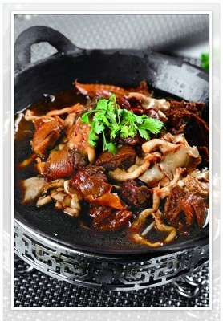

# 素炒榆黄蘑 (Stir-Fried Golden Oyster Mushrooms / Yellow Elm Mushrooms)

## 📋 基本資訊 / Recipe Overview
- **料理名稱 (繁體)**：素炒榆黃蘑
- **料理名称 (简体)**：素炒榆黄蘑
- **English Title**：Stir-Fried Golden Oyster Mushrooms with Green Peppers (Northeast Mountain Style)
- **素食流派 / Diet**：全素 / 纯素 Vegan (东北特色山珍，含葱蒜可选)
- **料理分類 / Category**：02-菌菇山珍类 / 关东山珍 / 金黄鲜嫩
- **份量 / Servings**：2-3 人份
- **準備時間 / Prep Time**：10 分鐘
- **烹飪時間 / Cook Time**：5 分鐘
- **總計耗時 / Total Time**：15 分鐘
- **來源 / Source**：现代中华素菜 Top 100 · [02-菌菇山珍类.md](../02-菌菇山珍类.md) 第 73 道

## 📖 菜品特色 / Description
金顶榆黄蘑配青椒，东北特色金黄山珍。榆黄蘑色泽金黄如玉、菌香清幽带坚果甜韵，与青尖椒大火爆炒，清脆滑嫩，色泽亮丽悦目，东北林海山珍风味醇正。

---

## 🌿 食材與調味清單 / Ingredients & Seasonings
### 主料
- 新鲜金顶榆黄蘑（黄金菇） 300g
- 东北青尖椒（或螺丝椒） 2 根（约 60g，切丝）
### 辅料
- 大葱花 10g
- 大蒜末 3 瓣（约 10g，可选）
- 红椒丝 10g（配色点缀）
### 调味品
- 纯酿造特级生抽 1 汤匙（约 15ml）
- 优质素蚝油 1/2 汤匙（约 7.5ml，少放保持金黄色泽）
- 食盐 1/2 茶匙（约 2.5g）
- 白胡椒粉 1/4 茶匙
- 熟大豆油 / 菜籽油 1.5 汤匙（约 22ml）

---

## 🍳 烹飪步驟 / Step-by-Step Cooking Steps
### 步骤 1：榆黄蘑精细摘洗与速焯
1. 榆黄蘑摘除根部木质硬蒂，轻轻撕成小朵，在流动清水下快速冲洗菌褶浮尘（切勿浸泡防吸水失色）。
2. 锅中烧水加 1/2 茶匙盐，水沸后下入榆黄蘑快速焯烫 20 秒，捞出后用厨房纸轻压吸干多余水分。

### 步骤 2：热油爆香葱蒜
1. 热锅倒入熟大豆油 1.5 汤匙，下入葱花和蒜末，中大火爆出地道东北家常葱蒜香。

### 步骤 3：大火猛炒榆黄蘑
1. 转大火下入吸干水分的榆黄蘑，猛火快速翻炒 1 分钟，炒至菌体边缘泛出微黄焦香、释放出类似坚果的天然香气。

### 步骤 4：下青椒调味出锅
1. 下入青尖椒丝与红椒丝，淋入生抽 1 汤匙、素蚝油 1/2 汤匙，撒入食盐 1/2 茶匙和白胡椒粉。
2. 大火快速颠锅翻炒 20-30 秒至青椒断生，汁水收干变清亮，即可装盘盛出。

---

## 💡 大厨秘诀 / Chef's Tips
1. **焯水 20 秒控水是锁色防软关键**：榆黄蘑质地细嫩，焯水超过 30 秒会失去脆嫩度；焯后吸干水分大火翻炒，菌色金黄亮丽不发黑。
2. **调味宜淡保持原色原味**：榆黄蘑清甜高雅，切忌加入老抽等浓重深色酱汁，少许生抽配素蚝油即可衬托其天然金黄与纯正山珍香。
3. **高温快炒激发天然坚果香**：全程保持大火，利用高温美拉德反应爆发出金顶侧耳特有的山林清幽香韵。

---
*食谱归档时间：2026-08-21 · 收录于 20260818-vegetarianism 本地菜谱库 (1Top 精选)*
