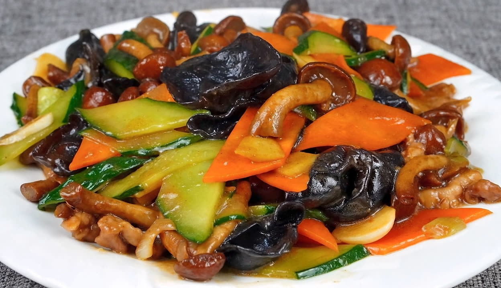

# 素炒滑子菇 (Stir-Fried Nameko Mushrooms with Peppers)

## 📋 基本資訊 / Recipe Overview
- **料理名稱 (繁體)**：素炒滑子菇
- **料理名称 (简体)**：素炒滑子菇
- **English Title**：Stir-Fried Slippery Nameko Mushrooms with Sweet Bell Peppers and Carrots
- **素食流派 / Diet**：全素 / 纯素 Vegan (东北家常素炒，不含五辛或含葱蒜可选)
- **料理分類 / Category**：02-菌菇山珍类 / 东北风味 / 爽滑可口
- **份量 / Servings**：2-3 人份
- **準備時間 / Prep Time**：10 分鐘
- **烹飪時間 / Cook Time**：6 分鐘
- **總計耗時 / Total Time**：16 分鐘
- **來源 / Source**：现代中华素菜 Top 100 · [02-菌菇山珍类.md](../02-菌菇山珍类.md) 第 74 道

## 📖 菜品特色 / Description
东北滑子菇焯水滑炒，滑润可口。滑子菇自带天然多糖丰富黏液，质地脆嫩滑溜，搭配青椒与胡萝卜快炒，调入薄水淀粉让咸鲜豉汁紧附菇身，滑润适口，鲜美开胃。

---

## 🌿 食材與調味清單 / Ingredients & Seasonings
### 主料
- 新鲜滑子菇（光帽鳞伞/滑菇） 300g
### 配料
- 青尖椒 1 个（约 40g，切小块）
- 胡萝卜片 30g（切菱形薄片）
- 大葱白花 10g
- 大蒜末 10g（可选）
### 调味料与薄芡
- 纯酿造特级生抽 1.5 汤匙（约 22ml）
- 优质素蚝油 1 汤匙（约 15ml）
- 白糖 1/3 茶匙（约 1.5g，提鲜中和）
- 食盐 1/3 茶匙（约 2g）
- 白胡椒粉 1/4 茶匙
- 水淀粉（玉米淀粉 1 茶匙 + 清水 1.5 汤匙）
- 食用大豆油/植物油 1.5 汤匙

---

## 🍳 烹飪步驟 / Step-by-Step Cooking Steps
### 步骤 1：滑子菇清洗与科学焯水
1. 滑子菇用剪刀剪去根部木质杂质，放在流水下轻柔冲净表层浮灰（**注意**：表面天然多糖黏液是其滑嫩精华，切勿用力搓洗）。
2. 锅中宽水烧开，加入 1/2 茶匙盐，下入滑子菇焯水 1-1.5 分钟去除生涩气味。
3. 捞出后迅速放入冷水中过凉，沥干水分备用。

### 步骤 2：爆香葱蒜与炒胡萝卜
1. 锅中倒入 1.5 汤匙食用油烧至五成热，下入葱花、蒜末爆香。
2. 先下入胡萝卜片，大火翻炒 30 秒至变软断生。

### 步骤 3：合炒滑子菇与青椒
1. 倒入沥干水分的滑子菇与青椒块，转大火猛火翻炒 1 分钟，让滑子菇受热均匀。

### 步骤 4：调味勾芡出锅
1. 沿锅边淋入生抽 1.5 汤匙、素蚝油 1 汤匙，加入白糖 1/3 茶匙、食盐 1/3 茶匙和白胡椒粉翻炒入味。
2. 淋入调匀的薄水淀粉，快速翻炒 15 秒使芡汁与菇身自带的多糖黏液乳化合一，晶莹油亮包裹菇身，关火装盘。

---

## 💡 大厨秘诀 / Chef's Tips
1. **保留滑子菇黏液营养**：滑子菇表面的滑溜黏液是核酸和多糖类营养物质，清洗时切忌用盐搓洗掉，轻冲即净。
2. **焯水 1-1.5 分钟去涩定型**：滑子菇必须焯水熟化并去除杂味，过凉水沥干后再炒，口感脆爽滑溜且不浑浊。
3. **薄芡合一增加挂味**：滑子菇表面光滑不易附着调料，微量水淀粉勾薄芡能让调味汁紧紧包裹，入口更加浓郁鲜滑。

---
*食谱归档时间：2026-08-21 · 收录于 20260818-vegetarianism 本地菜谱库 (1Top 精选)*
