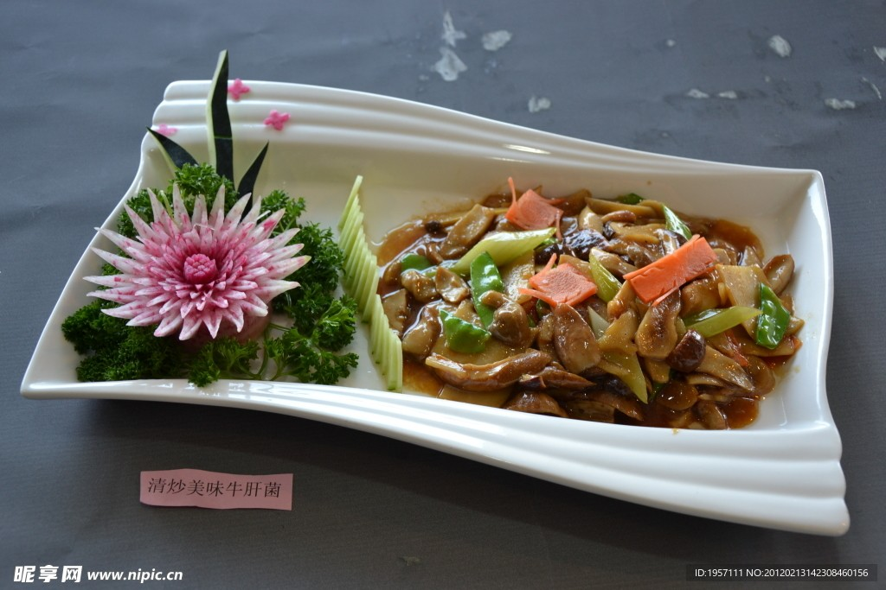

# 素炒牛肝菌 (Stir-Fried Porcini / Boletus Mushrooms Yunnan Style)

## 📋 基本資訊 / Recipe Overview
- **料理名稱 (繁體)**：素炒牛肝菌
- **料理名称 (简体)**：素炒牛肝菌
- **English Title**：Stir-Fried Yunnan Wild Boletus Mushrooms with Abundant Garlic and Chili
- **素食流派 / Diet**：全素 / 纯素 Vegan (云南名菌小炒，含大量大蒜；纯素五辛素)
- **料理分類 / Category**：02-菌菇山珍类 / 云南野菌 / 极鲜山珍
- **份量 / Servings**：2-3 人份
- **準備時間 / Prep Time**：15 分鐘
- **烹飪時間 / Cook Time**：15 分鐘
- **總計耗時 / Total Time**：30 分鐘
- **來源 / Source**：现代中华素菜 Top 100 · [02-菌菇山珍类.md](../02-菌菇山珍类.md) 第 79 道

## 📖 菜品特色 / Description
云南野生牛肝菌快炒大蒜青椒，菌香极其浓郁。厚切牛肝菌片肉质滑韧肥美，在足量熟菜籽油与浓郁大蒜的爆炒下，水分彻底煸干，菌香爆裂升华，山野原香回味无穷。

---

## 🌿 食材與調味清單 / Ingredients & Seasonings
### 主料
- 新鲜野生牛肝菌（黄牛肝或黑牛肝） 350g（或优质干牛肝菌 50g 充分泡发）
- 云南皱皮椒（或螺丝青椒） 2 根（约 60g，切滚刀块）
### 灵魂配料 / 厚蒜与辣椒
- 优质紫皮大蒜 1 整头（约 8-10 瓣，切 2mm 厚片，去毒提香不可少）
- 云南干红辣椒 5 根（剪段，增香微辣）
### 调味品
- 纯正熟菜籽油（或植物油） 3 汤匙（约 45ml，野生菌喜宽油）
- 纯酿造特级生抽 1 汤匙（约 15ml）
- 食用食盐 1/2 茶匙（约 2.5g）
- 白糖 1/4 茶匙（约 1g，和味提鲜）

---

## 🍳 烹飪步驟 / Step-by-Step Cooking Steps
### 步骤 1：牛肝菌清洗与均匀切厚片
1. 新鲜牛肝菌用小刀刮去根部泥土和杂质，在流动清水下用软毛刷快速刷洗干净，用干毛巾吸干水分（切忌长时间泡水）。
2. 将牛肝菌切成约 0.3-0.4cm 的均匀厚片（切得太薄翻炒易烂，切太厚不易熟透；厚片口感滑韧弹牙）。
3. 大蒜切厚片，皱皮椒切滚刀块备用。

### 步骤 2：宽油爆香厚蒜与干椒
1. 锅烧大热，倒入比平时炒菜宽一倍的菜籽油 3 汤匙烧至五成热。
2. 下入全部大蒜厚片和干辣椒段，中小火慢煸至蒜片边缘呈金黄色并散发出浓烈蒜香。

### 步骤 3：大火持续翻炒·彻底煸干水汽（关键步骤）
1. 转大火倒入牛肝菌厚片，保持全程大火持续翻炒。
2. 下锅后牛肝菌会迅速析出大量水分，耐心地保持大火翻炒 8-10 分钟，直到锅中水汽彻底蒸发完毕、油水重新由浑浊变为清亮滚烫、牛肝菌边缘微卷呈现金黄焦褐色。

### 步骤 4：下青椒与彻底熟化出锅
1. 下入皱皮青椒块，继续大火翻炒 2-3 分钟至青椒断生。
2. 沿锅边淋入生抽 1 汤匙，撒入食盐 1/2 茶匙和白糖 1/4 茶匙，大火翻炒均匀。
3. **确保全过程翻炒达 12-15 分钟以上**，牛肝菌完全熟透变透亮，关火盛盘。

---

## 💡 大厨秘诀 / Chef's Tips
1. **多油、厚蒜、足火是烹制牛肝菌三大铁律**：足量菜籽油导热均匀利于熟透，大量厚蒜片在云南传统中被视为去毒增香利器，必须放足整头大蒜。
2. **切厚片且煸干水汽至油清**：牛肝菌切 0.3cm 厚片口感最佳；炒制时必须将析出的水分完全炒干至锅内油清香浓，才算彻底熟透释放极致鲜味。
3. **必须彻底炒熟严防夹生**：野生菌烹饪时间务必充分（12-15 分钟），切忌追求所谓的脆嫩而缩短炒制时间。

---
*食谱归档时间：2026-08-21 · 收录于 20260818-vegetarianism 本地菜谱库 (1Top 精选)*
