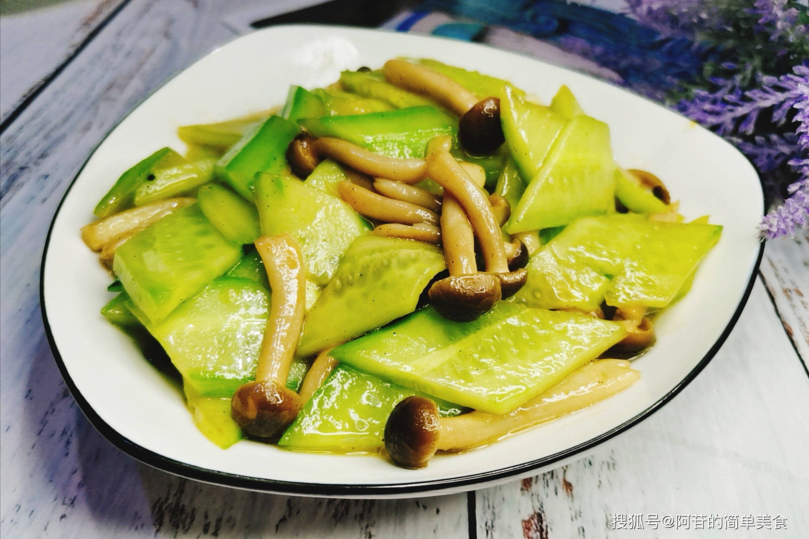

# 素炒蟹味菇 (Garlic Stir-Fried Brown Beech Mushrooms)

## 📋 基本資訊 / Recipe Overview
- **料理名稱 (繁體)**：素炒蟹味菇
- **料理名称 (简体)**：素炒蟹味菇
- **English Title**：Garlic Stir-Fried Brown Beech Mushrooms with Crispy Sweet Bell Pepper
- **素食流派 / Diet**：全素 / 纯素 Vegan (含大蒜；去蒜改姜丝即为纯净素)
- **料理分類 / Category**：02-菌菇山珍类 / 蒜香小炒 / 鲜香爽脆
- **份量 / Servings**：2-3 人份
- **準備時間 / Prep Time**：8 分鐘
- **烹飪時間 / Cook Time**：5 分鐘
- **總計耗時 / Total Time**：13 分鐘
- **來源 / Source**：现代中华素菜 Top 100 · [02-菌菇山珍类.md](../02-菌菇山珍类.md) 第 68 道

## 📖 菜品特色 / Description
蟹味菇快炒蒜蓉，释放独特的类似海蟹般的天然浓郁鲜香。蟹味菇肉质脆嫩，搭配双重蒜蓉爆香与青红甜椒，大火快炒裹薄芡，鲜香扑鼻，滑脆下饭。

---

## 🌿 食材與調味清單 / Ingredients & Seasonings
### 主料
- 新鲜蟹味菇（真姬菇褐色种） 250g
- 青椒 1 个（约 50g，切丝）
- 红甜椒 1/3 个（约 30g，切丝配色）
### 配料 / 双重蒜蓉
- 大蒜 6 瓣（剁成细碎蒜蓉，分成两份，净素改用生姜末 10g）
- 小葱花/大葱丝 10g
### 调味料与薄芡
- 特级生抽 1 汤匙（约 15ml）
- 优质素蚝油 1 汤匙（约 15ml）
- 白糖 1/3 茶匙（约 1.5g，提鲜和味）
- 食盐 1/3 茶匙（约 2g）
- 水淀粉（玉米淀粉 1 茶匙 + 清水 1.5 汤匙）
- 食用植物油 2 汤匙

---

## 🍳 烹飪步驟 / Step-by-Step Cooking Steps
### 步骤 1：蟹味菇切除根部与焯水
1. 蟹味菇切除底部木屑根基，用手掰散，流水快速冲洗干净。
2. 锅中加水烧沸，放入 1/3 茶匙盐，下入蟹味菇焯烫 1 分钟去除生涩味，捞出用冷水冲凉并充分沥干水分。

### 步骤 2：第一道蒜蓉煸香金蒜
1. 净锅烧热倒入 2 汤匙食用植物油，将准备好的蒜蓉取 2/3 下入冷油锅中。
2. 开中小火慢煸至蒜末呈现微微金黄色，爆发出浓郁焦香蒜油气息。

### 步骤 3：大火快炒与下配菜
1. 调至大火，倒入沥干水分的蟹味菇与青红椒丝，快速猛火翻炒 40 秒，让蟹味菇表面充分裹上金蒜香油。
2. 沿高温锅壁淋入生抽 1 汤匙、素蚝油 1 汤匙，加入白糖 1/3 茶匙和食盐 1/3 茶匙翻炒均匀。

### 步骤 4：下第二道生蒜与勾芡出锅
1. 倒入剩余的 1/3 生蒜蓉，淋入调好的薄水淀粉。
2. 大火快速颠锅翻炒 15 秒，让浓稠酱汁紧附菇身，熟蒜焦香与生蒜辛香双重激荡，立即关火盛盘。

---

## 💡 大厨秘诀 / Chef's Tips
1. **焯水去除轻微苦涩味**：蟹味菇含有微量天然苦苷物质，沸水加盐焯烫 1 分钟可彻底去除苦涩杂味，使菇肉更加脆弹鲜甜。
2. **双重蒜蓉法（金蒜+生蒜）**：2/3 蒜蓉低温煸成金蒜爆香底油，1/3 蒜蓉出锅前下入保留生蒜清辛，层次感极强。
3. **大火快炒勾薄芡**：大火快速翻炒并在出锅前勾薄芡，防止出水并使每一口蟹味菇都挂满浓郁的鲜美酱汁。

---
*食谱归档时间：2026-08-21 · 收录于 20260818-vegetarianism 本地菜谱库 (1Top 精选)*
