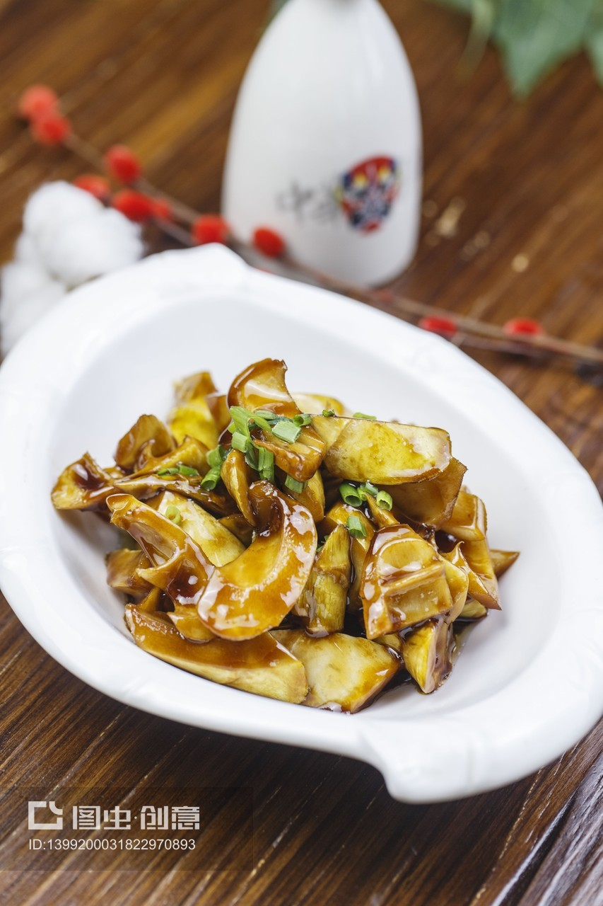

# 素炒见手青 (Stir-Fried Yunnan Lanmaoa asiatica with Heavy Garlic)

## 📋 基本資訊 / Recipe Overview
- **料理名稱 (繁體)**：素炒見手青
- **料理名称 (简体)**：素炒见手青
- **English Title**：Stir-Fried Yunnan Blue-Staining Bolete (Lanmaoa asiatica) with Heavy Garlic and Chili (High-Heat Long-Cooked)
- **素食流派 / Diet**：全素 / 纯素 Vegan (云南顶级野生山珍，含大量大蒜；纯素五辛素)
- **料理分類 / Category**：02-菌菇山珍类 / 滇味山珍 / 极致山野鲜香
- **份量 / Servings**：2-3 人份
- **準備時間 / Prep Time**：20 分鐘
- **烹飪時間 / Cook Time**：20-25 分鐘 (必須嚴格炒足時間)
- **總計耗時 / Total Time**：45 分鐘
- **來源 / Source**：现代中华素菜 Top 100 · [02-菌菇山珍类.md](../02-菌菇山珍类.md) 第 80 道

## 📖 菜品特色 / Description
云南名菌见手青（红葱牛肝菌/兰茂牛肝菌），伤后即变靛蓝色，多油厚蒜全程大火爆炒足20分钟以上彻底熟化去毒，鲜美绝伦。菌肉滑嫩弹爽、香气浓烈霸道，为野生菌老饕心中无上极品，但烹调必须敬畏科学、彻底炒透去毒。

---

## 🌿 食材與調味清單 / Ingredients & Seasonings
### 主料
- 新鲜正品见手青（红葱牛肝菌/兰茂牛肝菌） 400g
- 云南皱皮青椒（或螺丝椒） 3 根（约 80g，切滚刀块）
### 灵魂配料 / 海量厚蒜与干椒（去毒保命关键）
- 优质紫皮大蒜 2 整头（约 15-20 瓣，切 2-3mm 均匀厚片，不可剁碎防焦）
- 云南丘北干红辣椒 6 根（剪段剪去籽）
### 调味品
- 纯正熟菜籽油 5 汤匙（约 75ml，见手青极吃油，油量为平时 2-3 倍）
- 纯酿造特级生抽 1 汤匙（约 15ml）
- 食用食盐 1 茶匙（约 5g）
- 白糖 1/3 茶匙（约 1.5g）

---

## 🍳 烹飪步驟 / Step-by-Step Cooking Steps
### 步骤 1：严格预处理与极其均匀改刀（安全第一步）
1. **削根去泥**：用小刀细致削去菌柄根部的泥土与杂草，流水下用软毛刷快速轻柔洗净，用干毛巾彻底吸干表皮水分（切忌浸泡水）。
2. **绝对均匀切片**：用锋利厨刀将见手青切成约 **0.3cm 厚的极其均匀薄片**（刀工务必均匀，绝不可有的极厚有的极薄，防止厚片夹生引发中毒）。
3. **变色特征**：切开过程中菌肉遇空气迅速氧化呈现靛蓝色，此为见手青正常变色反应。

### 步骤 2：重油爆香厚蒜片与干辣椒
1. 选用大铁锅，倒入 **5 汤匙纯正熟菜籽油（约 75ml）** 烧至五成热。
2. 倒入全部大蒜厚片与干辣椒段，中小火慢炸 1-2 分钟，炸至蒜片金黄微卷、蒜香扑鼻（蒜不可切太碎，厚蒜片耐长时间高温煎炒且能作为熟化参考）。

### 步骤 3：倒入见手青·开定时器持续大火翻炒 20 分钟（去毒核心）
1. **启动定时器（设置 20 分钟）**！将切好的见手青片全部倒入锅中，转大火不间断翻炒。
2. 下锅 2 分钟内，见手青会受热大量吐水、菌肉颜色由蓝转深褐红变软。
3. 持续保持大火翻炒 8-10 分钟，耐心将菌子吐出的所有水分完全煸炒挥发蒸发完毕。
4. 炒至约 12 分钟时，锅内油水由浑浊转为完全清亮滚烫，菌片边缘开始卷缩泛金黄焦边，香气呈爆发式释放。

### 步骤 4：加入青椒合炒熟透与调味出锅
1. 在炒至 **第 16-17 分钟** 时，倒入青椒块，继续保持大火翻炒 3 分钟至青椒断生。
2. 在 **第 19 分钟** 时，沿锅壁淋入生抽 1 汤匙，撒入食盐 1 茶匙和白糖 1/3 茶匙，大火翻炒均匀。
3. **严格检查**：用锅铲刮下粘在锅壁及锅铲边缘的零星生菌片，确保所有菌片都在滚烫热油中受热翻滚；定时器满 20 分钟、确认彻底熟透后关火装盘即刻食用。

---

## 💡 大厨秘诀 / Chef's Tips
1. **【终极安全红线·必须多油厚蒜全程大火炒满 20 分钟】**：见手青含有热敏性神经致幻生物碱毒素，必须在 100℃ 以上滚烫宽油中持续大火翻炒 20 分钟以上彻底破坏毒素。严禁“3刀16秒”快炒，严禁半生不熟！
2. **【切片必须厚薄极其均匀】**：刀工不匀会导致薄片炒糊而厚片仍带生芯夹生中毒。翻炒中途务必将锅铲背及锅沿粘连的生片刮入油锅同炒熟化。
3. **【现炒现吃·坚决拒绝隔夜】**：见手青出锅必须趁热吃完，绝不可隔夜或放入冰箱次日二次加热再食（隔夜毒素易发生变化引发中毒）。食用后若有头晕恶心视物变形，须立即就医！

---
*食谱归档时间：2026-08-21 · 收录于 20260818-vegetarianism 本地菜谱库 (1Top 精选)*
