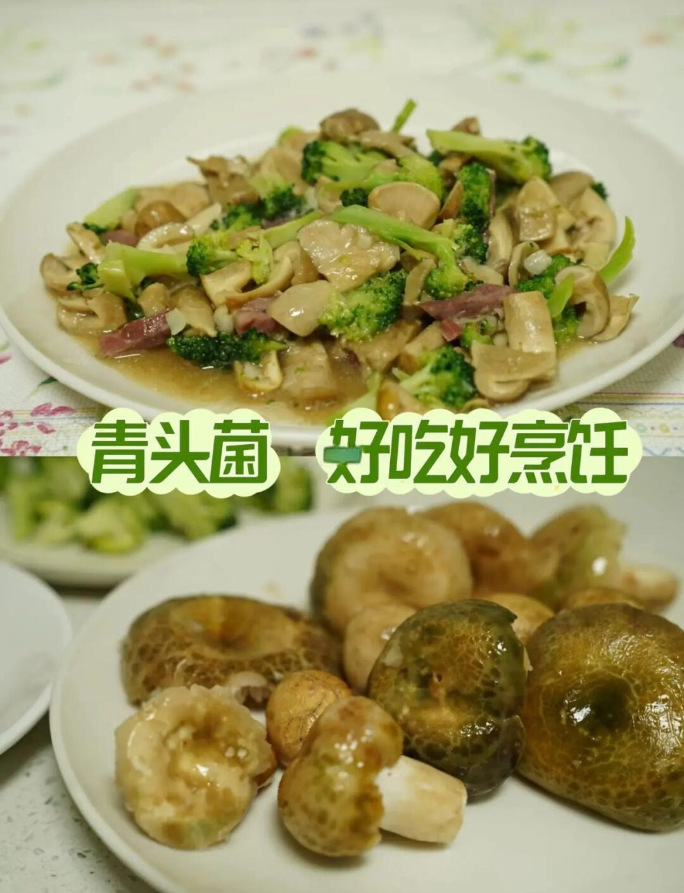

# 素炒青头菌 (Stir-Fried Green Russula Mushroom with Garlic and Chili)

## 📋 基本資訊 / Recipe Overview
- **料理名稱 (繁體)**：素炒青頭菌
- **料理名称 (简体)**：素炒青头菌
- **English Title**：Stir-Fried Green Russula Mushroom with Garlic and Chili
- **素食流派 / Diet**：全素 / 纯素 Vegan (含蒜五辛素；依戒律可去蒜做纯净素)
- **料理分類 / Category**：02-菌菇山珍类 / 云南野生菌珍馐 / 家常爆炒
- **份量 / Servings**：2-3 人份
- **準備時間 / Prep Time**：10 分鐘
- **烹飪時間 / Cook Time**：8 分鐘
- **總計耗時 / Total Time**：18 分鐘
- **來源 / Source**：现代中华素菜 Top 100 · [02-菌菇山珍类.md](../02-菌菇山珍类.md) 第 83 道

## 📖 菜品特色 / Description
云南青头菌清炒。（青头菌切厚片爆炒大蒜青椒，滑嫩鲜香。）

---

## 🌿 食材與調味清單 / Ingredients & Seasonings
### 主料
- 新鲜青头菌（变绿红菇）350g
- 皱皮青椒 / 螺丝椒 2 根（约 60g，切菱形块）
- 大蒜 8 瓣（约 35g，拍松切大粒，青头菌喜大蒜）
- 红椒 1/2 根（约 20g，切块增色）

### 调味料
- 菜籽油（或植物油）2 汤匙（约 30ml）
- 食盐 3/4 茶匙（约 4g）
- 白砂糖 1/4 茶匙（约 1g，提鲜）
- 素高汤 / 清水 3 汤匙（约 45ml，焖透用）
- 水淀粉 1 茶匙（玉米淀粉 1/2 茶匙 + 清水 1 茶匙调匀）

---

## 🍳 烹飪步驟 / Step-by-Step Cooking Steps
### 步骤 1：清洗与改刀
1. 青头菌放入淡盐水中浸洗 2 分钟，洗净菌盖表面绿色斑纹褶皱中的杂质，沥干。
2. 小个青头菌保持整颗或对半切开，大个青头菌切成 0.5cm 厚的大片（切忌太薄，以免炒软后碎烂失却滑嫩口感）。

### 步骤 2：油锅爆蒜与下菌
1. 炒锅烧热，倒入 2 汤匙菜籽油烧至五成热，下入足量大蒜粒，小火慢煸至大蒜边缘微金黄、蒜香浓郁。
2. 转大火，倒入切好的青头菌厚片，快速翻炒 1 分钟，见菌肉渗出天然清甜汁水。

### 步骤 3：加水焖透确保熟透
1. 倒入青红椒块翻炒均匀。
2. 加入 3 汤匙素高汤（或清水），盖上锅盖，转中小火焖煮 3-4 分钟（野生菌烹饪务必煮透焖熟，确保食用安全）。

### 步骤 4：收汁裹芡出锅
1. 揭开锅盖转大火收汁，加入 3/4 茶匙食盐和 1/4 茶匙白糖翻炒均匀。
2. 沿锅边淋入 1 茶匙薄水淀粉，快速颠锅翻炒，使浓郁的菌汁与蒜香稠亮地包裹在每一片青头菌上，出锅装盘。

---

## 💡 大厨秘诀 / Chef's Tips
1. **切厚片或切块**：青头菌肉质肥厚滑嫩，切厚片或掰大块炒制不易碎，且入口饱满多汁、滑爽适口。
2. **多放蒜粒并焖透**：云南民间烹制青头菌讲究“重蒜”，大蒜既能辟除生涩气，又能衬托菌香；加水焖煮数分钟是野生菌烹饪不可省略的安全法则。
3. **微薄芡紧汁**：青头菌焖煮后汤汁极为鲜甜，出锅前淋极薄水淀粉收汁，能把鲜汁牢牢吸附在菌片表面。

---
*食谱归档时间：2026-08-21 · 收录于 20260818-vegetarianism 本地菜谱库 (1Top 精选)*
