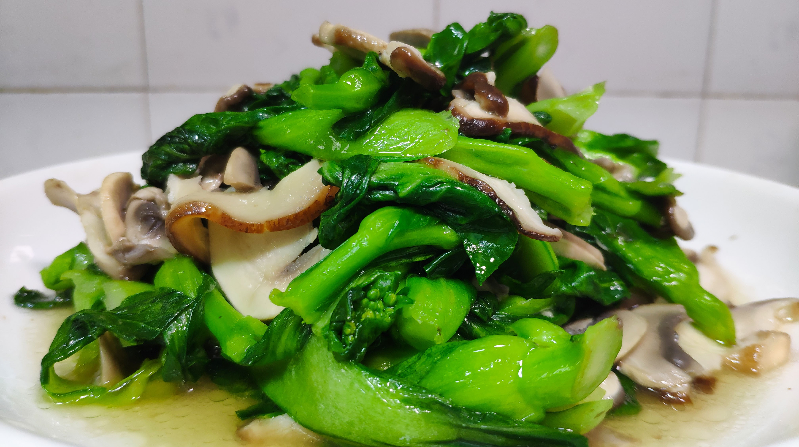

# 素炒香菇 (Quick Stir-Fried Fresh Shiitake Mushrooms)

## 📋 基本資訊 / Recipe Overview
- **料理名稱 (繁體)**：素炒香菇
- **料理名称 (简体)**：素炒香菇
- **English Title**：Quick Stir-Fried Fresh Shiitake Mushrooms
- **素食流派 / Diet**：全素 / 纯素 Vegan (含大蒜、香葱；可去五辛用生姜丝代替做纯净素)
- **料理分類 / Category**：02-菌菇山珍类 / 家常本味 / 咸鲜滑脆
- **份量 / Servings**：2-3 人份
- **準備時間 / Prep Time**：8 分鐘
- **烹飪時間 / Cook Time**：6 分鐘
- **總計耗時 / Total Time**：14 分鐘
- **來源 / Source**：现代中华素菜 Top 100 · [02-菌菇山珍类.md](../02-菌菇山珍类.md) 第 6 道

## 📖 菜品特色 / Description
鲜菇快炒蒜蓉，本味。

---

## 🌿 食材與調味清單 / Ingredients & Seasonings
### 主料
- 新鲜优质香菇 300g（洗净挤干，切 3-4mm 厚片）
- 红彩椒 / 青椒 各 1/4 个（切细丝配色）

### 调味料 / 配料
- 大蒜 4 瓣（切细末，分两次使用）
- 小葱 1 根（切葱花）
- 优质生抽 1.5 汤匙（约 22.5ml）
- 素蚝油 1 茶匙（约 5ml）
- 食盐 1/2 茶匙（约 2.5g）
- 白糖 1/3 茶匙（约 1.5g）
- 白胡椒粉 1/4 茶匙
- 水淀粉 1.5 汤匙（生粉 1 茶匙 + 清水 1.5 汤匙）
- 食用油 2 汤匙（约 30ml）

---

## 🍳 烹飪步驟 / Step-by-Step Cooking Steps
### 步骤 1：香菇改刀与预脱水
1. 鲜香菇洗净去蒂切厚片；锅中水烧开，下香菇焯烫 40 秒，捞出迅速过凉水并用手轻轻攥干水分。

### 步骤 2：爆香蒜蓉煸炒香菇
1. 炒锅烧热倒入食用油，下入一半蒜末中火煸炒出浓郁蒜香。
2. 下入攥干的香菇片，大火翻炒 1 分钟至表面微泛金黄油亮。

### 步骤 3：加入彩椒调味抱汁
1. 下入红绿彩椒丝，淋入生抽、素蚝油、盐、白糖和白胡椒粉，大火快速颠翻 20 秒。

### 步骤 4：勾芡出锅蒜提香
1. 淋入水淀粉快速翻炒让芡汁均匀包裹香菇，撒入剩余蒜末和葱花翻炒 5 秒激出蒜香，出锅装盘。

---

## 💡 大厨秘诀 / Chef's Tips
1. **焯水攥干去青涩防出汤**：鲜香菇自带生涩味且含水量高，焯水 40 秒挤去多余水分，下锅爆炒能迅速锁住香气，炒出的香菇滑嫩而不水哒哒。
2. **分两次放蒜（金银蒜效用）**：起锅时先下一半蒜末爆香打底，出锅前撒入剩余生蒜末，借锅气激发出浓郁鲜香，香气层次分明。
3. **薄芡包裹锁住本味**：鲜香菇表面光滑不易挂汁，勾入极薄的水淀粉可让咸鲜调料紧密贴合菇肉，入口滑润多汁。

---
*食谱归档时间：2026-08-21 · 收录于 20260818-vegetarianism 本地菜谱库 (1Top 精选)*
