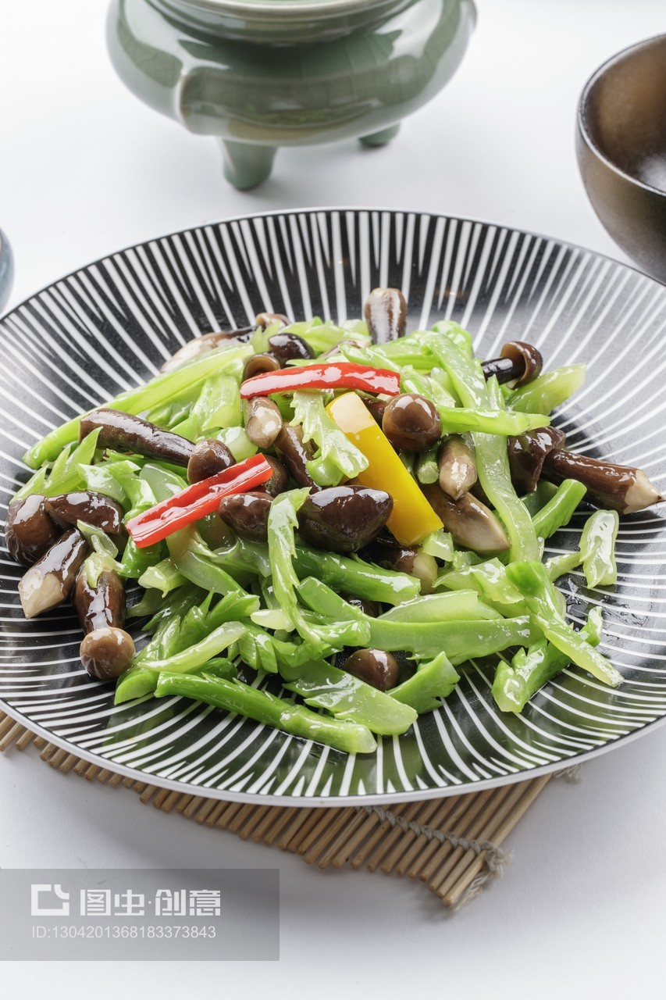

# 素炒鸡枞菌 (Stir-Fried Termitomyces Mushroom (Jizong) with Green Chili)

## 📋 基本資訊 / Recipe Overview
- **料理名稱 (繁體)**：素炒雞樅菌
- **料理名称 (简体)**：素炒鸡枞菌
- **English Title**：Stir-Fried Termitomyces Mushroom (Jizong) with Green Chili
- **素食流派 / Diet**：全素 / 纯素 Vegan (含蒜五辛素；依戒律可去蒜做纯净素)
- **料理分類 / Category**：02-菌菇山珍类 / 云南野生菌珍馐 / 鲜甜脆嫩
- **份量 / Servings**：2-3 人份
- **準備時間 / Prep Time**：10 分鐘
- **烹飪時間 / Cook Time**：5 分鐘
- **總計耗時 / Total Time**：15 分鐘
- **來源 / Source**：现代中华素菜 Top 100 · [02-菌菇山珍类.md](../02-菌菇山珍类.md) 第 82 道

## 📖 菜品特色 / Description
云南鸡枞，鲜香。（云南名贵鲜鸡枞清炒，肉质细嫩如鸡丝，甘甜多汁。）

---

## 🌿 食材與調味清單 / Ingredients & Seasonings
### 主料
- 新鲜黑皮或白皮鸡枞菌 300g
- 云南皱皮椒（或薄皮青椒）2 根（约 60g，切斜片）
- 红椒 1/2 根（约 20g，配色用，切丝）
- 大蒜 5 瓣（约 20g，切薄片）

### 调味料
- 熟菜籽油 / 优质植物油 2 汤匙（约 30ml）
- 食盐 1/2 茶匙（约 3g，极简调味以保原味鲜甜）
- 白胡椒粉 1/8 茶匙（约 0.5g）
- 素高汤 1 汤匙（约 15ml）

---

## 🍳 烹飪步驟 / Step-by-Step Cooking Steps
### 步骤 1：去泥清洗与手工撕条
1. 鸡枞菌用小刷子在流动清水下轻轻刷去根部泥土，洗净沥干。
2. 顺着鸡枞菌纵向纤维，用手将其撕成粗细适中的小长条（手撕比刀切断面更粗糙，更易裹汁入味且保持如鸡肉丝般的脆嫩质感）。

### 步骤 2：白锅微煸控水
1. 热锅不放油，下入撕好的鸡枞菌条，中火轻快翻炒 1 分钟左右，煸去微量草腥与多余水汽，待菌香初显时盛出备用。

### 步骤 3：爆香蒜片与青椒
1. 炒锅洗净烧热，倒入 2 汤匙菜籽油烧至五成热。
2. 放入蒜片煸炒出浓郁蒜香，随即下入青红椒片，大火翻炒 20 秒至表皮微起虎皮纹、清香四溢。

### 步骤 4：急火爆炒与出锅
1. 倒入处理好的鸡枞菌条，转大火猛火快炒 1-2 分钟。
2. 撒入 1/2 茶匙食盐、少许白胡椒粉，烹入 1 汤匙素高汤激出锅气。
3. 快速颠锅翻炒 10 秒，菌身紧致油亮、鲜汁四溢即可出锅装盘。

---

## 💡 大厨秘诀 / Chef's Tips
1. **手撕胜过刀切**：鸡枞菌纤维与鸡肉丝极为相似，手工顺丝撕成条状能保留菌肉天然纹理，口感更加爽脆细嫩。
2. **极简调味保本鲜**：鲜鸡枞富含多糖与鲜味氨基酸，清甜无比。烹调时严禁加入酱油、蚝油、鸡精等重味调料，仅需少许盐与蒜香即成绝味。
3. **必须彻底炒透**：虽然鸡枞菌无毒性，但作为野生菌仍需在大火热油中充分翻炒至熟透，既能杀菌又能最大化逼出菌油香气。

---
*食谱归档时间：2026-08-21 · 收录于 20260818-vegetarianism 本地菜谱库 (1Top 精选)*
