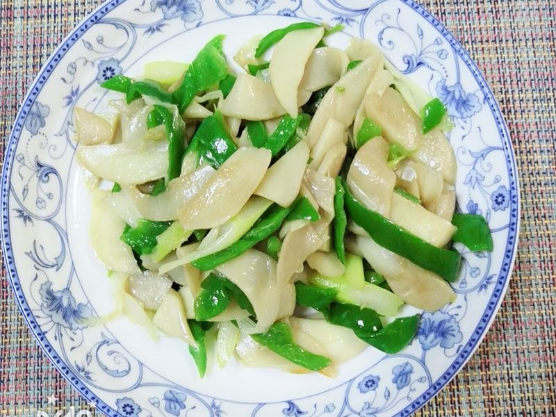

# 素炒鸡腿菇 (Stir-Fried King Oyster Mushroom / Chicken Drumstick Mushroom)

## 📋 基本資訊 / Recipe Overview
- **料理名稱 (繁體)**：素炒雞腿菇
- **料理名称 (简体)**：素炒鸡腿菇
- **English Title**：Stir-Fried King Drumstick Mushroom with Garlic and Sweet Peppers
- **素食流派 / Diet**：全素 / 纯素 Vegan (含大蒜；去蒜即为纯净素)
- **料理分類 / Category**：02-菌菇山珍类 / 家常小炒 / 鲜香滑嫩
- **份量 / Servings**：2-3 人份
- **準備時間 / Prep Time**：10 分鐘
- **烹飪時間 / Cook Time**：6 分鐘
- **總計耗時 / Total Time**：16 分鐘
- **來源 / Source**：现代中华素菜 Top 100 · [02-菌菇山珍类.md](../02-菌菇山珍类.md) 第 63 道

## 📖 菜品特色 / Description
鸡腿菇切厚片滚刀快炒，肉质紧实滑嫩。经过先煸干水汽再大火快炒，菌片边缘金黄焦香，内部滑润多汁，口感饱满胜似肉片，豉香浓郁锅气十足。

---

## 🌿 食材與調味清單 / Ingredients & Seasonings
### 主料
- 新鲜优质鸡腿菇（毛头鬼伞/杏鲍菇类型） 350g
- 青甜椒 1/2 个（约 40g）
- 红甜椒 1/2 个（约 40g）
### 配料 / 辛香料
- 大蒜 4 瓣（切厚片，净素可改用老姜片）
- 小葱白/生姜片 10g
### 调味料与芡汁
- 纯酿造特级生抽 1.5 汤匙（约 22ml）
- 优质素蚝油 1 汤匙（约 15ml）
- 白糖 1/3 茶匙（约 1.5g，和味提鲜）
- 食盐 1/3 茶匙（约 2g）
- 白胡椒粉 1/4 茶匙
- 水淀粉（玉米淀粉 1 茶匙 + 清水 1.5 汤匙）
- 食用植物油 2 汤匙

---

## 🍳 烹飪步驟 / Step-by-Step Cooking Steps
### 步骤 1：食材改刀与预处理
1. 鸡腿菇用湿厨房纸擦净表面，削去根部硬蒂，先顺长切半，再斜刀滚切成约 0.5cm 厚的厚菱形片（厚切保持丰满肉质感）。
2. 青红甜椒去籽切菱形片；大蒜切厚片备用。

### 步骤 2：干锅煸水逼出水汽
1. 净锅烧热不放油，倒入切好的鸡腿菇厚片，开中火干煸 2-3 分钟。
2. 待菇体受热收缩、表面析出的水汽彻底蒸发、边缘呈现微微焦黄色时盛出控盘（这一步是炒出肉质紧实弹牙的关键）。

### 步骤 3：爆香底油
1. 锅中倒入 2 汤匙食用植物油烧至五成热，下入蒜片与姜片，中火煸炒出浓郁蒜香。
2. 下入青红甜椒片大火翻炒 20 秒至断生透亮。

### 步骤 4：合炒调味出锅
1. 转大火倒入煸干的鸡腿菇片猛火快炒 30 秒。
2. 沿着高温锅边淋入生抽 1.5 汤匙、素蚝油 1 汤匙，加入白糖 1/3 茶匙、食盐 1/3 茶匙和白胡椒粉，快速颠锅翻炒出浓郁锅气酱香。
3. 淋入调好的薄水淀粉勾一层薄芡，让酱汁紧紧包裹每一片鸡腿菇，翻匀即可亮油装盘。

---

## 💡 大厨秘诀 / Chef's Tips
1. **先干煸脱水是核心**：鸡腿菇含水量高，直接下油锅炒容易出水导致口感变软烂。先干锅中火煸炒逼出水分再炒，菇肉紧实如鲍鱼片。
2. **滚刀厚切口感最佳**：不要切成过薄的薄片，0.5cm 的厚切滚刀片经煸炒脱水后厚度适中，外焦香内多汁。
3. **锅边烹酱激发豉香**：酱油和素蚝油务必从高温锅壁淋入（烹锅），利用瞬间高温美拉德反应爆发出浓郁的家常炒菜锅气。

---
*食谱归档时间：2026-08-21 · 收录于 20260818-vegetarianism 本地菜谱库 (1Top 精选)*
