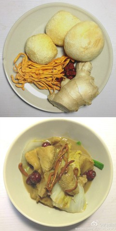

# 素燒猴頭菇 (Braised Lion's Mane Mushrooms in Rich Supreme Broth)

## 📋 基本資訊 / Recipe Overview
- **料理名稱 (繁體)**：素燒猴頭菇
- **料理名称 (简体)**：素烧猴头菇
- **English Title**：Braised Lion's Mane Mushrooms in Rich Supreme Broth
- **素食流派 / Diet**：全素 / 纯素 Vegan (纯净素 / 淮扬素斋名馔)
- **料理分類 / Category**：02-菌菇山珍类 / 淮扬素斋 / 筵席名菜
- **份量 / Servings**：2-3 人份
- **準備時間 / Prep Time**：35 分鐘 (含去苦泡发)
- **烹飪時間 / Cook Time**：15 分鐘
- **總計耗時 / Total Time**：50 分鐘
- **來源 / Source**：现代中华素菜 Top 100 · [02-菌菇山珍类.md](../02-菌菇山珍类.md) 第 29 道

## 📖 菜品特色 / Description
红烧或上汤扒，寺院与素馆招牌名菜。

---

## 🌿 食材與調味清單 / Ingredients & Seasonings
### 主料
- 优质干猴头菇 4 朵（约 60g，泡发去苦挤干后约 260g）

### 围边与配料
- 鲜嫩上海青 / 菜心 6 棵（焯水围边）
- 鲜香菇 2 朵（切片增鲜）
- 生姜 3 片（切丝）

### 浓汤煨烧调料
- 纯素高汤（黄豆芽、干香菇、玉米熬制） 300ml
- 素蚝油 1.5 汤匙（22g）
- 纯酿生抽 1 汤匙（15ml）
- 老抽 1/2 茶匙（2.5ml，增色）
- 单晶冰糖 1 茶匙（5g，提鲜柔和）
- 白胡椒粉 1/4 茶匙（1g）
- 芝麻香油 1/2 茶匙（2.5ml）
- 水淀粉 1.5 汤匙（玉米淀粉 1 茶匙 + 清水 1 汤匙）
- 植物油 2 汤匙（30ml）

---

## 🍳 烹飪步驟 / Step-by-Step Cooking Steps
### 步骤 1：猴头菇去苦泡发与撕朵
1. 干猴头菇用温水加少许淀粉浸泡 20 分钟至软透无硬芯。
2. 彻底剪掉根部发黑硬蒂，在清水中像海绵一样反复抓洗挤干水分，换水重复 6 次直至挤出的水清澈透明无苦味。
3. 用手撕成均等大块（约鸡蛋一半大小），手撕截面更易吸附汤汁。

### 步骤 2：素油香煎出焦香肉感
1. 炒锅烧热，倒入 1 汤匙植物油。
2. 放入挤干水分的猴头菇块，中小火慢煎 2-3 分钟至表面微微金黄起壳、香气四溢，盛出备用。

### 步骤 3：素汤慢煨入味
1. 锅留底油，下姜丝与鲜香菇片小火煸炒出香味。
2. 倒入纯素高汤 300ml 烧开，加入素蚝油 1.5 汤匙、生抽 1 汤匙、老抽 1/2 茶匙、冰糖 1 茶匙和白胡椒粉。
3. 放入煎好的猴头菇块，大火烧沸后转中小火，盖上锅盖慢火煨烧 10-12 分钟，让猴头菇吸饱鲜美高汤。

### 步骤 4：菜心围边与勾芡扒浇
1. 另起水锅烧沸，加少许盐和油，下上海青菜心焯烫 45 秒至翠绿断生，捞出沥干整齐摆在盘子周围围成一圈。
2. 揭开煨烧猴头菇的锅盖，转大火收汁，淋入水淀粉推匀至汤汁如玻璃芡般红亮浓稠。
3. 滴入芝麻香油提亮，将浓汁猴头菇整齐盛入菜心盘中，浇上剩余汤汁即可端上筵席。

---

## 💡 大厨秘诀 / Chef's Tips
1. **淮扬素斋煨透为贵**：去苦挤干后的猴头菇犹如天然海绵，需用素高汤小火慢煨 10 分钟以上，将高汤鲜美尽数吸纳，口感软嫩如珍禽。
2. **先煎后烧防松散**：先用少量油煎至表面结成微焦薄壳，煨炖时外层紧致有嚼劲，内部饱汁不烂。
3. **菜心焯水加油盐**：沸水中加入一勺盐和几滴植物油，能瞬间锁住菜心叶绿素，长时间摆盘依然碧绿油亮。

---
*食谱归档时间：2026-08-21 · 收录于 20260818-vegetarianism 本地菜谱库 (1Top 精选)*
