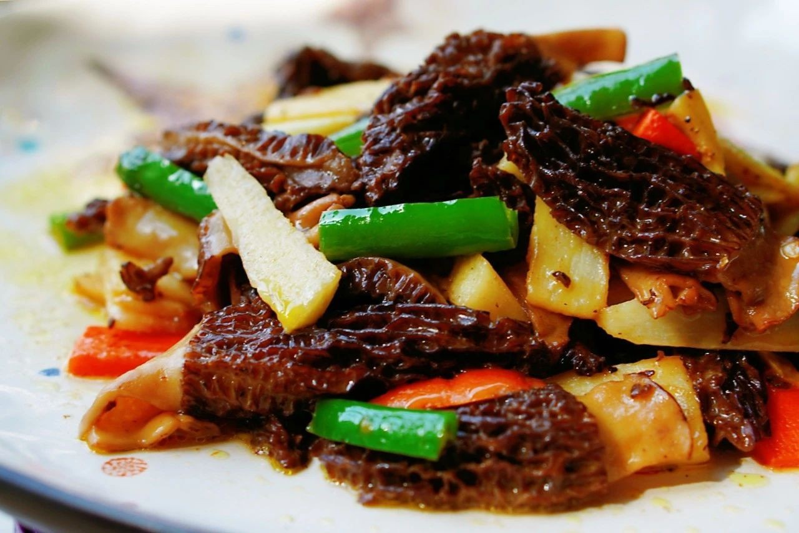

# 素烧羊肚菌 (Braised Morel Mushrooms in Rich Mushroom Broth)

## 📋 基本資訊 / Recipe Overview
- **料理名稱 (繁體)**：素燒羊肚菌
- **料理名称 (简体)**：素烧羊肚菌
- **English Title**：Braised Morel Mushrooms with Chinese Yam in Rich Golden Broth
- **素食流派 / Diet**：全素 / 纯素 Vegan (淮扬名馔 / 高档养生素席名菜，不含五辛)
- **料理分類 / Category**：02-菌菇山珍类 / 淮扬名馔 / 名贵山珍
- **份量 / Servings**：2-3 人份
- **準備時間 / Prep Time**：35 分鐘 (含羊肚菌泡发)
- **烹飪時間 / Cook Time**：15 分鐘
- **總計耗時 / Total Time**：50 分鐘
- **來源 / Source**：现代中华素菜 Top 100 · [02-菌菇山珍类.md](../02-菌菇山珍类.md) 第 77 道

## 📖 菜品特色 / Description
名贵羊肚菌泡发煨烧，浓油赤酱或原汤明芡。羊肚菌网眼菌褶层层吸饱原汁原汤与淮山甜润，肉厚脆嫩，菌香馥郁带有迷人的泥土坚果清香，入口鲜醇甘美，素宴之至尊佳品。

---

## 🌿 食材與調味清單 / Ingredients & Seasonings
### 主料
- 优质干羊肚菌 15-20 朵（约 20g）
- 铁棍山药 150g（削皮切厚片或滚刀块）
### 辅料 / 提鲜素汤
- 生姜 3 片（约 8g）
- 优质澄清羊肚菌泡发原汤 180ml
- 新鲜红甜椒片 15g（配色点缀）
### 调味料与琉璃芡汁
- 特级酿造生抽 1.5 汤匙（约 22ml）
- 优质香菇素蚝油 1 汤匙（约 15ml）
- 优质老冰糖 5g（提鲜亮色）
- 食盐 1/3 茶匙（约 2g）
- 白胡椒粉 少许
- 水淀粉（玉米淀粉 1 茶匙 + 清水 2 汤匙）
- 食用植物油（花生油或植物黄油） 1.5 汤匙
- 芝麻香油 1/2 茶匙（出锅明油）

---

## 🍳 烹飪步驟 / Step-by-Step Cooking Steps
### 步骤 1：羊肚菌温水泡发与原汤澄清（核心秘诀）
1. **温水泡发**：用 40℃ 左右温水浸泡羊肚菌 30 分钟至完全回软舒展。
2. **轻柔洗沙**：羊肚菌菌盖表面褶皱极多，在水中顺时针轻柔晃动，洗净褶皱中可能藏匿的微细泥沙，捞出轻轻挤干。
3. **原汤沉淀过滤**：浸泡羊肚菌的水呈深琥珀金黄色，静置 15 分钟沉淀泥沙，用细筛网或纱布滤出上层清液备用（原汤化原食之精髓）。

### 步骤 2：山药改刀与过水
1. 铁棍山药戴手套去皮，切成 0.5cm 厚斜片，沸水中焯烫 1 分钟捞出沥干（保持山药脆嫩防氧化变黑）。

### 步骤 3：煸香与注入原汤慢煨
1. 锅中倒入 1.5 汤匙植物油烧至五成热，下入姜片煸出清香。
2. 放入泡好的羊肚菌，中小火翻炒 1 分钟激发出天然坚果菌香。
3. 倒入过滤后的 **羊肚菌澄清原汤 180ml**，加入焯好的山药片，调入生抽 1.5 汤匙、素蚝油 1 汤匙和冰糖 5g。
4. 大火烧开后转小火，盖上锅盖慢火煨烧 10-12 分钟，让羊肚菌菌褶充分饱吸浓郁鲜香汤汁，菌身膨胀多汁。

### 步骤 4：收汁、琉璃薄芡与出锅
1. 开盖挑出姜片，下入红椒片，调入食盐 1/3 茶匙和少许白胡椒粉。
2. 转大火收汁，分次淋入调匀的水淀粉，用锅铲由锅底轻推推成晶莹剔透的琉璃薄芡。
3. 淋入 1/2 茶匙芝麻香油提亮，汤汁紧紧包裹每一朵羊肚菌，盛入温热的白瓷盘中上席。

---

## 💡 大厨秘诀 / Chef's Tips
1. **羊肚菌原汤是提鲜灵魂（原汤化原食）**：羊肚菌泡发时大量水溶性鲜味核苷酸和氨基酸融入水中，澄清滤沙后倒入同煨，鲜味比普通高汤更纯正浓烈数倍。
2. **煨足 10 分钟以上熟化入味**：羊肚菌不可急火短炒，必须小火慢煨 10-12 分钟以上，既确保菌体彻底熟透安全，又能让中空菌褶饱吸甘甜酱汁。
3. **搭配铁棍山药相得益彰**：山药黏液蛋白与羊肚菌原汤融合使汤汁更加醇厚柔润，清脆与弹嫩交织，素雅尊贵。

---
*食谱归档时间：2026-08-21 · 收录于 20260818-vegetarianism 本地菜谱库 (1Top 精选)*
