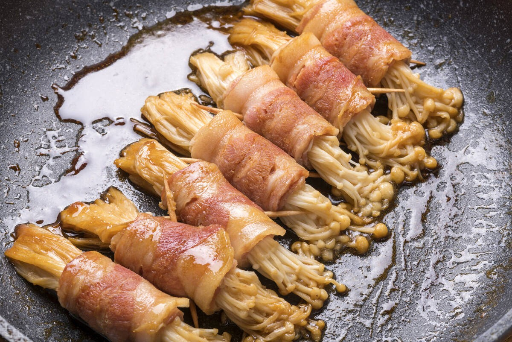

# 素金针菇肥牛卷 (Vegan Enoki Mushroom 'Beef' Rolls in Rich Teriyaki Glaze)

## 📋 基本資訊 / Recipe Overview
- **料理名稱 (繁體)**：素金針菇肥牛卷
- **料理名称 (简体)**：素金针菇肥牛卷
- **English Title**：Vegan Enoki Mushroom 'Beef' Rolls in Rich Teriyaki Glaze
- **素食流派 / Diet**：全素 / 纯素 Vegan（五辛素可选配葱花；纯净素以芹菜碎点缀）
- **料理分類 / Category**：02-菌菇山珍类 / 仿荤质感 / 创意菌鲜
- **份量 / Servings**：2-3 人份
- **準備時間 / Prep Time**：15 分鐘
- **烹飪時間 / Cook Time**：8 分鐘
- **總計耗時 / Total Time**：23 分鐘
- **來源 / Source**：现代中华素菜 Top 100 · [02-菌菇山珍类.md](../02-菌菇山珍类.md) 第 41 道

## 📖 菜品特色 / Description
金针卷豆皮或大豆蛋白素肉片，照烧或番茄浓汁煨煮，外层焦香弹韧，内馅爽滑爆汁，重现经典肥牛卷风味。

---

## 🌿 食材與調味清單 / Ingredients & Seasonings

### 主料
- 鲜金针菇 200g（切除老根，洗净撕成细小束）
- 薄豆腐皮（百叶皮 / 鲜油豆皮 / 大豆拉丝蛋白素肉片） 150g（切成约 8cm × 12cm 的长方形片）
- 细胡萝卜丝 30g（配色增脆）

### 秘制照烧浓汁（调和碗汁）
- 纯酿植物酱油 / 生抽 2 汤匙（约 30ml）
- 素蚝油（香菇素蚝油） 1 汤匙（约 15ml）
- 味醂 / 纯素甜料酒 1 汤匙（约 15ml）
- 冰糖粉 / 白砂糖 1 茶匙（约 5g）
- 素高汤 / 清水 4 汤匙（约 60ml）
- 玉米淀粉 1/2 茶匙（约 2.5g）

### 煎制与点缀
- 熟白芝麻 1 茶匙（约 3g）
- 纯植物油 1.5 汤匙（约 22ml）
- 芹菜碎 / 小葱花 1 茶匙（点缀）

---

## 🍳 烹飪步驟 / Step-by-Step Cooking Steps

### 步骤 1：豆皮与金针菇预处理
1. 薄豆腐皮若为干制品，先用温水浸泡 5 分钟至完全软韧，沥干水分切成 8cm × 12cm 的长方片备用。
2. 鲜金针菇切去根部 2cm 泥沙硬结，洗净后用厨房纸吸去多余水分，撕成直径约 1.5cm 的小束；胡萝卜切细丝。

### 步骤 2：卷制与定型
1. 平铺一张豆腐皮，在一端整齐码上一束金针菇和数根胡萝卜丝（金针菇头部露出豆皮外约 1.5-2cm）。
2. 由内向外紧紧卷起，卷成紧实的素肥牛卷，收口处可抹少许浓淀粉水辅助粘合。

### 步骤 3：调配照烧酱汁
小碗中加入生抽 2 汤匙、素蚝油 1 汤匙、味醂 1 汤匙、冰糖粉 1 茶匙、清水 4 汤匙与玉米淀粉 1/2 茶匙，充分搅拌均匀至糖完全溶解。

### 步骤 4：下锅香煎定型
1. 平底不粘锅烧热，倒入 1.5 汤匙植物油，保持中小火。
2. 将卷好的素肥牛卷**收口朝下**整齐码入锅中，中火慢煎 2 分钟，使封口处迅速受热定型焦黄。
3. 翻面继续煎制 1-2 分钟，直至豆皮表面呈现金黄虎皮斑纹。

### 步骤 5：浇汁煨煮与收汁
1. 再次搅匀照烧酱汁，沿锅边缓缓倒入锅中。
2. 转小火加盖焖煮 2-3 分钟，让金针菇吸收酱汁蒸熟变软，豆皮充分吸饱浓鲜咸甜汁。
3. 揭盖转大火收汁，不断用锅铲将浓稠酱汁淋在卷身上，待芡汁光亮包裹卷体时即可关火出锅。
4. 盛盘后撒上熟白芝麻与芹菜碎点缀。

---

## 💡 大厨秘诀 / Chef's Tips

1. **收口朝下先煎定型**：豆皮卷好后无需牙签固定，只要收口朝下直接接触热油锅底，豆蛋白受热凝固即可完美定型不散。
2. **金针菇勿分束过大**：金针菇束若太粗，内部不易受热入味且容易卷不紧，1.5cm 粗细最为适宜。
3. **番茄浓汁变体**：若做酸甜番茄味，可将番茄 2 个切碎炒出红油起沙，加入 1 勺番茄酱和生抽，将煎好的豆皮卷下入番茄浓汁中煨透。

---
*食谱归档时间：2026-08-21 · 收录于 20260818-vegetarianism 本地菜谱库 (1Top 精选)*
