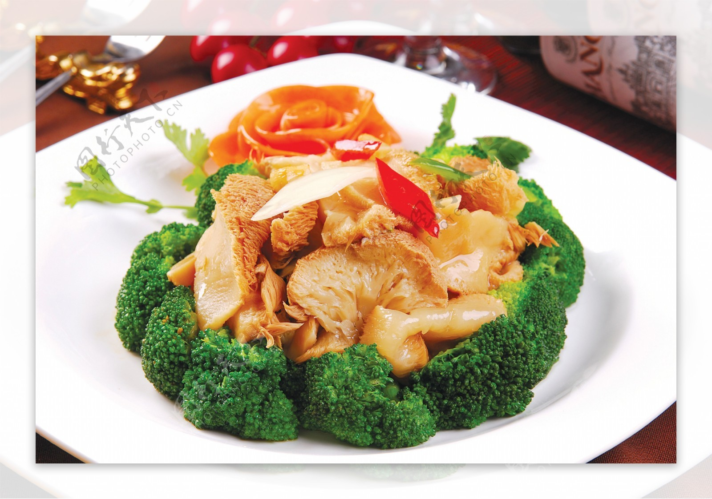

# 紅燒猴頭菇 (Braised Lion's Mane Mushrooms Abalone-Style)

## 📋 基本資訊 / Recipe Overview
- **料理名稱 (繁體)**：紅燒猴頭菇
- **料理名称 (简体)**：红烧猴头菇
- **English Title**：Braised Lion's Mane Mushrooms Abalone-Style
- **素食流派 / Diet**：全素 / 纯素 Vegan (纯净素 / 无五辛)
- **料理分類 / Category**：02-菌菇山珍类 / 仿鲍珍馔 / 红烧经典
- **份量 / Servings**：2-3 人份
- **準備時間 / Prep Time**：35 分鐘
- **烹飪時間 / Cook Time**：15 分鐘
- **總計耗時 / Total Time**：50 分鐘
- **來源 / Source**：现代中华素菜 Top 100 · [02-菌菇山珍类.md](../02-菌菇山珍类.md) 第 31 道

## 📖 菜品特色 / Description
猴头泡发去苦红烧，肥厚仿鲍鱼口感。

---

## 🌿 食材與調味清單 / Ingredients & Seasonings
### 主料
- 优质干猴头菇 4 朵（约 60-70g，泡发去苦挤干后约 280g）

### 围边与配料
- 西兰花 100g（切小朵，焯水围边）
- 生姜 3 片（切薄片）

### 经典红烧汁
- 纯素高汤 350ml
- 优质生抽 1.5 汤匙（22ml）
- 素蚝油 1.5 汤匙（22g）
- 老抽 1 茶匙（5ml，上红亮酱色）
- 单晶冰糖 1 汤匙（约 12g，提鲜亮色）
- 白胡椒粉 1/4 茶匙（1g）
- 芝麻香油 1/2 茶匙（2.5ml）
- 水淀粉 2 汤匙（玉米淀粉 1 茶匙 + 清水 2 汤匙）
- 植物油 2 汤匙（30ml）

---

## 🍳 烹飪步驟 / Step-by-Step Cooking Steps
### 步骤 1：去苦泡发与整只仿鲍改刀
1. 干猴头菇用温水加少许淀粉浸泡软透，彻底剪除发黑硬蒂。
2. 清水反复抓揉挤干换水 6-7 次至水清澈无苦味，用力挤干水分。
3. 每一朵猴头菇沿纵向切成 1.5cm 厚的大厚圆片（外形圆润饱满，极似整只鲜鲍鱼）。

### 步骤 2：双面微煎锁住形态
1. 锅中倒入 1 汤匙植物油烧热。
2. 将猴头菇厚片整齐平铺入锅中，中火慢煎 2 分钟，翻面再煎 1.5 分钟，至两面焦黄起微壳，锁住形态与汁水，盛出备用。

### 步骤 3：炒香糖色与红烧慢煨
1. 锅留底油倒入 1 汤匙冰糖，小火慢慢翻炒至冰糖融化呈琥珀金红色微起小泡。
2. 下姜片爆香，立即倒入素高汤 350ml 冲开糖色，加入生抽、素蚝油、老抽和白胡椒粉调匀。
3. 倒入煎好的猴头菇厚片，大火烧沸后转中小火，盖上锅盖慢煨 12 分钟，让猴头菇内部纤维吸满浓郁红烧酱汁。

### 步骤 4：西兰花围边与浓汁挂芡
1. 另起水锅烧沸加少许盐和油，下西兰花焯水 1 分钟捞出沥干，沿盘边排成一圈。
2. 揭开红烧锅盖转大火收汁，淋入水淀粉推匀，煮至汤汁红润发亮、浓稠如琉璃。
3. 淋入少许香油，将红烧猴头菇厚片整齐盛入盘中央，浇上红亮浓汁即可上桌。

---

## 💡 大厨秘诀 / Chef's Tips
1. **大厚片改刀仿鲍鱼**：切成 1.5cm 厚圆片，煎香后慢煨，纤维柔韧多汁，外形与口感神似高档红烧鲜鲍。
2. **微炒糖色红亮不腻**：少许冰糖炒成琥珀色再加入素高汤，红烧汤色红润透亮，无需过多老抽即可呈现天然酱红光泽。
3. **挤干吸汁关键**：猴头菇必须彻底排干原生苦水，才能像海绵般在 12 分钟慢煨中将高汤与酱油的醇厚鲜甜尽数吸入。

---
*食谱归档时间：2026-08-21 · 收录于 20260818-vegetarianism 本地菜谱库 (1Top 精选)*
