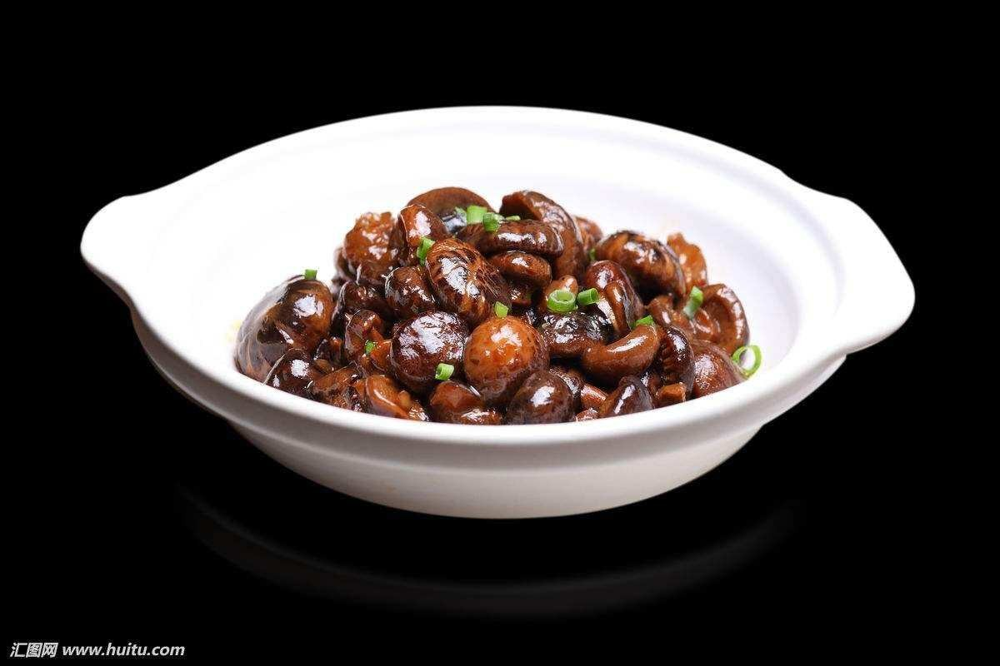

# 红烧花菇 (Braised Flowered Mushrooms in Supreme Brown Sauce)

## 📋 基本資訊 / Recipe Overview
- **料理名稱 (繁體)**：紅燒花菇
- **料理名称 (简体)**：红烧花菇
- **English Title**：Braised Flowered Mushrooms in Supreme Brown Sauce
- **素食流派 / Diet**：全素 / 纯素 Vegan (纯素无五辛；含生姜)
- **料理分類 / Category**：02-菌菇山珍类 / 宴席名肴 / 肥厚软糯
- **份量 / Servings**：2-3 人份
- **準備時間 / Prep Time**：3 小時（泡发时间）+ 8 分鐘
- **烹飪時間 / Cook Time**：25 分鐘
- **總計耗時 / Total Time**：33 分鐘（不含泡发）
- **來源 / Source**：现代中华素菜 Top 100 · [02-菌菇山珍类.md](../02-菌菇山珍类.md) 第 5 道

## 📖 菜品特色 / Description
厚花菇红烧，比普通香菇更香。

---

## 🌿 食材與調味清單 / Ingredients & Seasonings
### 主料
- 特级厚肉天白花菇 / 椴木花菇 8-10 朵（干重约 100g，裂纹深、肉厚无柄）
- 西蓝花 / 广东菜心 150g（焯熟围边摆盘）

### 调味料 / 配料
- 生姜 4 片
- 滤清花菇原汤 300ml
- 顶级生抽 2 汤匙（约 30ml）
- 优质老抽 1 茶匙（约 5ml，上诱人酱色）
- 素蚝油 1.5 汤匙（约 22.5ml）
- 老冰糖 15g
- 料酒 / 花雕酒 1 汤匙（约 15ml，去陈增醇）
- 食盐 1/3 茶匙（约 2g）
- 水淀粉 2 汤匙（生粉 1 茶匙 + 清水 2 汤匙）
- 花生油 2 汤匙（约 30ml）
- 芝麻香油 1 茶匙

---

## 🍳 烹飪步驟 / Step-by-Step Cooking Steps
### 步骤 1：深度泡发与修整
1. 花菇冷水或 40℃ 温水加入 1 茶匙面粉和 1 茶匙白糖浸泡 3-4 小时至厚心完全软透。
2. 剪去硬蒂洗净裂缝中的微尘，轻轻攥出水分；泡菇水静置沉淀后用细纱布滤清 300ml 备用。

### 步骤 2：沸水焯透与爆香底料
1. 沸水中加入 1 汤匙料酒，下花菇焯烫 2 分钟去除干货陈味，捞出沥干。
2. 炒锅倒入花生油烧热，下姜片慢火煸炒出浓郁姜香。

### 步骤 3：小火慢煨 25 分钟入味
1. 下花菇翻炒片刻，烹入生抽、老抽、素蚝油和老冰糖炒匀上色。
2. 倒入滤清的花菇原汤 300ml 淹过花菇，大火煮沸后加盖转极小火慢煨 20-25 分钟，让厚厚的花菇肉吸饱鲜浓汤汁。

### 步骤 4：围边摆盘与浓汁封油
1. 另起锅加水放盐和油，将西蓝花焯熟捞出，在圆盘外围码成翠绿一圈。
2. 花菇锅揭盖转大火收缩浓汁，淋入水淀粉推成玻璃浓芡，滴入芝麻香油，将肥厚花菇盛入盘心，浓芡淋在花菇上即可。

---

## 💡 大厨秘诀 / Chef's Tips
1. **面粉白糖洗发去泥沙**：花菇表面龟裂深邃易藏山泥，浸泡时加少许面粉能吸附杂质，白糖能加速水分深入菌肉厚芯。
2. **花菇肉厚需小火慢煨 25 分钟**：花菇肉质极为紧实，必须给足煨炖时间，让菇体组织充分膨胀吸足浓稠酱汁，达到“软糯而有筋骨、丰腴媲美鲍鱼”的顶级口感。
3. **原汤去沉淀浓缩煨制**：沉淀过滤出的花菇水带有极高的鲜味核苷酸，配合素蚝油慢煨收浓，回味悠长醇厚。

---
*食谱归档时间：2026-08-21 · 收录于 20260818-vegetarianism 本地菜谱库 (1Top 精选)*
