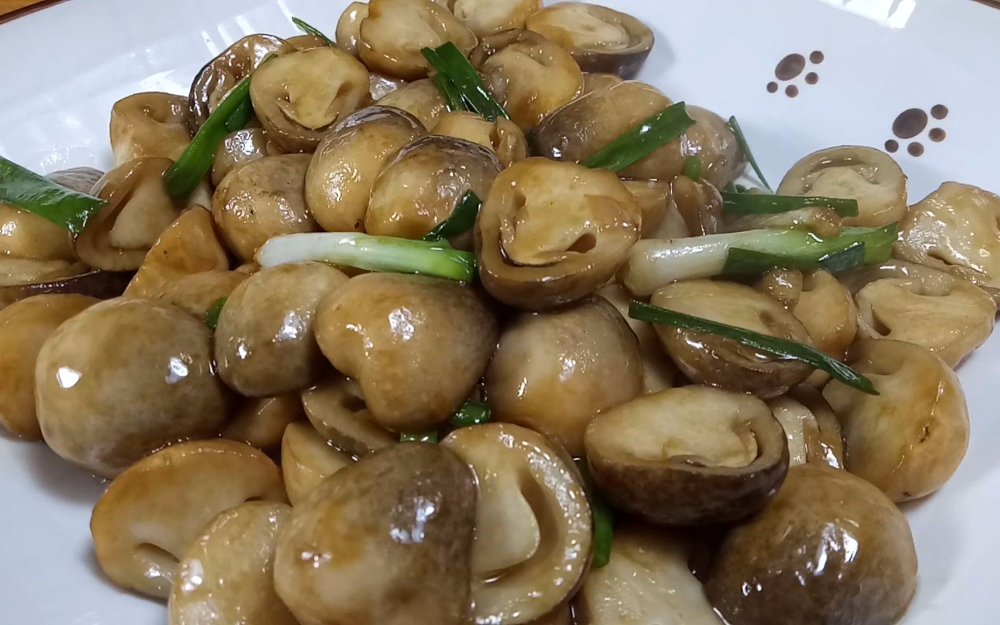

# 红烧草菇 (Braised Fresh Straw Mushrooms in Rich Brown Glaze)

## 📋 基本資訊 / Recipe Overview
- **料理名稱 (繁體)**：紅燒草菇
- **料理名称 (简体)**：红烧草菇
- **English Title**：Braised Fresh Straw Mushrooms in Rich Brown Glaze
- **素食流派 / Diet**：全素 / 纯素 Vegan
- **料理分類 / Category**：02-菌菇山珍类 / 传统红烧 / 浓油赤酱
- **份量 / Servings**：2-3 人份
- **準備時間 / Prep Time**：10 分鐘
- **烹飪時間 / Cook Time**：8 分鐘
- **總計耗時 / Total Time**：18 分鐘
- **來源 / Source**：现代中华素菜 Top 100 · [02-菌菇山珍类.md](../02-菌菇山珍类.md) 第 45 道

## 📖 菜品特色 / Description
鲜草菇红烧收汁，口感弹嫩多汁。红亮酱汁紧裹圆润菇体，一口咬下浓汁迸发，酱香浓郁，回味醇甜。

---

## 🌿 食材與調味清單 / Ingredients & Seasonings

### 主料
- 鲜草菇 400g（圆整无裂纹为佳）

### 配料与调料
- 生姜 3 片（切薄片）
- 香葱碎 / 芹菜粒 1 汤匙（出锅点缀）
- 纯植物花生油 2 汤匙（约 30ml）
- 单晶冰糖 6 粒（约 10g，炒嫩糖色与增光泽）
- 优质生抽 1.5 汤匙（约 22ml）
- 酿造老抽 1/2 汤匙（约 7.5ml，上红亮色）
- 香菇素蚝油 1 汤匙（约 15ml）
- 素高汤 / 沸水 120ml
- 芝麻香油 1/2 茶匙（约 2.5ml）
- 熟白芝麻 1/2 茶匙（点缀）
- 玉米淀粉 1 茶匙（兑水 2 汤匙成薄芡）

---

## 🍳 烹飪步驟 / Step-by-Step Cooking Steps

### 步骤 1：草菇改刀与沸水焯烫
1. 草菇切去基部泥沙硬皮，洗净沥干。在每只草菇底部划十字花刀深约 1/3（保持整颗外观，同时加速内部吸汁入味）。
2. 锅中加足量宽水烧沸，加 1 茶匙盐，下入草菇大火焯烫 2 分钟，捞出过凉水沥干备用。

### 步骤 2：炒制微黄冰糖糖色
1. 锅中倒入 2 汤匙花生油，下入冰糖粒，转小火慢炒。
2. 用锅铲不断划动，至冰糖融化并出现微黄浅褐色细密小泡沫（嫩糖色，切勿炒过发黑变苦）。

### 步骤 3：下料裹色与烹汁
1. 立即下入姜片和沥干的草菇，转中大火快速翻炒 1 分钟，让草菇均匀裹上一层晶亮糖色油膜。
2. 沿锅边烹入生抽 1.5 汤匙、素蚝油 1 汤匙与老抽 1/2 汤匙，大火快速翻炒出酱香味与红润底色。

### 步骤 4：慢煨入味与大火收浓汁
1. 倒入素高汤 120ml，大火煮沸后转中小火，加盖慢煨 4-5 分钟，让草菇内部纤维充分吸收红烧酱汁。
2. 揭盖转大火收汁，淋入水淀粉快速翻匀，让汤汁收浓成红亮芡汁紧紧抱住草菇。
3. 淋入香油翻匀关火，出锅装盘，撒上熟白芝麻与香葱碎或芹菜粒。

---

## 💡 大厨秘诀 / Chef's Tips

1. **底部十字花刀是入味关键**：草菇外表致密光滑不易入味，底部打浅十字刀能让内部瞬间吸饱酱汁，成菜多汁爆浆。
2. **小火炒嫩糖色赋光泽**：用冰糖炒出嫩黄糖色，不仅赋予草菇柔和回甘，更能让成品呈现琥珀般明亮光泽。
3. **大火紧汁抱芡**：红烧菌菇讲究“自来芡”与薄芡结合，收汁到锅底几乎无多余流动汤汁，酱汁全裹在菇体上。

---
*食谱归档时间：2026-08-21 · 收录于 20260818-vegetarianism 本地菜谱库 (1Top 精选)*
