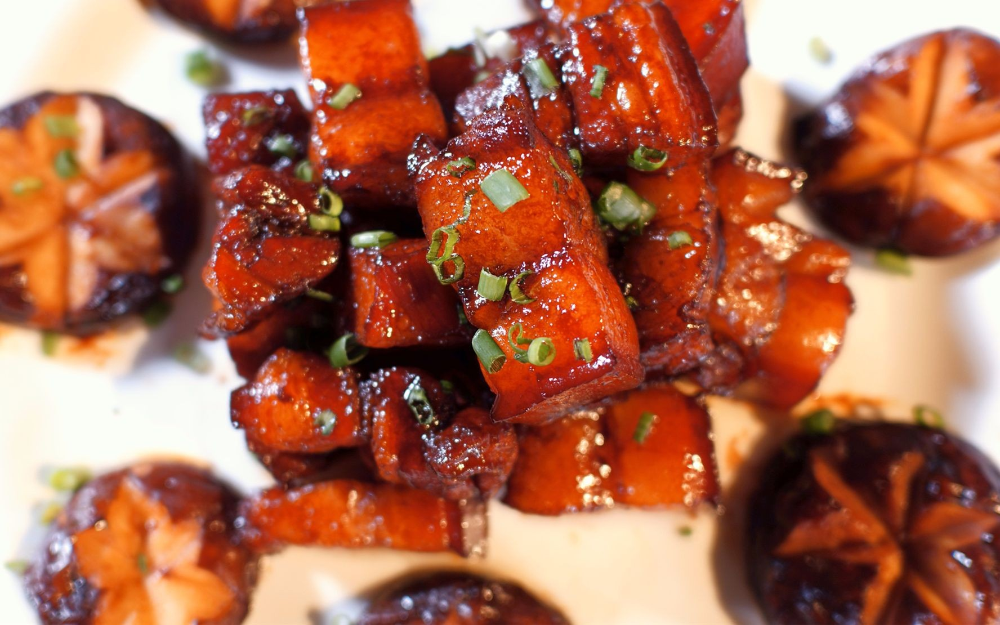

# 红烧香菇 (Braised Dried Shiitake Mushrooms in Savory Brown Sauce)

## 📋 基本資訊 / Recipe Overview
- **料理名稱 (繁體)**：紅燒香菇
- **料理名称 (简体)**：红烧香菇
- **English Title**：Braised Dried Shiitake Mushrooms in Savory Brown Sauce
- **素食流派 / Diet**：全素 / 纯素 Vegan (纯素无五辛；含生姜)
- **料理分類 / Category**：02-菌菇山珍类 / 经典红烧 / 酱香浓郁
- **份量 / Servings**：2-3 人份
- **準備時間 / Prep Time**：2 小時（泡发时间）+ 5 分鐘
- **烹飪時間 / Cook Time**：20 分鐘
- **總計耗時 / Total Time**：25 分鐘（不含泡发）
- **來源 / Source**：现代中华素菜 Top 100 · [02-菌菇山珍类.md](../02-菌菇山珍类.md) 第 4 道

## 📖 菜品特色 / Description
干香菇泡发红烧，软糯酱香，年菜素席都用。

---

## 🌿 食材與調味清單 / Ingredients & Seasonings
### 主料
- 优质干香菇 15-20 朵（约 80g 干重，选择朵形完整、肉厚者）

### 调味料 / 配料
- 生姜 3 片
- 八角 1 颗（提复合微香）
- 沉淀过滤香菇原汤 250ml
- 优质生抽 2 汤匙（约 30ml）
- 老抽 1 茶匙（约 5ml，调上红亮酱色）
- 素蚝油 1 汤匙（约 15ml）
- 黄冰糖 15g（咸甜和味与增亮）
- 食盐 1/3 茶匙（约 2g）
- 水淀粉 2 汤匙（生粉 1 茶匙 + 清水 2 汤匙）
- 熟植物油 2 汤匙（约 30ml）
- 芝麻香油 1/2 茶匙

---

## 🍳 烹飪步驟 / Step-by-Step Cooking Steps
### 步骤 1：干香菇温水泡发与修剪
1. 干香菇用 40℃ 温水加入 1/2 茶匙白糖浸泡 1.5-2 小时至完全舒展软透。
2. 剪去硬根洗净泥沙轻轻挤干；将泡香菇的水用双层细纱布过滤沉淀备用。

### 步骤 2：香菇焯水与煸炒出焦香
1. 锅中烧沸水，下香菇焯烫 1 分钟捞出沥干去陈味。
2. 炒锅热油，下姜片和八角小火煸香，倒入香菇中火煸炒 2 分钟，使水分蒸发、边缘微泛金黄。

### 步骤 3：红烧调味慢火煨透
1. 锅内加入黄冰糖翻炒融化，调入生抽、老抽、素蚝油炒匀上色。
2. 倒入过滤后的香菇原汤 250ml 没过香菇，大火煮沸后加盖转中小火慢煨 15 分钟，让浓汁彻底渗入菇肉。

### 步骤 4：大火收汁与挂芡
1. 揭开锅盖挑去姜片和八角，转大火收缩汤汁至浓稠。
2. 淋入水淀粉推匀挂上浓亮芡汁，滴入芝麻香油，翻炒均匀出锅装盘。

---

## 💡 大厨秘诀 / Chef's Tips
1. **干香菇比鲜香菇风味更醇厚**：日晒干燥过程中香菇鸟苷酸与多糖充分转化，红烧必须选用优质干香菇，才能做出媲美鲍鱼般的弹牙与浓郁酱香。
2. **温水加糖加速泡发**：温水中加少许白糖可减小水分子表面张力，加速菇肉吸水软化，同时锁住菌菇鲜味成分不流失。
3. **慢火煨透 15 分钟是入味核心**：煨煮时间不可偷工减料，只有让酱汁中的糖、酱、菌香深度融合渗透，每一朵香菇才能咬出浓醇爆汁感。

---
*食谱归档时间：2026-08-21 · 收录于 20260818-vegetarianism 本地菜谱库 (1Top 精选)*
