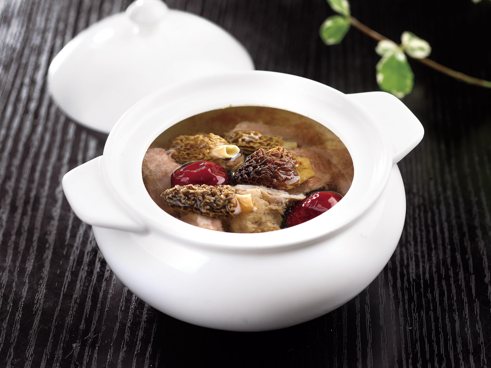

# 羊肚菌汤 (Double-Boiled Morel Mushroom Nourishing Herbal Soup)

## 📋 基本資訊 / Recipe Overview
- **料理名稱 (繁體)**：羊肚菌湯
- **料理名称 (简体)**：羊肚菌汤
- **English Title**：Double-Boiled Morel Mushroom Soup with Chinese Yam, Sweet Corn and Goji
- **素食流派 / Diet**：全素 / 纯素 Vegan (顶级养生滋补素汤，不含五辛)
- **料理分類 / Category**：02-菌菇山珍类 / 药膳养生 / 清润素汤
- **份量 / Servings**：2-3 人份
- **準備時間 / Prep Time**：35 分鐘 (含羊肚菌泡发)
- **烹飪時間 / Cook Time**：45 分鐘
- **總計耗時 / Total Time**：80 分鐘
- **來源 / Source**：现代中华素菜 Top 100 · [02-菌菇山珍类.md](../02-菌菇山珍类.md) 第 78 道

## 📖 菜品特色 / Description
羊肚菌配淮山、杞子、红枣、甜玉米清炖，养生滋补素汤顶级代表。汤色金黄透亮如琥珀，山野坚果香浓郁悠长，玉米与淮山贡献天然清甜，清润回甘，温养身心。

---

## 🌿 食材與調味清單 / Ingredients & Seasonings
### 主料
- 优质干羊肚菌 8-10 朵（约 12-15g）
- 鲜铁棍山药（淮山） 150g（切厚段）
- 水果甜玉米 1 根（约 200g，切小段）
### 配料 / 养生辅料
- 红枣 4 枚（去核切半，去燥热）
- 优质宁夏枸杞 15 粒
- 生姜 2 片（约 6g）
- 澄清羊肚菌浸泡原汤 + 纯净水 共 1200ml
### 调味品
- 优质食盐 1 茶匙（约 5g）
- 白胡椒粉 少许（约 0.5g，选配）

---

## 🍳 烹飪步驟 / Step-by-Step Cooking Steps
### 步骤 1：羊肚菌低温泡发与滤沙
1. 羊肚菌用 35-40℃ 温水浸泡 35-40 分钟至菌身完全胀发变软（切忌使用滚开水，以免烫坏菌盖多糖与香气成分）。
2. 在水中轻柔晃动清洗菌褶中的微细沙尘，捞出羊肚菌；浸泡的水静置 15 分钟沉淀泥沙后，用密筛网滤出上方清澈的金黄色原汤备用。

### 步骤 2：配料准备
1. 铁棍山药去皮切成 2cm 长的厚滚刀段；水果玉米切成 3cm 小圆段；红枣洗净去核；枸杞洗净沥干。

### 步骤 3：砂锅慢火煲制底汤
1. 将砂锅置于火上，倒入澄清的羊肚菌原汤与纯净水（共约 1200ml）。
2. 放入玉米段、红枣、姜片，大火煮沸后撇去浮沫，转小火加盖慢炖 20 分钟，熬出玉米与红枣的天然清甜底味。

### 步骤 4：放入羊肚菌与淮山慢炖
1. 下入泡发好的羊肚菌与铁棍山药段，继续保持微沸小火慢炖 20 分钟，使羊肚菌的天然山珍浓香彻底融入汤中。

### 步骤 5：调味与出锅品饮
1. 出锅前 5 分钟加入枸杞，调入 1 茶匙食盐和极微量白胡椒粉，轻轻搅匀慢煨 3 分钟即可关火出锅盛碗。

---

## 💡 大厨秘诀 / Chef's Tips
1. **温水泡发留原汤是汤色金黄清甜之魂**：羊肚菌泡发原汤富含水溶性多糖和天然色素，过滤去沙后倒入汤中，奠定琥珀金黄汤色与极致鲜美。
2. **玉米与山药是素汤油脂替代物**：水果玉米煮出的天然甜味配合山药的黏多糖，能使汤体醇厚有深度，完全不输荤汤。
3. **极简调味不夺山珍真味**：只加微量食盐调味，严禁加入鸡精、八角等刺激性香料，保持大自然赋予的纯净山野芳香。

---
*食谱归档时间：2026-08-21 · 收录于 20260818-vegetarianism 本地菜谱库 (1Top 精选)*
