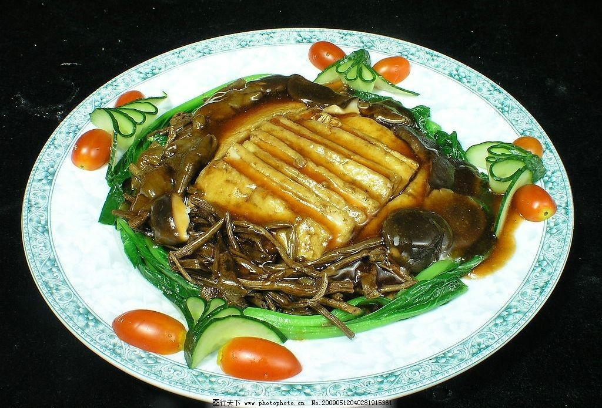

# 茶樹菇炒香干 (Stir-Fried Agrocybe (Tea Tree) Mushrooms with Spiced Tofu)

## 📋 基本資訊 / Recipe Overview
- **料理名稱 (繁體)**：茶樹菇炒香干
- **料理名称 (简体)**：茶树菇炒香干
- **English Title**：Stir-Fried Agrocybe (Tea Tree) Mushrooms with Spiced Tofu
- **素食流派 / Diet**：全素 / 纯素 Vegan (纯净素 / 无五辛；若食五辛可加蒜片)
- **料理分類 / Category**：02-菌菇山珍类 / 家常小炒 / 鲜香劲道
- **份量 / Servings**：2-3 人份
- **準備時間 / Prep Time**：10 分鐘
- **烹飪時間 / Cook Time**：8 分鐘
- **總計耗時 / Total Time**：18 分鐘
- **來源 / Source**：现代中华素菜 Top 100 · [02-菌菇山珍类.md](../02-菌菇山珍类.md) 第 36 道

## 📖 菜品特色 / Description
茶树菇配豆腐干，鲜香柔韧。

---

## 🌿 食材與調味清單 / Ingredients & Seasonings
### 主料
- 新鲜茶树菇 250g（或干茶树菇 50g 提前温水泡发洗净）
- 五香豆腐干 4 块（约 150g）

### 配料
- 青椒 1 个（切细丝）
- 红椒半个（切细丝，配色）
- 生姜 2 片（切细丝）
- 干辣椒 2 根（剪小段）

### 调味料
- 植物油 2 汤匙（30ml）
- 优质生抽 1.5 汤匙（22ml）
- 素蚝油 1 汤匙（15g）
- 白糖 1/3 茶匙（1.5g，提鲜中和）
- 食盐 1/4 茶匙（1.5g）
- 芝麻香油 1/2 茶匙（2.5ml）

---

## 🍳 烹飪步驟 / Step-by-Step Cooking Steps
### 步骤 1：食材改刀与沥干
1. 茶树菇切除根部硬结沙囊，洗净后用厨房纸或沥水篮彻底控干水分；较粗的撕成细条，太长的从中切断。
2. 五香豆腐干洗净擦干，切成约 0.3cm 厚的均匀长薄条。
3. 青红椒去籽切细丝；生姜切细丝；干辣椒剪段。

### 步骤 2：煸炒香干出焦香边
1. 炒锅烧热倒入 1 汤匙植物油。
2. 下入香干条，中火翻炒煸煎 2 分钟，至香干表面微微起小泡、边缘金黄微焦（更劲道易吸味），盛出备用。

### 步骤 3：大火干煸茶树菇出浓香
1. 锅中补入 1 汤匙植物油烧热。
2. 倒入沥干水分的茶树菇，转大火快速翻炒煸炒 2-3 分钟。
3. 煸至茶树菇脱水变软、散发出浓郁干燥的木本菌菇香气。

### 步骤 4：爆香合炒与调味出锅
1. 将茶树菇推至锅边，下姜丝与干辣椒段小火爆香 10 秒。
2. 倒入煸好的香干条与青红椒丝，转大火快速翻炒。
3. 沿锅边淋入生抽 1.5 汤匙、素蚝油 1 汤匙、白糖 1/3 茶匙与食盐 1/4 茶匙。
4. 旺火快速翻炒 1 分钟至酱汁均匀裹紧食材，淋入芝麻香油，颠锅出香即可装盘。

---

## 💡 大厨秘诀 / Chef's Tips
1. **香干先煸出微焦泡**：香干先经热油煸煎至表皮微起小泡，口感更加筋道有嚼劲，且能牢牢吸住茶树菇的鲜汁。
2. **茶树菇彻底沥干大火煸**：茶树菇下锅前务必沥干水分，大火干煸逼出水气与浓郁山珍菌香，避免菜肴出水软塌。
3. **大火快炒锁锅气**：调味料下锅后保持旺火快速翻炒 1 分钟内出锅，青红椒脆嫩，香干与茶树菇柔韧鲜香。

---
*食谱归档时间：2026-08-21 · 收录于 20260818-vegetarianism 本地菜谱库 (1Top 精选)*
