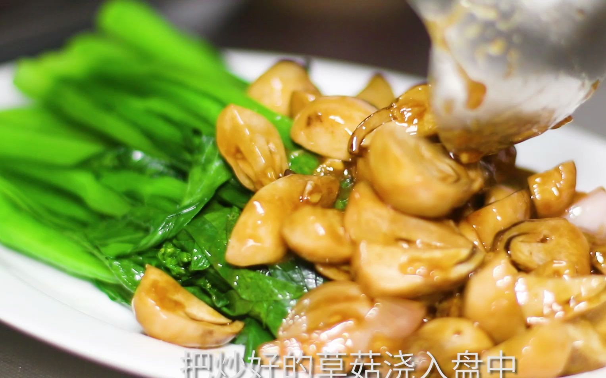

# 草菇菜心 (Cantonese Braised Straw Mushrooms over Poached Choy Sum)

## 📋 基本資訊 / Recipe Overview
- **料理名稱 (繁體)**：草菇扒菜心
- **料理名称 (简体)**：草菇菜心
- **English Title**：Cantonese Braised Straw Mushrooms over Poached Choy Sum
- **素食流派 / Diet**：全素 / 纯素 Vegan
- **料理分類 / Category**：02-菌菇山珍类 / 粤港经典 / 宴席名肴
- **份量 / Servings**：2-3 人份
- **準備時間 / Prep Time**：12 分鐘
- **烹飪時間 / Cook Time**：6 分鐘
- **總計耗時 / Total Time**：18 分鐘
- **來源 / Source**：现代中华素菜 Top 100 · [02-菌菇山珍类.md](../02-菌菇山珍类.md) 第 46 道

## 📖 菜品特色 / Description
草菇扒菜心，粤港酒楼高档素席名菜。草菇油亮滑嫩，菜心碧绿清甜，素高汤琉璃芡浇淋其上，色泽分明，清雅华贵。

---

## 🌿 食材與調味清單 / Ingredients & Seasonings

### 主料
- 鲜嫩广东菜心（或优质油菜心） 300g（修切整齐，长约 12cm）
- 鲜草菇 200g（对半切开）

### 焯菜心料
- 食盐 1 茶匙（约 5g）
- 花生油 1 汤匙（约 15ml，保翠绿油亮）
- 白砂糖 1/2 茶匙（约 2.5g）

### 扒草菇高汤浓汁
- 生姜丝 1 茶匙（约 5g）
- 素高汤 150ml（黄豆芽香菇熬制）
- 香菇素蚝油 1.5 汤匙（约 22ml）
- 优质生抽 1/2 汤匙（约 7.5ml）
- 白砂糖 1/3 茶匙（约 1.5g）
- 白胡椒粉 1/4 茶匙（约 1g）
- 玉米淀粉 1 茶匙（兑水 2 汤匙成琉璃芡）
- 芝麻香油 1/2 茶匙（约 2.5ml）

---

## 🍳 烹飪步驟 / Step-by-Step Cooking Steps

### 步骤 1：菜心精修与白灼摆盘
1. 菜心洗净削去老根外皮，修剪整齐为一致长度。
2. 锅中烧开足量水，加入食盐 1 茶匙、花生油 1 汤匙与白糖 1/2 茶匙。
3. 手持菜叶，先将菜心根茎浸入沸水中焯 30 秒，再将整株浸入水中焯 30 秒至碧绿断生。
4. 捞出沥水，整齐并排平铺在长形白瓷盘中央做底。

### 步骤 2：草菇去涩焯烫
草菇洗净对半切开，放入加了少许姜片的沸水中大火焯水 2 分钟，捞出过凉水沥干。

### 步骤 3：煨烧浓鲜草菇
1. 炒锅倒入 1 汤匙花生油烧热，下入姜丝爆出清香。
2. 倒入焯水后的草菇大火翻炒 30 秒。
3. 注入素高汤 150ml，调入素蚝油 1.5 汤匙、生抽 1/2 汤匙、白糖 1/3 茶匙与白胡椒粉。
4. 中火煨煮 2-3 分钟，让草菇吸透素高汤鲜味。

### 步骤 4：勾琉璃芡与扒盘
1. 转大火，淋入水淀粉快速推匀，勾出清澈透亮的薄琉璃芡。
2. 淋入 1/2 茶匙香油提亮，将草菇连同浓鲜芡汁整齐舀浇在盘中碧绿菜心之上即可上席。

---

## 💡 大厨秘诀 / Chef's Tips

1. **菜心焯水三诀（油、盐、糖）**：油封住叶绿素保持翠绿光亮，盐入底味，糖锁住清甜爽脆。
2. **先焯根再浸叶**：菜心根茎粗叶片嫩，分段下锅受热均匀，菜茎脆嫩多汁而不软烂。
3. **琉璃芡汁点睛**：素高汤与素蚝油调制的芡汁必须晶莹剔透，轻柔裹住草菇与菜心，呈现高级粤菜宴席品相。

---
*食谱归档时间：2026-08-21 · 收录于 20260818-vegetarianism 本地菜谱库 (1Top 精选)*
