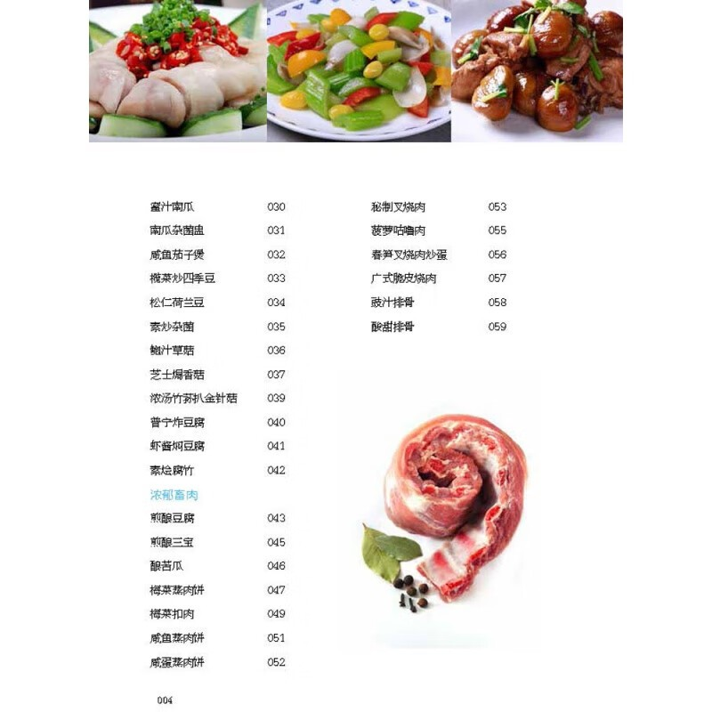

# 草菇豆腐 (Braised Fresh Straw Mushrooms with Golden Silken Tofu)

## 📋 基本資訊 / Recipe Overview
- **料理名稱 (繁體)**：草菇豆腐
- **料理名称 (简体)**：草菇豆腐
- **English Title**：Braised Fresh Straw Mushrooms with Golden Silken Tofu
- **素食流派 / Diet**：全素 / 纯素 Vegan
- **料理分類 / Category**：02-菌菇山珍类 / 粤式素馆 / 软嫩滑润
- **份量 / Servings**：2-3 人份
- **準備時間 / Prep Time**：12 分鐘
- **烹飪時間 / Cook Time**：8 分鐘
- **總計耗時 / Total Time**：20 分鐘
- **來源 / Source**：现代中华素菜 Top 100 · [02-菌菇山珍类.md](../02-菌菇山珍类.md) 第 44 道

## 📖 菜品特色 / Description
鲜草菇配滑豆腐，粤式素馆经典。金黄微脆的豆腐吸饱草菇的浓郁鲜汁，滑润适口，菌香与豆香交融。

---

## 🌿 食材與調味清單 / Ingredients & Seasonings

### 主料
- 鲜草菇 200g（洗净对半切开）
- 老豆腐 / 板豆腐（或日本玉子豆腐） 300g（切 2cm 厚块）

### 配料与底香
- 生姜 3 片（切薄片）
- 红彩椒 1/4 个（切菱形片配色）
- 青甜椒 1/4 个（切菱形片配色）
- 花生油 3 汤匙（约 45ml，用于煎豆腐与滑炒）

### 经典粤式煨汁
- 素高汤 / 清水 150ml
- 香菇素蚝油 1.5 汤匙（约 22ml）
- 优质生抽 1 汤匙（约 15ml）
- 白砂糖 1/3 茶匙（约 1.5g）
- 白胡椒粉 1/4 茶匙（约 1g）
- 芝麻香油 1/2 茶匙（约 2.5ml）

### 勾芡
- 玉米淀粉 1 茶匙（约 5g）兑水 2 汤匙（约 30ml）调成薄芡汁

---

## 🍳 烹飪步驟 / Step-by-Step Cooking Steps

### 步骤 1：草菇飞水去生涩
1. 草菇洗净削去基部泥屑，纵向对半切开。
2. 锅中烧开宽水，加入 2 片姜与 1/2 茶匙盐，下入草菇焯水 2 分钟，捞出立即过冷水冲凉沥干（此步彻底去除草菇特有的土腥生涩味）。

### 步骤 2：豆腐煎至两面金黄
1. 豆腐切成厚块，用厨房纸吸去表面水分。
2. 平底锅倒入 2 汤匙花生油烧热，将豆腐块逐一放入，中小火慢煎 3 分钟至一面金黄，翻面继续煎至两面金黄硬壳，盛出备用。

### 步骤 3：爆香与合锅煨烧
1. 锅中留少许底油，下入姜片爆出香味。
2. 放入焯好水的草菇大火煸炒 1 分钟，倒入煎好的豆腐块。
3. 注入素高汤 150ml，调入素蚝油 1.5 汤匙、生抽 1 汤匙、白糖 1/3 茶匙与白胡椒粉。
4. 大火烧开后转中火加盖煨煮 3-4 分钟，让豆腐内部多孔充分吸透草菇的高汤鲜味。

### 步骤 4：加彩椒与勾薄芡
1. 揭盖放入青红彩椒菱形片翻炒 30 秒至断生。
2. 沿锅边淋入调匀的水淀粉，大火翻炒收汁，使芡汁如琉璃般包裹在豆腐与草菇表面。
3. 淋入 1/2 茶匙香油，出锅装入深盘即可上桌。

---

## 💡 大厨秘诀 / Chef's Tips

1. **草菇必经沸水姜片飞水**：鲜草菇自带草腥味，开水加生姜飞水 2 分钟再过冷水，可锁住脆嫩并彻底去涩。
2. **豆腐先煎后煨是核心**：豆腐煎至金黄起蜂窝孔，既能保持成菜形状完整不碎，又能在煨煮时大量吸收草菇鲜汁。
3. **芡汁宜薄不宜厚**：粤菜扒烩类讲究“琉璃芡”，轻薄透亮，紧扣食材却不糊嘴。

---
*食谱归档时间：2026-08-21 · 收录于 20260818-vegetarianism 本地菜谱库 (1Top 精选)*
