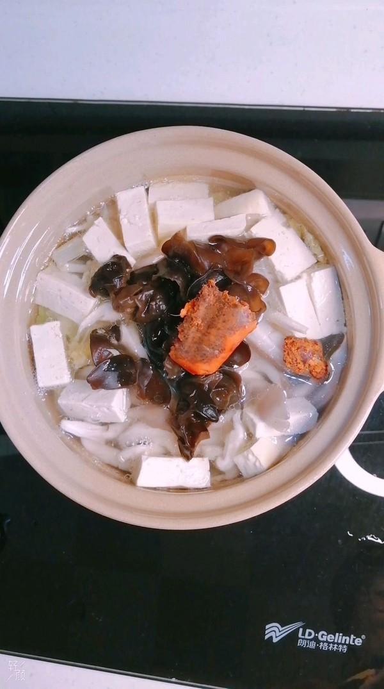

# 菌菇煲 (Claypot Braised Mixed Mushrooms with Tofu and Napa Cabbage)

## 📋 基本資訊 / Recipe Overview
- **料理名稱 (繁體)**：砂鍋菌菇煲
- **料理名称 (简体)**：菌菇煲
- **English Title**：Claypot Braised Mixed Mushrooms with Tofu and Napa Cabbage
- **素食流派 / Diet**：全素 / 纯素 Vegan
- **料理分類 / Category**：02-菌菇山珍类 / 砂锅慢煨 / 暖胃鲜甜
- **份量 / Servings**：3-4 人份
- **準備時間 / Prep Time**：15 分鐘
- **烹飪時間 / Cook Time**：15 分鐘
- **總計耗時 / Total Time**：30 分鐘
- **來源 / Source**：现代中华素菜 Top 100 · [02-菌菇山珍类.md](../02-菌菇山珍类.md) 第 54 道

## 📖 菜品特色 / Description
砂锅杂菌慢煨，配白菜豆腐，热气腾腾。白菜铺底垫出天然清甜，煎豆腐吸饱菌汤，原煲慢煨，保温暖心。

---

## 🌿 食材與調味清單 / Ingredients & Seasonings

### 主料
- 鲜嫩娃娃菜 / 大白菜叶 200g（切长条）
- 老豆腐 250g（切 1.5cm 厚方块）
- 鲜香菇 4 朵（切十字花刀）
- 鲜平菇 80g（撕小块）
- 鲜白玉菇 80g（去根洗净）
- 鲜金针菇 80g（去根洗净）
- 枸杞 10 粒（温水泡发）

### 煲底调味高汤
- 生姜 3 片（切厚片）
- 纯酿生抽 1.5 汤匙（约 22ml）
- 香菇素蚝油 1.5 汤匙（约 22ml）
- 纯素高汤 / 开水 350ml
- 海盐 1 茶匙（约 5g）
- 白胡椒粉 1/3 茶匙（约 1.5g）
- 芝麻香油 1 茶匙（约 5ml）
- 植物油 2 汤匙（用于煎豆腐）

---

## 🍳 烹飪步驟 / Step-by-Step Cooking Steps

### 步骤 1：豆腐香煎与菌菇处理
1. 老豆腐切块吸干水分，平底锅加 2 汤匙油，中小火将豆腐两面煎至金黄起焦壳，盛出备用。
2. 鲜香菇顶部划十字花刀，平菇撕小朵，白玉菇和金针菇去根洗净沥干。

### 步骤 2：砂锅铺底码盘
1. 取一传统砂锅，锅底整齐铺上一层厚厚的娃娃菜叶（防止菌菇粘底，并能在加热中释放天然清甜水分）。
2. 在娃娃菜上方依次美观码入煎好的金黄豆腐块、花刀香菇、平菇、白玉菇与金针菇。

### 步骤 3：调配注入素高汤汁
1. 小碗中混合素高汤 350ml、生抽 1.5 汤匙、素蚝油 1.5 汤匙、海盐 1 茶匙与白胡椒粉，搅拌均匀。
2. 放入姜片，将调好的高汤汁缓缓浇入砂锅中（约没过食材一半深度）。

### 步骤 4：加盖慢煨与上桌
1. 盖上砂锅盖，置于火上大火烧开，转中小火慢煨 12-15 分钟，让白菜软烂、豆腐充分吸饱菌汤。
2. 揭盖，撒入枸杞，淋上 1 茶匙香油，加盖关火，直接端着滚烫沸腾的砂锅上桌享用。

---

## 💡 大厨秘诀 / Chef's Tips

1. **白菜铺底两全其美**：白菜受热出水防止砂锅干烧糊底，白菜的甘甜与菌菇的鲜美在锅底融汇，比肉汤更清润。
2. **豆腐先煎再煨起蜂窝**：豆腐两面煎黄后形成海绵状微孔，煨煮时能吸足满满的鲜菌浓汤，入口多汁。
3. **原煲保温煨透**：砂锅聚热保温性极佳，食材在恒温慢煨下滋味深入，秋冬季食用尤为暖胃舒心。

---
*食谱归档时间：2026-08-21 · 收录于 20260818-vegetarianism 本地菜谱库 (1Top 精选)*
