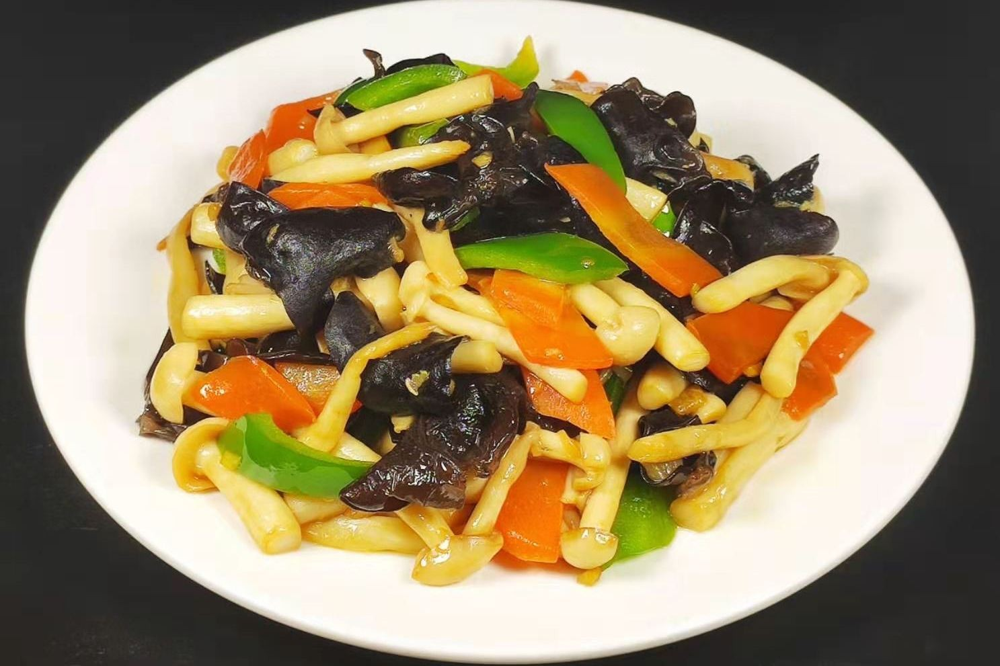

# 蒜蓉平菇 (Garlic Stir-Fried Oyster Mushrooms)

## 📋 基本資訊 / Recipe Overview
- **料理名稱 (繁體)**：蒜蓉平菇
- **料理名称 (简体)**：蒜蓉平菇
- **English Title**：Quick Stir-Fried Oyster Mushrooms with Sizzling Double Garlic and Chili
- **素食流派 / Diet**：全素 / 纯素 Vegan (含大蒜；纯素五辛素)
- **料理分類 / Category**：02-菌菇山珍类 / 快手小炒 / 蒜香浓郁
- **份量 / Servings**：2-3 人份
- **準備時間 / Prep Time**：8 分鐘
- **烹飪時間 / Cook Time**：5 分鐘
- **總計耗時 / Total Time**：13 分鐘
- **來源 / Source**：现代中华素菜 Top 100 · [02-菌菇山珍类.md](../02-菌菇山珍类.md) 第 70 道

## 📖 菜品特色 / Description
平菇撕块与大量蒜蓉快手爆炒，蒜香浓郁。浓油赤蒜与滑嫩平菇相互渗透，平菇菌肉吸足蒜油的醇香，大火爆炒锅气升腾，蒜香四溢，下饭至极。

---

## 🌿 食材與調味清單 / Ingredients & Seasonings
### 主料
- 新鲜平菇 300g
### 核心配料 / 双倍蒜香
- 优质大蒜 8-10 瓣（约 40g，剁成粗细均匀的蒜蓉）
- 干红辣椒 2 根（剪小段，增香点缀）
- 小葱花 1 根（出锅点缀）
### 调味料
- 纯酿造特级生抽 1 汤匙（约 15ml）
- 优质素蚝油 1 汤匙（约 15ml）
- 食盐 1/3 茶匙（约 2g）
- 白糖 1/4 茶匙（约 1g，柔和蒜辣）
- 白胡椒粉 1/4 茶匙
- 食用植物油 2.5 汤匙（菌菇喜油，油量略宽）

---

## 🍳 烹飪步驟 / Step-by-Step Cooking Steps
### 步骤 1：平菇撕条与焯水去水
1. 平菇去蒂洗净撕成手指宽的长条小块。
2. 沸水中加入 1/3 茶匙盐，倒入平菇焯水 30 秒捞出过凉，用手彻底挤干水分。
3. 大蒜剁成蒜蓉，均分成两份（1/2 作金蒜底油，1/2 作出锅生蒜增香）。

### 步骤 2：慢火煸炒金蒜油
1. 热锅倒入 2.5 汤匙植物油，下入第一份蒜蓉和干辣椒段，开中小火慢慢煸炒 1-2 分钟，直至蒜末呈金黄微焦色，满室飘香。

### 步骤 3：大火爆炒平菇吸香
1. 转大火，倒入攥干水分的平菇条，猛火快速翻炒 1 分钟，让平菇充分吸干锅底金蒜油，表面炒至微泛焦黄色。

### 步骤 4：调味与下生蒜出锅
1. 沿锅边淋入生抽 1 汤匙、素蚝油 1 汤匙，加入白糖 1/4 茶匙、食盐 1/3 茶匙与白胡椒粉翻匀入味。
2. 出锅前撒入剩余的第二份生蒜蓉和葱花，大火快速颠锅翻炒 10 秒，激出生蒜辛香即刻出锅装盘。

---

## 💡 大厨秘诀 / Chef's Tips
1. **双重蒜蓉（金蒜底油 + 生蒜尾香）**：金蒜赋予整道菜底层的焦香醇厚，出锅前的生蒜则提供鲜活冲鼻的蒜辣鲜香，双蒜合璧风味无敌。
2. **油量稍宽更油润**：菌菇类自身多孔吸油，油量太少容易干瘪发涩，适度放宽油量才能让平菇滑嫩多汁。
3. **出水必挤、火候必大**：焯水后必须攥干水分，入锅全程大火猛炒，避免平菇受热析水稀释蒜香。

---
*食谱归档时间：2026-08-21 · 收录于 20260818-vegetarianism 本地菜谱库 (1Top 精选)*
