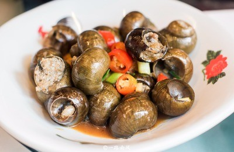

# 蒜蓉木耳 (Sautéed Black Fungus with Golden Minced Garlic)

## 📋 基本資訊 / Recipe Overview
- **料理名稱 (繁體)**：蒜蓉木耳
- **料理名称 (简体)**：蒜蓉木耳
- **English Title**：Sautéed Black Fungus with Golden Minced Garlic
- **素食流派 / Diet**：五辛素 Vegetarian (含大蒜；纯净素不适用，纯净素可做姜汁木耳)
- **料理分類 / Category**：02-菌菇山珍类 / 家常快炒 / 蒜香脆嫩
- **份量 / Servings**：2-3 人份
- **準備時間 / Prep Time**：10 分鐘
- **烹飪時間 / Cook Time**：5 分鐘
- **總計耗時 / Total Time**：15 分鐘
- **來源 / Source**：现代中华素菜 Top 100 · [02-菌菇山珍类.md](../02-菌菇山珍类.md) 第 13 道

## 📖 菜品特色 / Description
蒜蓉快炒黑木耳，家常。

---

## 🌿 食材與調味清單 / Ingredients & Seasonings
### 主料
- 优质干黑木耳 25g（泡发后约 200g，洗净去蒂撕小朵）

### 调味料 / 配料
- 大蒜 1 整头（约 8-10 瓣，细细剁成蒜蓉，分两份）
- 小米辣 1 根（切圈，可选）
- 优质生抽 1 汤匙（约 15ml）
- 素蚝油 1 茶匙（约 5ml）
- 食盐 1/3 茶匙（约 2g）
- 白糖 1/3 茶匙（约 1.5g）
- 水淀粉 1 汤匙（生粉 1/2 茶匙 + 清水 1 汤匙）
- 花生油 2 汤匙（约 30ml）

---

## 🍳 烹飪步驟 / Step-by-Step Cooking Steps
### 步骤 1：木耳焯水冰镇与沥干
1. 木耳冷水泡发洗净，沸水中焯烫 1.5 分钟捞出过凉水，用沥水篮彻底沥干表面水分。

### 步骤 2：制作金蒜底油
1. 锅中倒入花生油，油温 4 成热时下入一半蒜蓉小火慢煸，煸至蒜蓉微黄散发焦香金蒜味。

### 步骤 3：倒入木耳大火爆炒
1. 转大火，倒入彻底控干水分的黑木耳，快速翻炒 30 秒，让每一朵木耳裹上蒜油香气。

### 步骤 4：调味加银蒜收汁出锅
1. 加入生抽、素蚝油、盐、白糖和小米辣圈，淋入水淀粉颠翻均匀。
2. 最后撒入剩下的一半生蒜蓉（银蒜），翻炒 5 秒激出复合生熟蒜香，立即关火装盘。

---

## 💡 大厨秘诀 / Chef's Tips
1. **金银蒜结合香气倍增**：先用小火慢炸一半蒜蓉制成焦香“金蒜”，出锅前撒入剩余生蒜成“银蒜”，金蒜醇香、银蒜辛香，层次极度丰富。
2. **蒜蓉与木耳必须吸干水分**：油锅爆响主因是水分遇热炸油，蒜蓉剁好后若多汁可用纸巾轻压，木耳务必甩干水分，炒制安全无飞溅。
3. **大火急炒防木耳回软**：木耳已焯水断生，入锅大火快速翻炒不足 1 分钟即可出锅，保留木耳最顶级的脆爽质感。

---
*食谱归档时间：2026-08-21 · 收录于 20260818-vegetarianism 本地菜谱库 (1Top 精选)*
