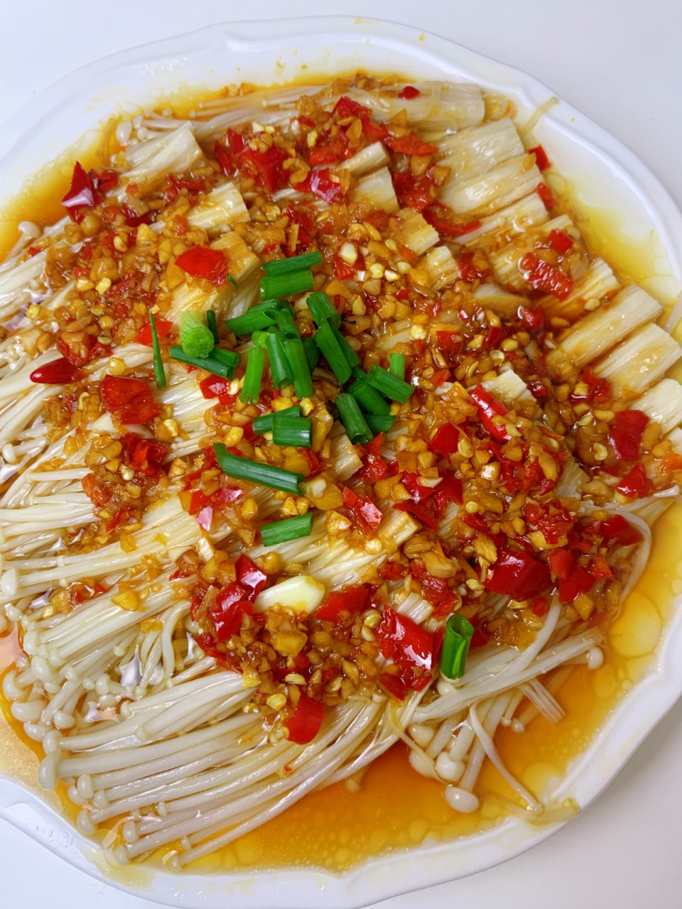

# 蒜蓉金针菇 (Steamed Enoki Mushrooms with Golden & Silver Garlic Soy Sauce)

## 📋 基本資訊 / Recipe Overview
- **料理名稱 (繁體)**：蒜蓉金針菇
- **料理名称 (简体)**：蒜蓉金针菇
- **English Title**：Steamed Enoki Mushrooms with Golden & Silver Garlic Soy Sauce
- **素食流派 / Diet**：五辛素（含蒜）；纯净素可以生姜蓉、香芹碎及鲜红椒碎替代蒜蓉
- **料理分類 / Category**：02-菌菇山珍类 / 粤式蒸菜 / 鲜滑爽脆
- **份量 / Servings**：2-3 人份
- **準備時間 / Prep Time**：10 分鐘
- **烹飪時間 / Cook Time**：6 分鐘
- **總計耗時 / Total Time**：16 分鐘
- **來源 / Source**：现代中华素菜 Top 100 · [02-菌菇山珍类.md](../02-菌菇山珍类.md) 第 42 道

## 📖 菜品特色 / Description
蒸锅或锡纸烤，金银蒜蓉豉油泼热油，鲜滑多汁，蒜香浓郁，保留金针菇脆嫩本味。

---

## 🌿 食材與調味清單 / Ingredients & Seasonings

### 主料
- 鲜金针菇 350g（切除根部，撕小撮）

### 秘制金银蒜蓉酱
- 大蒜 2 头（约 60g，去皮剁成均匀细蒜蓉）
- 鲜红指天椒 / 红甜椒 1 个（剁细末配色）
- 花生油 / 玉米油 3 汤匙（约 45ml）
- 酿造蒸鱼豉油（纯植物）/ 优质生抽 2 汤匙（约 30ml）
- 香菇素蚝油 1 汤匙（约 15ml）
- 白砂糖 1/2 茶匙（约 2.5g）
- 白胡椒粉 1/4 茶匙（约 1g）

### 泼油与出锅点缀
- 香葱碎 / 鲜香菜末 1 汤匙（五辛素用葱，纯素用香菜）
- 热花生油 1 汤匙（约 15ml，出锅泼香用）

---

## 🍳 烹飪步驟 / Step-by-Step Cooking Steps

### 步骤 1：金针菇清洗与码盘
1. 金针菇切去根部 2-3cm 泥沙结块，流水冲洗干净。
2. 用手轻轻挤干多余水分，撕成小指粗细的小撮，整齐辐射状或并排铺入略带深度的长盘或圆盘中。

### 步骤 2：炒制金银蒜蓉
1. 将剁好的蒜蓉分成两半（一半为熟金蒜，一半为生银蒜）。
2. 锅中倒入 3 汤匙花生油，三成油温（微温）下入第一半蒜蓉，转小火慢炒 2-3 分钟，炒至蒜粒微黄发脆、香气扑鼻（金蒜），立即离火。
3. 将锅中热油与金蒜一同倒入碗中，趁热冲入生银蒜末与红椒碎，利用余温激发生蒜辣香与椒香。
4. 在蒜蓉碗中加入生抽 2 汤匙、素蚝油 1 汤匙、白糖 1/2 茶匙、白胡椒粉 1/4 茶匙，搅拌均匀成金银蒜蓉酱。

### 步骤 3：浇酱与旺火清蒸
1. 将调好的金银蒜蓉酱连同酱汁均匀铺盖在金针菇表面。
2. 蒸锅中加足量清水大火烧开，上汽后将金针菇盘放入蒸架。
3. 加盖保持大火旺气清蒸 5-6 分钟，至金针菇完全塌软入味。

### 步骤 4：沥出多余汤汁与泼热油激香
1. 取出蒸盘，盘底会蒸出较多天然菌菇水分，小心倒出 1/3 多余水汽（保留适量鲜汤避免味道过淡）。
2. 在表面撒上香葱碎或鲜香菜末。
3. 小锅烧热 1 汤匙花生油至 8 成热（微冒青烟），迅速泼淋在葱蒜表面，“嗞啦”激出终极复合香气即可上桌。

---

## 💡 大厨秘诀 / Chef's Tips

1. **金银蒜黄金配比**：一半熟蒜焦香浓郁，一半生蒜辛香提神，金银合璧比单纯生蒜或熟蒜更具层次感。
2. **严控蒸制时间**：大火蒸 5-6 分钟断生即关火。金针菇久蒸会析出过多胶质且纤维变硬塞牙。
3. **倒掉部分蒸水**：金针菇含水量极高，蒸熟后会产生大量水分，若不倒出多余汤水，调味酱汁会被大幅稀释。

---
*食谱归档时间：2026-08-21 · 收录于 20260818-vegetarianism 本地菜谱库 (1Top 精选)*
