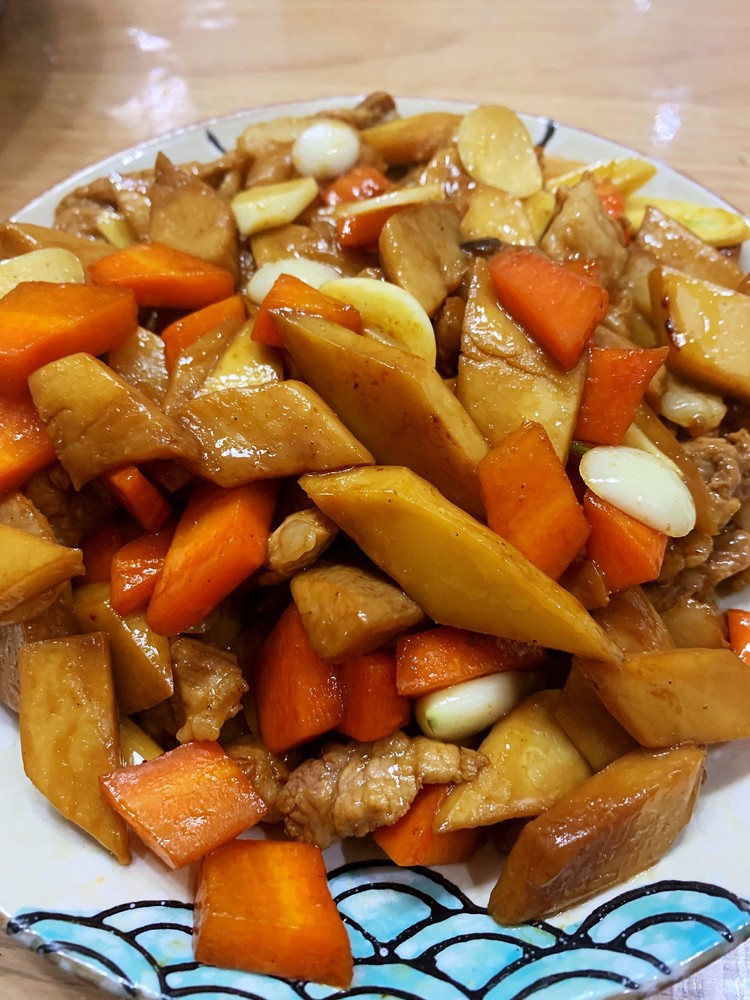

# 蒜香杏鮑菇 (Garlic Butter King Oyster Mushrooms)

## 📋 基本資訊 / Recipe Overview
- **料理名稱 (繁體)**：蒜香杏鮑菇
- **料理名称 (简体)**：蒜香杏鲍菇
- **English Title**：Garlic Butter King Oyster Mushrooms
- **素食流派 / Diet**：五辛素 (含大蒜；纯素无五辛者可用生姜碎与植物黄油替代)
- **料理分類 / Category**：02-菌菇山珍类 / 煎烤风味 / 家常小炒
- **份量 / Servings**：2-3 人份
- **準備時間 / Prep Time**：10 分鐘
- **烹飪時間 / Cook Time**：8 分鐘
- **總計耗時 / Total Time**：18 分鐘
- **來源 / Source**：现代中华素菜 Top 100 · [02-菌菇山珍类.md](../02-菌菇山珍类.md) 第 21 道

## 📖 菜品特色 / Description
蒜蓉黄油或素油煎杏鲍，肥厚多汁。

---

## 🌿 食材與調味清單 / Ingredients & Seasonings
### 主料
- 鲜嫩杏鲍菇 3 根（约 350g，选粗细均匀、菌盖未开的优质菇）

### 爆香配料
- 大蒜 6-8 瓣（约 30g，剁成均匀细蓉）
- 小葱 1 根（切葱花，五辛素；纯素可用欧芹碎或香芹末 5g 替代）
- 红椒碎 10g（配色切小丁）

### 调味料
- 植物黄油 / 素黄油 20g（或优质初榨橄榄油 1.5 汤匙 22ml）
- 优质生抽 1 汤匙（15ml）
- 素蚝油 1 汤匙（15g）
- 白糖 1/2 茶匙（2.5g，柔和咸鲜并提亮光泽）
- 现磨黑胡椒碎 1/2 茶匙（1g）
- 熟白芝麻 1 茶匙（3g）

---

## 🍳 烹飪步驟 / Step-by-Step Cooking Steps
### 步骤 1：杏鲍菇改刀与花刀处理
1. 杏鲍菇用湿厨房纸擦净表面杂质，切去根部硬蒂。
2. 将杏鲍菇切成约 1.5cm 厚的圆轮厚片（或大滚刀块）。
3. **十字花刀**：在每一片杏鲍菇的一面用刀尖划上深度约为菇体 1/3 的十字花刀，切勿切断。划花刀不仅能让杏鲍菇在煎制时迅速受热，更能锁住饱满汁水并深层吸收入味。

### 步骤 2：干锅慢煎逼水与锁汁
1. 平底不粘锅烧热，倒入 1 茶匙植物油润锅（或不放油直接干煎）。
2. 将切好的杏鲍菇花刀面朝下平铺于锅底，保持中小火慢煎。
3. 煎约 2 分钟至一面金黄微焦、水气微散，翻面继续煎另 1-2 分钟，直至双面皆呈现迷人的金黄色并释放菌菇天然香气，盛出备用。

### 步骤 3：黄油蒜蓉爆香
1. 锅中转小火，放入植物黄油 20g 慢慢融化。
2. 倒入 2/3 的蒜蓉（留 1/3 蒜蓉出锅前放），用小火慢炒 30 秒至蒜香浓郁、蒜粒呈浅金黄色，注意控制火候避免蒜蓉变黑发苦。

### 步骤 4：裹汁收浓与出锅装盘
1. 倒入煎好的杏鲍菇块，转中大火快速翻炒，让黄油蒜香充分包裹菇片。
2. 沿锅边淋入生抽 1 汤匙、素蚝油 1 汤匙、白糖 1/2 茶匙和现磨黑胡椒碎，快速颠锅翻炒 1 分钟，让酱汁紧紧包裹在每一片杏鲍菇的花刀缝隙中。
3. 起锅前下入剩余的 1/3 蒜蓉、红椒碎与葱花（或欧芹碎），大火翻炒 5 秒激出新鲜生蒜清香，撒上熟白芝麻即可关火出锅。

---

## 💡 大厨秘诀 / Chef's Tips
1. **十字花刀深度适中**：切至厚度 1/3 即可，太浅不易入味，太深煎炒时容易断裂散碎。
2. **先干煎逼水再裹油**：杏鲍菇水分含量高，先入锅干煎逼出多余水气并产生美拉德反应，再下黄油蒜蓉翻炒，口感紧实弹牙绝不水塌。
3. **大蒜两段式下锅**：前段慢炒出金黄熟蒜焦香，后段起锅前补生蒜末激发出清爽辛香，双重蒜味层次丰富饱满。

---
*食谱归档时间：2026-08-21 · 收录于 20260818-vegetarianism 本地菜谱库 (1Top 精选)*
