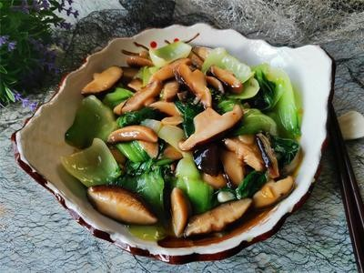

# 蘑菇扒油菜 (Braised Fresh Button Mushrooms over Baby Bok Choy)

## 📋 基本資訊 / Recipe Overview
- **料理名稱 (繁體)**：蘑菇扒油菜
- **料理名称 (简体)**：蘑菇扒油菜
- **English Title**：Braised Fresh Button Mushrooms over Baby Bok Choy
- **素食流派 / Diet**：全素 / 纯素 Vegan (纯净素)
- **料理分類 / Category**：02-菌菇山珍类 / 酒楼宴席热菜 / 清雅琉璃
- **份量 / Servings**：3-4 人份
- **準備時間 / Prep Time**：15 分鐘
- **烹飪時間 / Cook Time**：8 分鐘
- **總計耗時 / Total Time**：23 分鐘
- **來源 / Source**：现代中华素菜 Top 100 · [02-菌菇山珍类.md](../02-菌菇山珍类.md) 第 98 道

## 📖 菜品特色 / Description
鲜菇扒油菜，酒楼。（鲜蘑菇与油菜心酒楼扒盘，琉璃素芡。）

---

## 🌿 食材與調味清單 / Ingredients & Seasonings
### 主料
- 新鲜白口蘑 / 鲜花菇 250g（去柄切厚片或整朵雕十字花）
- 鲜嫩油菜心（上海青菜胆）8 棵（约 250g）

### 焯水调料（保色保翠）
- 食盐 1 茶匙（约 5g）
- 植物油 1/2 汤匙（约 7.5ml）

### 扒菇汤汁与琉璃芡
- 熟花生油 1.5 汤匙（约 22ml）
- 生姜汁 / 姜丝 5g
- 清甜素高汤 200ml
- 香菇素蚝油 1 汤匙（约 15ml）
- 优质生抽 1 茶匙（约 5ml）
- 白砂糖 1/3 茶匙（约 1.5g）
- 食盐 1/4 茶匙（约 1.5g）
- 水淀粉 2 汤匙（玉米淀粉 1 茶匙 + 清水 2 汤匙调匀）
- 纯芝麻香油 几滴

---

## 🍳 烹飪步驟 / Step-by-Step Cooking Steps
### 步骤 1：油菜心修整与沸水焯烫
1. 油菜心削去根部老皮修成橄榄形，洗净沥干。
2. 锅中水大火烧沸，加入食盐 1 茶匙和植物油半汤匙，下入油菜心焯烫 40 秒至深绿断生。
3. 捞出油菜心沥干，整齐地在盘中排成放射状圆形（菜叶朝外、菜梗朝内）。

### 步骤 2：口蘑改刀与焯水
1. 口蘑洗净切成 0.4cm 厚片（或整朵口蘑顶端划十字浅花刀）。
2. 放入沸水中焯烫 1 分钟去生除涩，捞出沥干水分。

### 步骤 3：素高汤煨烧蘑菇
1. 炒锅烧热倒入 1.5 汤匙油，下入姜汁小火煸香。
2. 倒入焯好的口蘑片翻炒片刻，加入素高汤 200ml、素蚝油 1 汤匙、生抽 1 茶匙、白糖 1/3 茶匙和食盐 1/4 茶匙。
3. 大火烧沸转中火煨煮 3-4 分钟，使蘑菇片充分吸饱素高汤鲜汁。

### 步骤 4：勾琉璃芡与扒盘浇汁
1. 用漏勺将煨透入味的蘑菇片捞出，整齐码放在摆好油菜心的盘子正中央。
2. 锅中剩余原汤大火烧开，淋入调匀的水淀粉，迅速推匀勾成明亮透彻的琉璃素芡。
3. 滴入几滴香油，将热腾腾的琉璃芡汁均匀浇淋在中央的蘑菇和四周的油菜心上即可。

---

## 💡 大厨秘诀 / Chef's Tips
1. **油盐水快焯保碧绿**：油菜心焯水必须加入食盐和植物油，大火快焯 40 秒，菜心翠绿光亮、挺拔爽脆。
2. **素高汤煨透菌菇**：蘑菇先在清甜素高汤与素蚝油中慢煨 4 分钟，内部吸足鲜美高汤，多汁软滑。
3. **明亮琉璃素芡**：扒菜的核心是“琉璃玻璃芡”，水淀粉比例要恰到好处，薄而明澈，使整道菜晶莹剔透，宴客大气高雅。

---
*食谱归档时间：2026-08-21 · 收录于 20260818-vegetarianism 本地菜谱库 (1Top 精选)*
